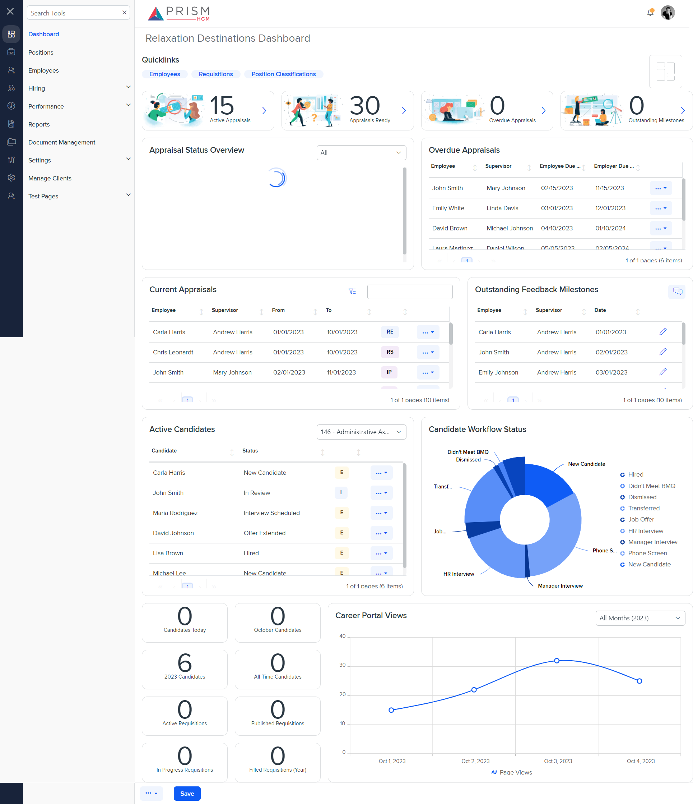

# Differences between `dash-appr.component.html` (Mocks) and `dash-appr.component.html` (Production)

## Table of Contents

-   [Relative Paths](#relative-paths)
-   [Differences](#differences)
-   [Prod Screenshots](#prod-screenshots)
-   [Mock Screenshots](#mock-screenshots)
-   [URL](#url)

### Relative Paths

-   **dash-appr.component.html**: `components-ng-shared/projects/mocks-talent-ng/src/app/dashboard/dash-appr/dash-appr.component.html`
-   **dash-appr.component.html**: `AgileHR/Talent/Talent.Web/ClientApp/src/app/dashboard/dash-appr/dash-appr.component.html`

### Differences

#### components-ng-shared/projects/mocks-talent-ng/src/app/dashboard/dash-appr/dash-appr.component.html

-   Contains a `<button-base>` component with an `[iconClass]` attribute set to `'fa-light fa-filter-list'`.
-   Contains an `<ejs-grid>` component with a `[rowRenderingMode]` attribute set to `'Vertical'`.
-   Contains an `<e-column>` component with a `field` attribute set to `Status`, a `headerText` attribute set to an empty string, a `[template]` attribute set to `statusTemplate`, and a `width` attribute set to `80px`.
-   Contains an `<ng-template>` with `#popoverTemplate` inside the `#statusTemplate` template.
-   Contains an `<ng-template>` with `#editSetupContent` containing a `<settings-table>` component with a `<settings-row>` component.

#### AgileHR/Talent/Talent.Web/ClientApp/src/app/dashboard/dash-appr/dash-appr.component.html

-   Contains a `<button-base>` component with a `(click)` event bound to `openAdvancedSearch()`.
-   Contains an `<e-column>` component with a `width` attribute set to `50px` for the `Status` field.
-   Contains an `<ng-template>` with `#statusTemplate` containing an `<ejs-tooltip>` component with a `#tooltip` template reference variable and a `content` attribute.
-   Contains an `<ng-template>` with `#editSetupContent` containing a `<settings-row>` component with `[title]`, `[description]`, and `[required]` attributes.

### This component is currently not implemented in production.

### Prod Screenshots

N/A

### Mock Screenshots

### URL

[link to the page in mock environment](http://localhost:4340/dashboard)
