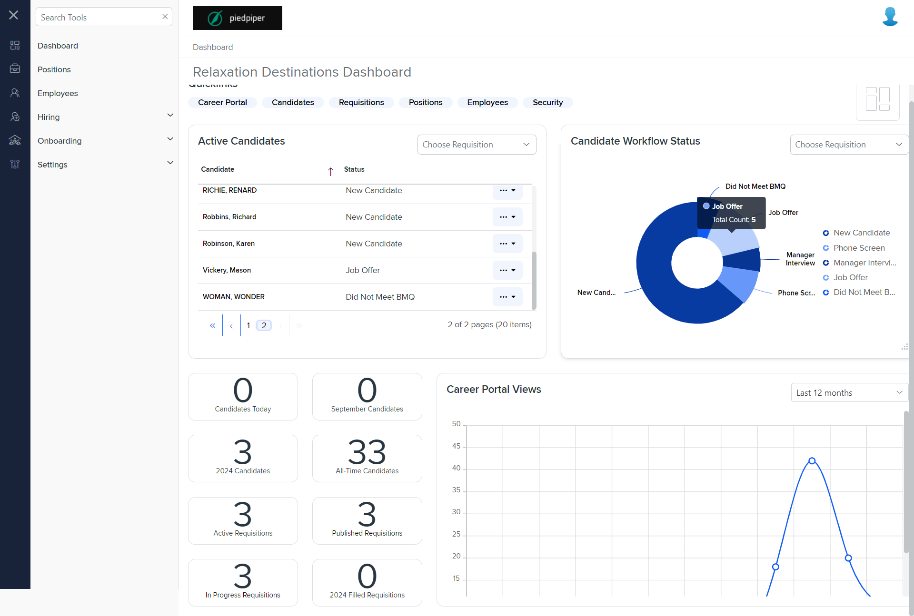
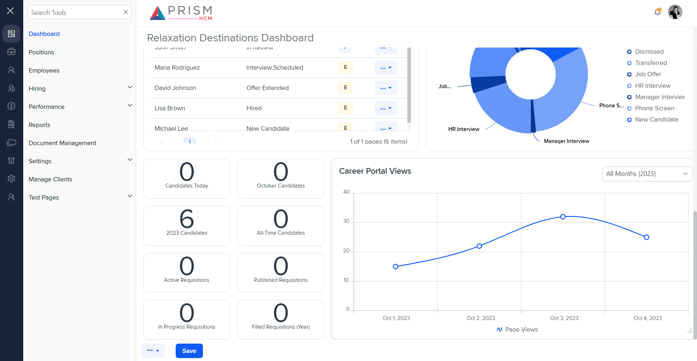

# Differences between `dash-cpv.component.html` (Mocks) and `dash-cpv.component.html` (Production)

## Table of Contents

-   [Relative Paths](#relative-paths)
-   [Differences](#differences)
-   [Prod Screenshots](#prod-screenshots)
-   [Mock Screenshots](#mock-screenshots)
-   [URL](#url)

### Relative Paths

-   **dash-cpv.component.html (Mocks)**: `components-ng-shared/projects/mocks-talent-ng/src/app/dashboard/dash-cpv/dash-cpv.component.html`
-   **dash-cpv.component.html (Production)**: `AgileHR/Talent/Talent.Web/ClientApp/src/app/dashboard/dash-cpv/dash-cpv.component.html`

### Differences

#### components-ng-shared/projects/mocks-talent-ng/src/app/dashboard/dash-cpv/dash-cpv.component.html

-   Contains an `<input-dropdown>` component with attributes `[data]`, `[value]`, and `[floatLabelType]`.
-   Contains a `
` with class `chart-container`.
-   The `<ejs-chart>` component has an `[annotations]` attribute.

#### AgileHR/Talent/Talent.Web/ClientApp/src/app/dashboard/dash-cpv/dash-cpv.component.html

-   Contains an `<ejs-dropdownlist>` component with attributes `[dataSource]`, `[value]`, `[fields]`, and `(change)`.
-   The `<ejs-chart>` component has an `id` attribute set to `cpv-chart-container`.

### Production Screenshots

### Mock Screenshots

### URL

[link to the page in prod](https://piedpiper.agilehr.net)

[link to the page in mock environment](http://localhost:4340/dashboard)
