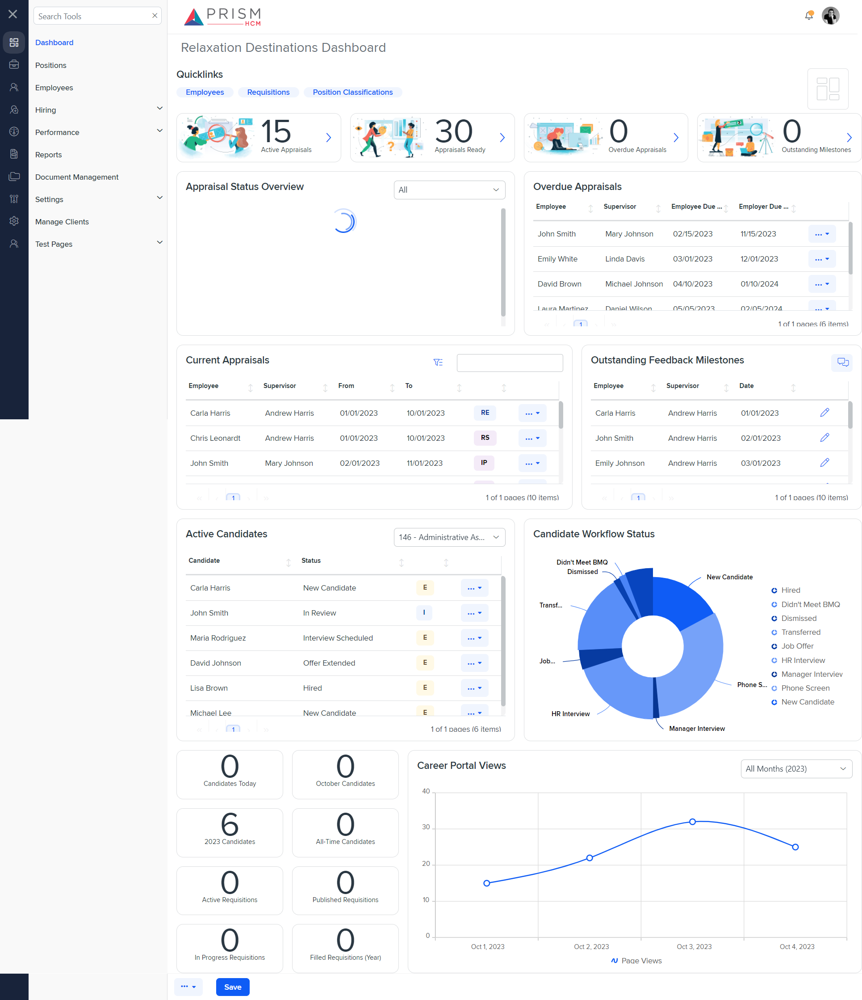

# Differences between `dash-om.component.html` (Mocks) and `dash-om.component.html` (Production)

## Table of Contents

-   [Relative Paths](#relative-paths)
-   [Differences](#differences)
-   [Prod Screenshots](#prod-screenshots)
-   [Mock Screenshots](#mock-screenshots)
-   [URL](#url)

### Relative Paths

-   **dash-om.component.html**: `components-ng-shared/projects/mocks-talent-ng/src/app/dashboard/dash-om/dash-om.component.html`
-   **dash-om.component.html**: `AgileHR/Talent/Talent.Web/ClientApp/src/app/dashboard/dash-om/dash-om.component.html`

### Differences

#### components-ng-shared/projects/mocks-talent-ng/src/app/dashboard/dash-om/dash-om.component.html

-   Contains an `<ejs-grid>` component with attribute `[rowRenderingMode]` set to `'Vertical'`.
-   Contains an `<ng-template>` with `#editbutton` that includes `onKeyPress`, `onKeyDown`, and `onKeyUp` events.
-   Contains a `<settings-row>` component with `[enabled]` attribute set to `false` for both `'Employee'` and `'Supervisor'` fields.
-   Contains a `<settings-row>` component with `[type]` attribute set to `'WYSIWYG'` and an `<input-rich-text>` component with `[height]` attribute set to `250`.

#### AgileHR/Talent/Talent.Web/ClientApp/src/app/dashboard/dash-om/dash-om.component.html

-   Contains an `<ejs-richtexteditor>` component instead of `<input-rich-text>` for the `'Provide Feedback about Employee'` field.

### Prod Screenshots

### dash-oc is implemented on dashboard.component.html, but not visible.

### Mock Screenshots

### URL

[link to the page in prod](https://piedpiper.agilehr.net)

[link to the page in mock environment](http://localhost:4340/dashboard)
