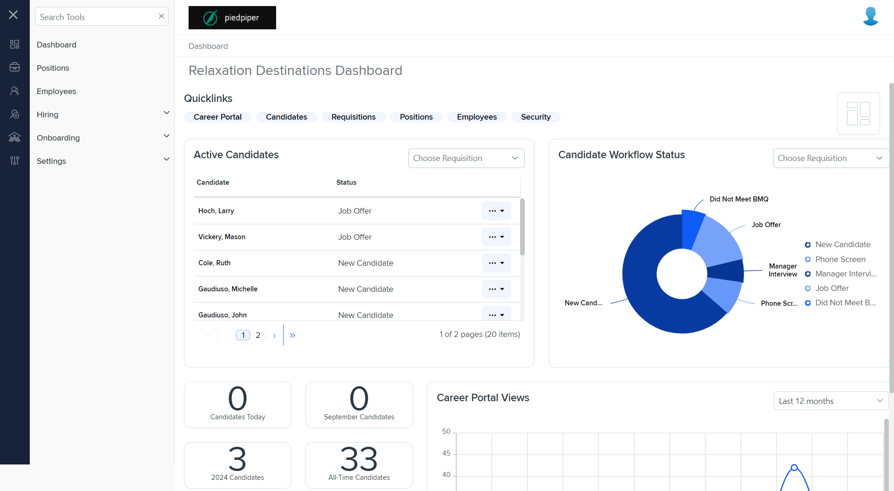
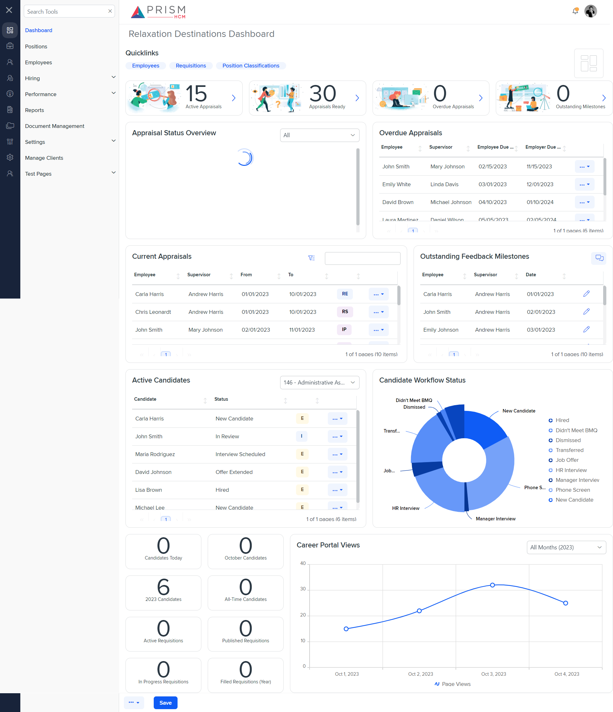

# Differences between `dashboard.component.html` and `dashboard.component.html`

## Table of Contents

-   [Relative Paths](#relative-paths)
-   [Differences](#differences)
-   [Prod Screenshots](#prod-screenshots)
-   [Mock Screenshots](#mock-screenshots)
-   [URL](#url)

### Relative Paths

-   **dashboard.component.html**: `path/to/dashboard.component.html`
-   **dashboard.component.html**: `path/to/dashboard.component.html`

### Differences

#### dashboard.component.html

-   Contains a `<page-title>` component with a `[title]` attribute set to `'Relaxation Destinations Dashboard'`.
-   Contains a `<quicklinks>` component with a `[links]` attribute set to an array of objects with `name` and `route` properties.
-   Contains a `<popover>` component with a `[template]` attribute set to `popoverTemplate`.
-   Contains a `<button>` element with a `(click)` event bound to `onrestoreClick($event)`.
-   Contains a `
` with class `dashboard__design` and multiple child `
` elements with classes `dashboard__design-a`, `dashboard__design-b`, `dashboard__design-c`, and `dashboard__design-d`.
-   Contains an `<ng-template>` with `#popoverTemplate` containing the text `Reset Dashboard layout`.
-   Contains an `<ejs-dashboardlayout>` component with attributes `columns`, `[cellSpacing]`, `[allowResizing]`, `(resizeStop)`, `(resizeStart)`, `(resize)`, `(dragStart)`, `(drag)`, `(dragStop)`, `[showGridLines]`, `[panels]`, and `[mediaQuery]`.
-   Contains multiple `<ng-template>` elements with `#dash1` to `#dash19`.

#### dashboard.component.html

-   Contains a commented-out `<illustration-block>` component with `[illustrationBlockTitle]` and `[illustrationBlockDescription]` attributes.
-   Contains a `<quicklinks>` component with a `[links]` attribute set to `quicklinks`.
-   Contains an `<ejs-tooltip>` component with `#tooltip` and `content` attributes.
-   Contains a `<button>` element with a `(click)` event bound to `onrestoreClick($event)`.
-   Contains a `
` with class `dashboard__design` and multiple child `
` elements with classes `dashboard__design-a`, `dashboard__design-b`, `dashboard__design-c`, and `dashboard__design-d`.
-   Contains an `<ejs-dashboardlayout>` component with attributes `columns`, `[cellSpacing]`, `[allowResizing]`, `(resizeStop)`, `(resizeStart)`, `(resize)`, `(dragStart)`, `(drag)`, `(dragStop)`, `[showGridLines]`, `[panels]`, and `[mediaQuery]`.
-   Contains multiple `<ng-template>` elements with `#dash1` to `#dash19`.
-   Contains a `
` with class `dashboard-mini__figure` and an interpolation binding to `candidateRequisitionCounts?.candidatesToday || 0`.
-   Contains a `
` with class `dashboard-mini__title` and an interpolation binding to `currentMonth`.
-   Contains a `
` with class `dashboard-mini__figure` and an interpolation binding to `candidateRequisitionCounts?.candidatesThisYear || 0`.
-   Contains a `
` with class `dashboard-mini__title` and an interpolation binding to `currentYear`.
-   Contains a `
` with class `dashboard-mini__figure` and an interpolation binding to `candidateRequisitionCounts?.candidatesAllTime || 0`.
-   Contains a `
` with class `dashboard-mini__figure` and an interpolation binding to `candidateRequisitionCounts?.requisitionsActive || 0`.
-   Contains an `<a>` element with an `href` attribute set to `/hiring/requisitions#statusesFilter=Published`.
-   Contains a `
` with class `dashboard-mini__figure` and an interpolation binding to `candidateRequisitionCounts?.requisitionsPublished || 0`.
-   Contains an `<a>` element with an `href` attribute set to `/hiring/requisitions#statusesFilter=In+Progress`.
-   Contains a `
` with class `dashboard-mini__figure` and an interpolation binding to `candidateRequisitionCounts?.requisitionsInProgress || 0`.
-   Contains a `
` with class `dashboard-mini__figure` and an interpolation binding to `candidateRequisitionCounts?.requisitionsFilledThisYear || 0`.
-   Contains a `
` with class `dashboard-mini__title` and an interpolation binding to `currentYear`.

### Prod Screenshots

### Mock Screenshots

### URL

[link to the page in prod](https://example.com/dashboard)

[link to the page in mock environment](http://localhost:4340/dashboard)
