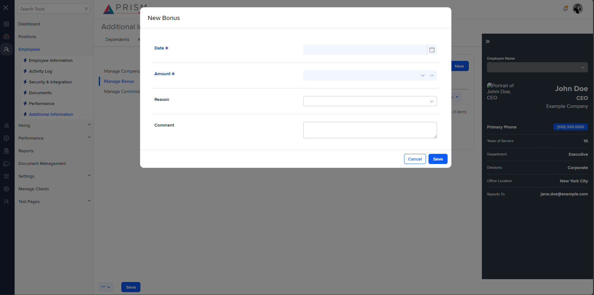

## File Comparison Report

## Table of Contents

- [File Paths](#file-paths)
- [Differences in Markup Structure](#differences-in-markup-structure)
  - [AgileHR](#agilehr)
  - [mocks-talent-ng](#mocks-talent-ng)
- [Unique Markup Tags](#unique-markup-tags)
  - [AgileHR](#agilehr-1)
  - [mocks-talent-ng](#mocks-talent-ng-1)
- [Summary](#summary)
- [Prod Screenshots](#prod-screenshots)
- [Mock Screenshots](#mock-screenshots)
- [URL](#url)

### File Paths

- **AgileHR**: `AgileHR/Talent/Talent.Web/ClientApp/src/app/employees/employee-additional/compensation/manage-bonus/new-bonus/new-bonus.component.html`
- **mocks-talent-ng**: `components-ng-shared/projects/mocks-talent-ng/src/app/employees/employee-additional/compensation/manage-bonus/new-bonus/new-bonus.component.html`

### Differences in Markup Structure

#### AgileHR

- Contains a `<settings-table>` component with `[settingsTitle]` and `[formGroup]` attributes.
- Contains multiple `<settings-row>` components with `[title]`, `[description]`, and `[required]` attributes.
- Each `<settings-row>` contains different input components:
  - `<input-datepicker>` for date input.
  - `<input-numeric>` for amount input.
  - `<input-dropdown>` for reason input.
  - `<input-multiline>` for comment input.

#### mocks-talent-ng

- Contains a `<settings-table>` component with `[settingsTitle]` and `[formGroup]` attributes.
- Contains multiple `<settings-row>` components with `[title]`, `[description]`, and `[required]` attributes.
- Each `<settings-row>` contains different input components:
  - `<input-datepicker>` for date input.
  - `<input-numeric>` for amount input.
  - `<input-dropdown>` for reason input.
  - `<input-multiline>` for comment input.

### Unique Markup Tags

#### AgileHR

- None

#### mocks-talent-ng

- None

### Differences in Markup Structure

- Both files have identical markup structures with `<settings-table>`, `<settings-row>`, `<input-datepicker>`, `<input-numeric>`, `<input-dropdown>`, and `<input-multiline>` components.
- There are no differences in the number or types of input components used within the `<settings-row>` elements.

### Summary

The primary observation is that both files have identical markup structures and use the same components for date, amount, reason, and comment inputs.

### Prod Screenshots

None

### Mock Screenshots

### URL

link to the page in prod: None

[link to the page in mock](https://localhost:4340/employees/:id/additional)
