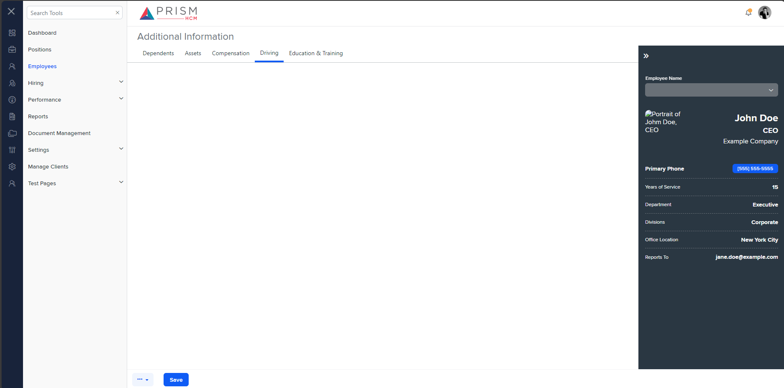

## File Comparison Report

## Table of Contents

- [File Paths](#file-paths)
- [Differences in Markup Structure](#differences-in-markup-structure)
  - [AgileHR](#agilehr)
  - [mocks-talent-ng](#mocks-talent-ng)
- [Unique Markup Tags](#unique-markup-tags)
  - [AgileHR](#agilehr-1)
  - [mocks-talent-ng](#mocks-talent-ng-1)
- [Summary](#summary)
- [Prod Screenshots](#prod-screenshots)
- [Mock Screenshots](#mock-screenshots)
- [URL](#url)

### File Paths

- **AgileHR**: `AgileHR/Talent/Talent.Web/ClientApp/src/app/employees/employee-additional/driving-records/driving-records.component.html`
- **mocks-talent-ng**: `components-ng-shared/projects/mocks-talent-ng/src/app/employees/employee-additional/driving-records/driving-records.component.html`

### Differences in Markup Structure

#### AgileHR

- Contains an `<ejs-grid>` component with `[allowPaging]`, `[dataSource]`, and `[toolbar]` attributes.
- Uses a `<ng-template>` for the toolbar with a custom toolbar structure.
- Contains `<button-base>`, `<input-text>`, and `<button-dropdown-grid>` components within the toolbar.
- Includes an advanced search section with `
` and `
`.
- Contains `<modal-base>` components for delete and new driving record modals with respective templates.

#### mocks-talent-ng

- Contains a `<grid-filters>` component with `[centerTemplate]` and `[centerHeaderTemplate]` attributes.
- Uses a `<ng-template>` for the center header with a custom toolbar structure.
- Contains `<input-text>`, `<button-dropdown-grid>`, and `<button-new>` components within the toolbar.
- Contains an `<ejs-grid>` component with `[enableAdaptiveUI]`, `[rowRenderingMode]`, `[allowPaging]`, and `[dataSource]` attributes.
- Contains `<modal-base>` components for delete and new driving record modals with respective templates.

### Unique Markup Tags

#### AgileHR

- `button-base`
- `div` (with class `custom-toolbar__lc` and `custom-toolbar__rc`)

#### mocks-talent-ng

- `grid-filters`
- `button-new`

### Differences in Markup Structure

- **AgileHR** uses `<button-base>` for toolbar buttons, while **mocks-talent-ng** uses `<button-new>`.
- **AgileHR** includes an advanced search section with `
` and `
`, which is not present in **mocks-talent-ng**.
- **mocks-talent-ng** uses a `<grid-filters>` component for filtering, which is not present in **AgileHR**.

### Summary

The primary differences between the two files are the types of components used within the toolbar and the presence of an advanced search section in **AgileHR**. Additionally, **mocks-talent-ng** uses a `<grid-filters>` component for filtering, which is not present in **AgileHR**.

### Prod Screenshots

None

### Mock Screenshots

### URL

link to the page in prod: None

[link to the page in mock](https://localhost:4340/employees/:id/additional)