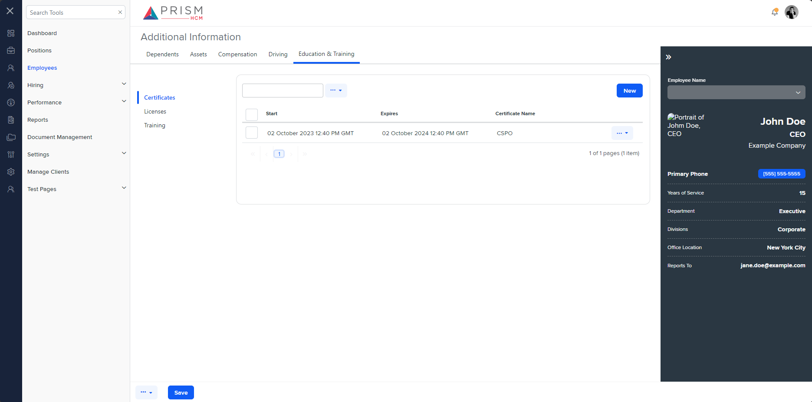

## File Comparison Report

## Table of Contents

- [File Paths](#file-paths)
- [Differences in Markup Structure](#differences-in-markup-structure)
  - [AgileHR](#agilehr)
  - [mocks-talent-ng](#mocks-talent-ng)
- [Unique Markup Tags](#unique-markup-tags)
  - [AgileHR](#agilehr-1)
  - [mocks-talent-ng](#mocks-talent-ng-1)
- [Summary](#summary)
- [Prod Screenshots](#prod-screenshots)
- [Mock Screenshots](#mock-screenshots)
- [URL](#url)

### File Paths

- **AgileHR**: `AgileHR/Talent/Talent.Web/ClientApp/src/app/employees/employee-additional/education/education.component.html`
- **mocks-talent-ng**: `components-ng-shared/projects/mocks-talent-ng/src/app/employees/employee-additional/education/education.component.html`

### Differences in Markup Structure

#### AgileHR

- Contains an `<ejs-tab>` component with `id="tab_default"` and `headerPlacement="Left"` attributes.
- Contains multiple `<e-tabitem>` components with `[header]` attributes.
- Each `<e-tabitem>` contains an `<ng-template>` with a `#content` template reference variable.
- Each `<ng-template>` contains different components:
  - `<certificates>` for the first tab.
  - `<licenses>` for the second tab.
  - `<training>` for the third tab.

#### mocks-talent-ng

- Contains an `<ejs-tab>` component with `id="tab_default"` and `headerPlacement="Left"` attributes.
- Contains multiple `<e-tabitem>` components with `[header]` attributes.
- Each `<e-tabitem>` contains an `<ng-template>` with a `#content` template reference variable.
- Each `<ng-template>` contains different components:
  - `<certificates>` for the first tab.
  - `<licenses>` for the second tab.
  - `<training>` for the third tab.

### Unique Markup Tags

#### AgileHR

- None

#### mocks-talent-ng

- None

### Differences in Markup Structure

- Both files have identical markup structures with `<ejs-tab>`, `<e-tabitem>`, and `<ng-template>` components.
- There are no differences in the number or types of components used within the `<ng-template>` elements.

### Summary

The primary observation is that both files have identical markup structures and use the same components for managing certificates, licenses, and training within the tabs.

### Prod Screenshots

None

### Mock Screenshots

### URL

link to the page in prod: None

[link to the page in mock](https://localhost:4340/employees/:id/additional)
