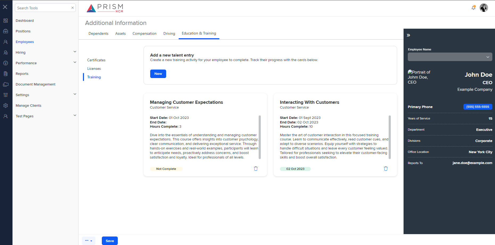

## File Comparison Report

## Table of Contents

- [File Paths](#file-paths)
- [Differences in Markup Structure](#differences-in-markup-structure)
  - [AgileHR](#agilehr)
  - [mocks-talent-ng](#mocks-talent-ng)
- [Unique Markup Tags](#unique-markup-tags)
  - [AgileHR](#agilehr-1)
  - [mocks-talent-ng](#mocks-talent-ng-1)
- [Summary](#summary)
- [Prod Screenshots](#prod-screenshots)
- [Mock Screenshots](#mock-screenshots)
- [URL](#url)

### File Paths

- **AgileHR**: `AgileHR/Talent/Talent.Web/ClientApp/src/app/employees/employee-additional/training/training.component.html`
- **mocks-talent-ng**: `components-ng-shared/projects/mocks-talent-ng/src/app/employees/employee-additional/training/training.component.html`

### Differences in Markup Structure

#### AgileHR

- Contains a `
` section with a title and subtitle for adding a new talent entry.
- Contains a `<button-new>` component with a tooltip and callback for adding new talent.
- Contains multiple `
` sections with headers, body, and footer.
- Each `
` contains:
  - A title and category.
- Each `
` contains:
  - Start date, end date, hours complete, and description.
- Each `
` contains:
  - Status and delete button.
- Contains `<modal-base>` components for delete and new talent modals with respective templates.

#### mocks-talent-ng

- Contains a `
` section with a title and subtitle for adding a new talent entry.
- Contains a `<button-new>` component with a tooltip and callback for adding new talent.
- Contains multiple `<education-card>` components with attributes for title, category, date start, date end, hours complete, and description.
- Contains a `<modal-base>` component for the new talent modal with a respective template.

### Unique Markup Tags

#### AgileHR

- `div` (with class `education-card`, `education-card__header`, `education-card__body`, `education-card__footer`, `custom-toolbar__lc`, `custom-toolbar__rc`)
- `button-base`

#### mocks-talent-ng

- `education-card`

### Differences in Markup Structure

- **AgileHR** uses multiple `
` elements with specific classes for structuring the education cards, while **mocks-talent-ng** uses `<education-card>` components with attributes.
- **AgileHR** includes an advanced search section with `
` and `
`, which is not present in **mocks-talent-ng**.
- **mocks-talent-ng** simplifies the structure by using custom components like `<education-card>`.

### Summary

The primary differences between the two files are the use of custom components in **mocks-talent-ng** to simplify the structure, while **AgileHR** uses multiple `
` elements with specific classes. Additionally, **AgileHR** includes an advanced search section that is not present in **mocks-talent-ng**.

### Prod Screenshots

None

### Mock Screenshots

### URL

link to the page in prod: None

[link to the page in mock](https://localhost:4340/employees/:id/additional)
