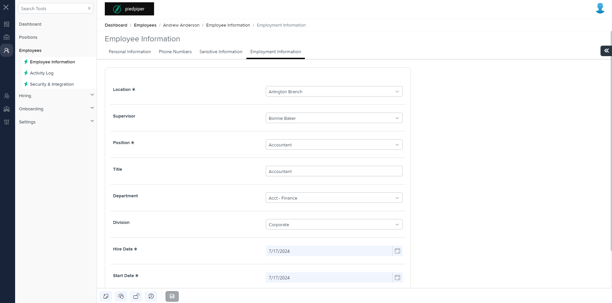
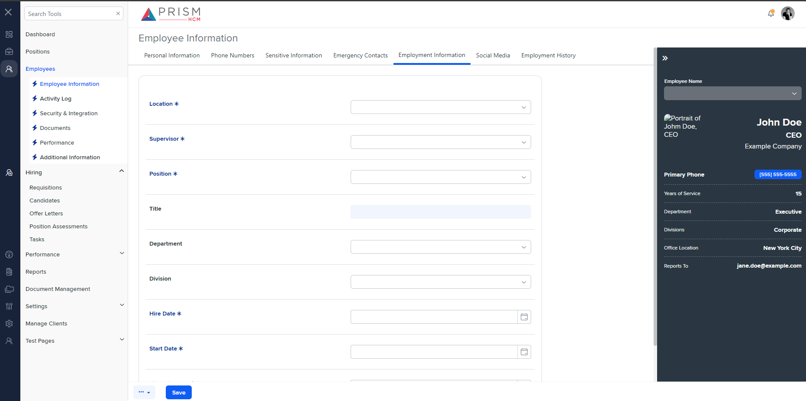

## File Comparison Report

## Table of Contents

- [File Paths](#file-paths)
- [Differences in Markup Structure](#differences-in-markup-structure)
  - [AgileHR](#agilehr)
  - [mocks-talent-ng](#mocks-talent-ng)
- [Unique Markup Tags](#unique-markup-tags)
  - [AgileHR](#agilehr-1)
  - [mocks-talent-ng](#mocks-talent-ng-1)
- [Summary](#summary)
- [Prod Screenshots](#prod-screenshots)
- [Mock Screenshots](#mock-screenshots)
- [URL](#url)

### File Paths

- **AgileHR**: `AgileHR/Talent/Talent.Web/ClientApp/src/app/employees/employee-additional/employment-information/employment-information.component.html`
- **mocks-talent-ng**: `components-ng-shared/projects/mocks-talent-ng/src/app/employees/employee-additional/employment-information/employment-information.component.html`

### Differences in Markup Structure

#### AgileHR

- Contains a `<fieldset>` element with `[formGroup]` and `[disabled]` attributes.
- Contains a `
` element with a nested `
`.
- Contains a `<settings-table>` component.
- Uses conditional rendering with `@if(isHcmSynced)` to disable certain fields.
- Contains multiple `<settings-row>` components with `[title]`, `[required]`, and `[description]` attributes.
- Each `<settings-row>` contains different input components:
  - `<input-dropdown>` for location, supervisor, position, department, and division inputs.
  - `<input-text>` for title input.
  - `<input-datepicker>` for hire date, start date, and first hire date inputs.
- Uses different forms (`employmentInfoDisabledForm` and `employeeInformationForm.get('employmentInformation')`) based on the `isHcmSynced` condition.

#### mocks-talent-ng

- Contains a `<settings-table>` component.
- Contains multiple `<settings-row>` components with `[title]`, `[description]`, and `[required]` attributes.
- Each `<settings-row>` contains different input components:
  - `<input-dropdown>` for location, supervisor, position, department, and division inputs.
  - `<input-text>` for title input.
  - `<input-datepicker>` for hire date, start date, and first hire date inputs.
- Uses a single form for all input components.

### Unique Markup Tags

#### AgileHR

- `fieldset`
- `div` (with `formGroupName="employmentInformation"`)
- `input-dropdown` (with `[form]="employmentInfoDisabledForm"` or `[form]="employeeInformationForm.get('employmentInformation')"`)

#### mocks-talent-ng

- None

### Differences in Markup Structure

- **AgileHR** uses a `<fieldset>` element with conditional rendering based on `isHcmSynced`, while **mocks-talent-ng** does not.
- **AgileHR** uses different forms (`employmentInfoDisabledForm` and `employeeInformationForm.get('employmentInformation')`) based on the `isHcmSynced` condition, while **mocks-talent-ng** uses a single form for all input components.

### Summary

The primary differences between the two files are the use of a `<fieldset>` element with conditional rendering based on `isHcmSynced` in **AgileHR**, and the use of different forms based on the `isHcmSynced` condition. **mocks-talent-ng** uses a simpler structure with a single form for all input components.

### Prod Screenshots

### Mock Screenshots

### URL

[link to the page in prod](https://piedpiper.agilehr.net/core/employees/employee_01j30gtf7ye5z9mc9zbwcft1wg/overview/employment-information)

[link to the page in mock](https://localhost:4340/employees/:id/overview)
