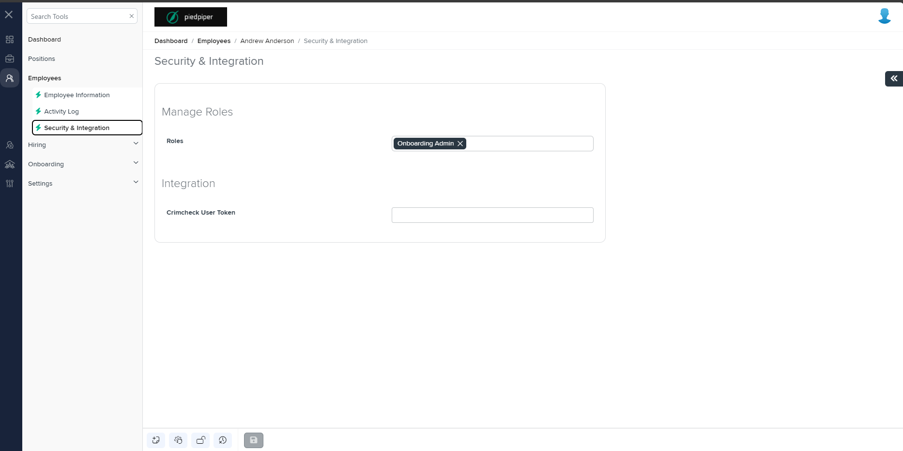
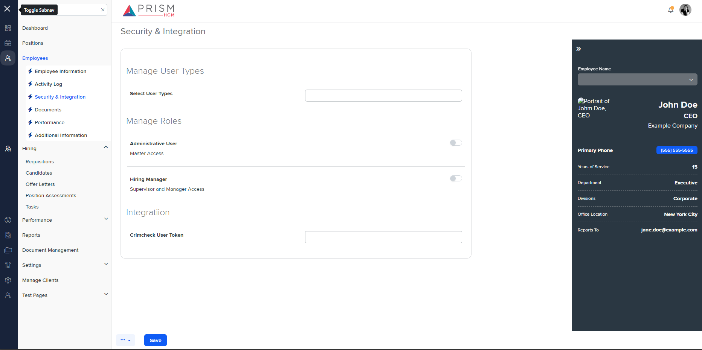

## File Comparison Report

## Table of Contents

- [File Paths](#file-paths)
- [Differences in Markup Structure](#differences-in-markup-structure)
  - [AgileHR](#agilehr)
  - [mocks-talent-ng](#mocks-talent-ng)
- [Unique Markup Tags](#unique-markup-tags)
  - [AgileHR](#agilehr-1)
  - [mocks-talent-ng](#mocks-talent-ng-1)
- [Summary](#summary)
- [Prod Screenshots](#prod-screenshots)
- [Mock Screenshots](#mock-screenshots)
- [URL](#url)

### File Paths

- **AgileHR**: `AgileHR/Talent/Talent.Web/ClientApp/src/app/employees/employee-additional/security/employee-security.component.html`
- **mocks-talent-ng**: `components-ng-shared/projects/mocks-talent-ng/src/app/employees/employee-additional/security/employee-security.component.html`

### Differences in Markup Structure

#### AgileHR

- Contains a `<page-title>` component with `[title]="'Security & Integration'"` attribute.
- Contains a `<fieldset>` element with `[formGroup]="roleFormGroup"` and `[disabled]="disabled"` attributes.
- Contains a `<settings-table>` component.
- Contains multiple `<settings-row>` components with `[title]`, `[description]`, and `subtitle` attributes.
- Each `<settings-row>` contains different input components:
  - `<input-dropdown-multi>` for roles input.
  - `<input-text>` for Crimcheck User Token and Payroll Code inputs.
- Uses conditional rendering with `*ngIf` for integration-related fields.

#### mocks-talent-ng

- Contains a `<page-title>` component with `[title]="'Security & Integration'"` attribute.
- Contains a `<layout-drawers>` component with nested `<layout-drawer-center>` and `<layout-drawer-right>` sections.
- The center drawer section includes:
  - A `<settings-table>` component.
  - Multiple `<settings-row>` components with `[title]`, `[description]`, and `subtitle` attributes.
  - Each `<settings-row>` contains different input components:
    - `<input-dropdown-multi>` for user types input.
    - `<toggle-switch>` for administrative user and hiring manager inputs.
    - `<input-text>` for Crimcheck User Token input.
- The right drawer section includes:
  - A `<layout-toolbox>` component with an `<app-ee-drawer>` component.

### Unique Markup Tags

#### AgileHR

- `fieldset`
- `input-dropdown-multi` (with `[form]="roleFormGroup"` and `formControlName` attributes)
- `input-text` (with `[form]="roleFormGroup"` and `formControlName` attributes)

#### mocks-talent-ng

- `layout-drawers`
- `layout-drawer-center`
- `layout-drawer-right`
- `toggle-switch`
- `layout-toolbox`
- `app-ee-drawer`

### Differences in Markup Structure

- **AgileHR** uses a `<fieldset>` element with form control attributes, while **mocks-talent-ng** uses a `<layout-drawers>` component with nested drawer sections.
- **AgileHR** includes conditional rendering for integration-related fields, while **mocks-talent-ng** does not.
- **mocks-talent-ng** includes additional components such as `<toggle-switch>` for administrative user and hiring manager inputs, and a right drawer section with `<layout-toolbox>` and `<app-ee-drawer>` components, which are not present in **AgileHR**.

### Summary

The primary differences between the two files are the layout structures and the components used for displaying security and integration information. **AgileHR** uses a `<fieldset>` element with form control attributes and conditional rendering for integration-related fields, while **mocks-talent-ng** uses a `<layout-drawers>` component with nested drawer sections and additional components such as `<toggle-switch>` and `<app-ee-drawer>`.

### Prod Screenshots

### Mock Screenshots

### URL

[link to the page in prod](https://piedpiper.agilehr.net/core/employees/employee_01j30gtf7ye5z9mc9zbwcft1wg/security)

[link to the page in mock](https://localhost:4340/employees/:id/security)
