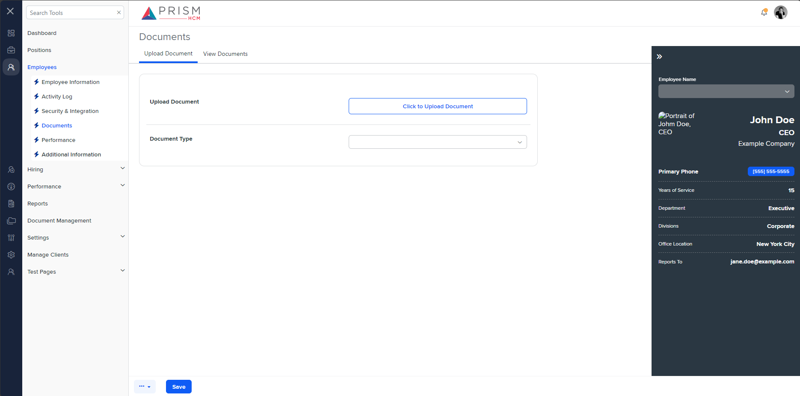

## File Comparison Report

## Table of Contents

- [File Paths](#file-paths)
- [Differences in Markup Structure](#differences-in-markup-structure)
  - [AgileHR](#agilehr)
  - [mocks-talent-ng](#mocks-talent-ng)
- [Unique Markup Tags](#unique-markup-tags)
  - [AgileHR](#agilehr-1)
  - [mocks-talent-ng](#mocks-talent-ng-1)
- [Summary](#summary)
- [Prod Screenshots](#prod-screenshots)
- [Mock Screenshots](#mock-screenshots)
- [URL](#url)

### File Paths

- **AgileHR**: `AgileHR/Talent/Talent.Web/ClientApp/src/app/employees/employee-additional/upload-document/upload-document.component.html`
- **mocks-talent-ng**: `components-ng-shared/projects/mocks-talent-ng/src/app/employees/employee-additional/upload-document/upload-document.component.html`

### Differences in Markup Structure

#### AgileHR

- Contains a `<settings-table>` component.
- Contains multiple `<settings-row>` components with `[title]` and `[description]` attributes.
- Each `<settings-row>` contains different input components:
  - `<settings-uploader>` for uploading documents.
  - `<input-dropdown>` for selecting document type with attributes:
    - `[data]="documentList"`
    - `[value]="value"`
    - `placeholder="Select a Country"`
    - `floatLabelType="Always"`

#### mocks-talent-ng

- Contains a `<settings-table>` component.
- Contains multiple `<settings-row>` components with `[title]` and `[description]` attributes.
- Each `<settings-row>` contains different input components:
  - `<input-file>` for uploading documents with `[title]="'Click to Upload Document'"`.
  - `<input-dropdown>` for selecting document type with attributes:
    - `[data]="documentList"`
    - `[value]="value"`
    - `placeholder="Select a Country"`
    - `floatLabelType="Always"`

### Unique Markup Tags

#### AgileHR

- `settings-uploader`

#### mocks-talent-ng

- `input-file`

### Differences in Markup Structure

- **AgileHR** uses a `<settings-uploader>` component for uploading documents, while **mocks-talent-ng** uses an `<input-file>` component with a title attribute.
- Both files use the `<input-dropdown>` component for selecting document type with identical attributes.

### Summary

The primary differences between the two files are the components used for uploading documents. **AgileHR** uses a `<settings-uploader>` component, while **mocks-talent-ng** uses an `<input-file>` component with a title attribute. Both files use the `<input-dropdown>` component for selecting document type with identical attributes.

### Prod Screenshots

None

### Mock Screenshots

### URL

link to the page in prod: None

[link to the page in mock](https://localhost:4340/employees/:id/documents)
