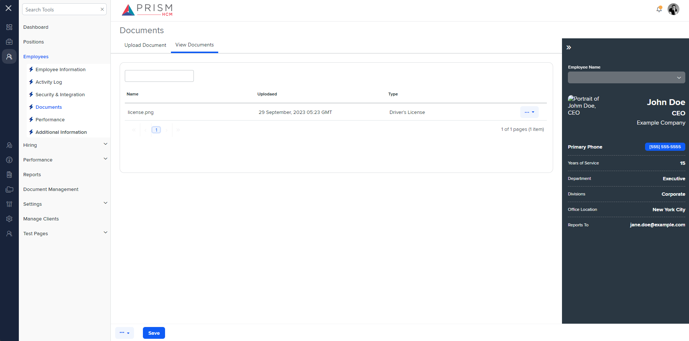

## File Comparison Report

## Table of Contents

- [File Paths](#file-paths)
- [Differences in Markup Structure](#differences-in-markup-structure)
  - [AgileHR](#agilehr)
  - [mocks-talent-ng](#mocks-talent-ng)
- [Unique Markup Tags](#unique-markup-tags)
  - [AgileHR](#agilehr-1)
  - [mocks-talent-ng](#mocks-talent-ng-1)
- [Summary](#summary)
- [Prod Screenshots](#prod-screenshots)
- [Mock Screenshots](#mock-screenshots)
- [URL](#url)

### File Paths

- **AgileHR**: `AgileHR/Talent/Talent.Web/ClientApp/src/app/employees/employee-additional/view-documents/view-documents.component.html`
- **mocks-talent-ng**: `components-ng-shared/projects/mocks-talent-ng/src/app/employees/employee-additional/view-documents/view-documents.component.html`

### Differences in Markup Structure

#### AgileHR

- Contains an `<ejs-grid>` component with attributes:
  - `[allowPaging]="true"`
  - `[dataSource]="data"`
  - `[toolbar]="toolbar"`
- Contains a `<ng-template #toolbarTemplate>` for custom toolbar with:
  - `<input-text>` for search input.
- Contains `<e-columns>` with multiple `<e-column>` components for displaying data fields.
- Contains a `<ng-template #moreOptions>` for dropdown options with:
  - `<button-dropdown-grid>` component.
- Contains a `<modal-base>` component for delete document modal with:
  - `<ng-template #deleteDocumentContent>` for modal content.

#### mocks-talent-ng

- Contains a `<grid-filters>` component with attributes:
  - `[centerTemplate]="centerContent"`
  - `[centerHeaderTemplate]="centerHeaderTemplate"`
- Contains a `<ng-template #centerHeaderTemplate>` for custom toolbar with:
  - `<input-text>` for search input.
- Contains a `<ng-template #centerContent>` with:
  - `<ejs-grid>` component with attributes:
    - `[enableAdaptiveUI]="true"`
    - `[rowRenderingMode]="'Vertical'"`
    - `[allowPaging]="true"`
    - `[dataSource]="data"`
  - Contains `<e-columns>` with multiple `<e-column>` components for displaying data fields.
- Contains a `<ng-template #moreOptions>` for dropdown options with:
  - `<button-dropdown-grid>` component.
- Contains a `<modal-base>` component for delete document modal with:
  - `<ng-template #deleteDocumentContent>` for modal content.

### Unique Markup Tags

#### AgileHR

- `ejs-grid` (with `[toolbar]="toolbar"`)
- `toolbarTemplate`

#### mocks-talent-ng

- `grid-filters`
- `centerHeaderTemplate`
- `centerContent`
- `ejs-grid` (with `[enableAdaptiveUI]="true"` and `[rowRenderingMode]="'Vertical'"`)

### Differences in Markup Structure

- **AgileHR** uses an `<ejs-grid>` component with a `toolbar` attribute and a custom toolbar template.
- **mocks-talent-ng** uses a `<grid-filters>` component with `centerTemplate` and `centerHeaderTemplate` attributes for custom toolbar and content.
- **mocks-talent-ng** includes additional attributes `[enableAdaptiveUI]="true"` and `[rowRenderingMode]="'Vertical'"` for the `<ejs-grid>` component, which are not present in **AgileHR**.

### Summary

The primary differences between the two files are the components and attributes used for the grid and toolbar. **AgileHR** uses an `<ejs-grid>` component with a `toolbar` attribute and a custom toolbar template, while **mocks-talent-ng** uses a `<grid-filters>` component with `centerTemplate` and `centerHeaderTemplate` attributes for custom toolbar and content. Additionally, **mocks-talent-ng** includes attributes `[enableAdaptiveUI]="true"` and `[rowRenderingMode]="'Vertical'"` for the `<ejs-grid>` component.

### Prod Screenshots

None

### Mock Screenshots

### URL

link to the page in prod: None

[link to the page in mock](https://localhost:4340/employees/:id/documents)
