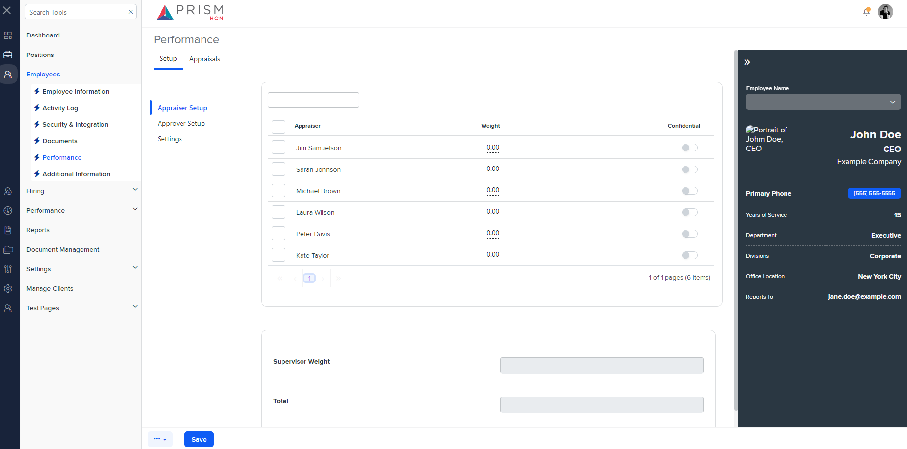

## File Comparison Report

## Table of Contents

- [File Paths](#file-paths)
- [Differences in Markup Structure](#differences-in-markup-structure)
  - [AgileHR](#agilehr)
  - [mocks-talent-ng](#mocks-talent-ng)
- [Unique Markup Tags](#unique-markup-tags)
  - [AgileHR](#agilehr-1)
  - [mocks-talent-ng](#mocks-talent-ng-1)
- [Summary](#summary)
- [Prod Screenshots](#prod-screenshots)
- [Mock Screenshots](#mock-screenshots)
- [URL](#url)

### File Paths

- **AgileHR**: `AgileHR/Talent/Talent.Web/ClientApp/src/app/employees/employee-additional/eep-deets/eep-deets.component.html`
- **mocks-talent-ng**: `components-ng-shared/projects/mocks-talent-ng/src/app/employees/employee-additional/eep-deets/eep-deets.component.html`

### Differences in Markup Structure

#### AgileHR

- Contains an `<ejs-tab>` component with `overflowMode="Popup"` and `headerPlacement="Left"` attributes.
- The first tab item includes:
  - A `
` section with nested `
`, `
`, and `
` sections.
  - The left section includes:
    - A title with a `<button-base>` component for closing filters.
    - A wrapper `
` containing an `<input-dropdown>` component for department selection.
  - The center section includes:
    - An `<ejs-grid>` component with a custom toolbar template and multiple columns.
    - The toolbar template includes a search bar and a button for toggling search filters.
  - The right section is empty.
  - A `<settings-table>` component with multiple `<settings-row>` components for supervisor weight and total weight.
- The second tab item includes:
  - An `<ejs-grid>` component with attributes for paging, row drag-and-drop, and sorting.
  - A custom toolbar template similar to the first tab item.
- The third tab item includes:
  - A `<settings-table>` component with multiple `<settings-row>` components for milestone reminders and appraisal cycle.
- Contains a `<modal-base>` component for editing appraiser setup with a nested `<settings-table>` component.
- Contains `<ng-template>` components for inline editing and toggle switch.

#### mocks-talent-ng

- Contains an `<ejs-tab>` component with `overflowMode="Popup"` and `headerPlacement="Left"` attributes.
- The first tab item includes:
  - A `<grid-filters>` component with `centerTemplate` and `centerHeaderTemplate` attributes.
  - The center header template includes a custom toolbar with a search bar.
  - The center content template includes:
    - An `<ejs-grid>` component with attributes for adaptive UI, vertical row rendering, and paging.
    - Multiple columns including a checkbox column, appraiser column, weight column with inline editing, and confidential column with a toggle switch.
  - A `<settings-table>` component with multiple `<settings-row>` components for supervisor weight and total weight.
- The second tab item includes:
  - A `<grid-filters>` component with `centerTemplate` and `centerHeaderTemplate` attributes.
  - The center header template includes a custom toolbar with a search bar.
  - The center content template includes:
    - An `<ejs-grid>` component with attributes for adaptive UI, vertical row rendering, paging, row drag-and-drop, and sorting.
    - A column for approver name.
- The third tab item includes:
  - A `<settings-table>` component with multiple `<settings-row>` components for milestone reminders and appraisal cycle.
- Contains a `<modal-base>` component for editing appraiser setup with a nested `<settings-table>` component.
- Contains `<ng-template>` components for inline editing and toggle switch.

### Unique Markup Tags

#### AgileHR

- `div` (with class `grid-filters`, `grid-filters__left`, `grid-filters__center`, `grid-filters__right`, `grid-filters__left-title`, `grid-filters__left-wrapper`)
- `button-base` (for closing filters and toggling search filters)
- `input-dropdown` (for department selection)

#### mocks-talent-ng

- `grid-filters`
- `centerTemplate`
- `centerHeaderTemplate`

### Differences in Markup Structure

- **AgileHR** uses a `
` based structure for the grid filters, while **mocks-talent-ng** uses a `<grid-filters>` component with `centerTemplate` and `centerHeaderTemplate` attributes.
- **AgileHR** includes a custom toolbar template with a search bar and a button for toggling search filters, while **mocks-talent-ng** includes a simpler custom toolbar with only a search bar.
- **mocks-talent-ng** includes additional attributes for adaptive UI and vertical row rendering in the `<ejs-grid>` component, which are not present in **AgileHR**.

### Summary

The primary differences between the two files are the layout structures and the components used for displaying grid filters and toolbars. **AgileHR** uses a `
` based structure with a more complex custom toolbar, while **mocks-talent-ng** uses a `<grid-filters>` component with simpler custom toolbar templates. Additionally, **mocks-talent-ng** includes attributes for adaptive UI and vertical row rendering in the `<ejs-grid>` component.

### Prod Screenshots

None

### Mock Screenshots

### URL

link to the page in prod: None

[link to the page in mock](https://localhost:4340/employees/:id/performance)
