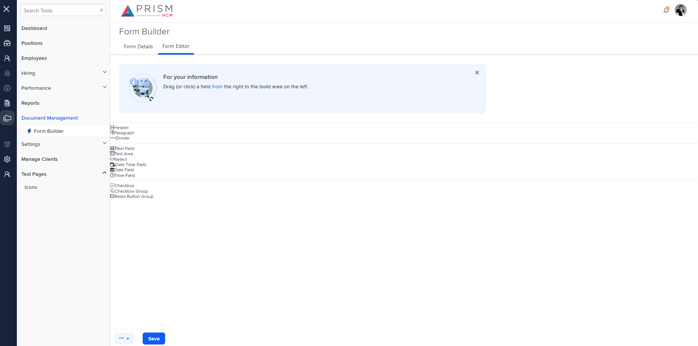

## File Comparison Report

## Table of Contents

- [File Paths](#file-paths)
- [Differences in Markup Structure](#differences-in-markup-structure)
  - [AgileHR](#agilehr)
  - [mocks-talent-ng](#mocks-talent-ng)
- [Unique Markup Tags](#unique-markup-tags)
  - [AgileHR](#agilehr-1)
  - [mocks-talent-ng](#mocks-talent-ng-1)
- [Summary](#summary)
- [Prod Screenshots](#prod-screenshots)
- [Mock Screenshots](#mock-screenshots)
- [URL](#url)

### File Paths

- **AgileHR**: `AgileHR/Talent/Talent.Web/ClientApp/src/app/employees/employee-additional/fd-editor/fd-editor.component.html`
- **mocks-talent-ng**: `components-ng-shared/projects/mocks-talent-ng/src/app/employees/employee-additional/fd-editor/fd-editor.component.html`

### Differences in Markup Structure

#### AgileHR

- Contains a `<message-panel>` component with attributes:
  - `[title]="'For your information'"`
  - `[content]="'Drag (or click) a field from the right to the build area on the left.'"`
  - `[state]="0"`
  - `[config]="{dismissible: true}"`
- Contains a `
` section with nested `
` and `
` sections.
- The build space section includes:
  - Event bindings for `dragover` and `drop`.
  - A `
` with an `<ng-container>` for iterating over `droppedItems`.
  - An `
` element.
- The elements section includes:
  - An `<ng-container>` for iterating over `draggableItems`.
  - A `
` for each draggable item with attributes:
    - `*ngIf="item.label !== 'hr'"`
    - `class="form-editor__elements-item draggable"`
    - `[draggable]="true"`
    - `[id]="item.label"`
    - Event binding for `dragstart`.
  - An `<i>` element for displaying an icon if `item.iconClass` is present.
  - An `
` element.

#### mocks-talent-ng

- Contains a `<message-panel>` component with attributes:
  - `[title]="'For your information'"`
  - `[content]=" 'Drag (or click) a field from the right to the build area on the left.' "`
  - `[state]="0"`
  - `[config]="{ dismissible: true }"`
- Contains a `
` section with nested `
` and `
` sections.
- The build space section includes:
  - Event bindings for `dragover` and `drop`.
  - A `
` with an `<ng-container>` for iterating over `droppedItems`.
  - An `
` element.
- The elements section includes:
  - An `<ng-container>` for iterating over `draggableItems`.
  - A `
` for each draggable item with attributes:
    - `*ngIf="item.label !== 'hr'"`
    - `class="form-editor__elements-item draggable"`
    - `[draggable]="true"`
    - `[id]="item.label"`
    - Event binding for `dragstart`.
  - An `<i>` element for displaying an icon if `item.iconClass` is present.
  - An `
` element.

### Unique Markup Tags

#### AgileHR

- None

#### mocks-talent-ng

- None

### Differences in Markup Structure

- The primary difference between the two files is the formatting of the `[content]` attribute in the `<message-panel>` component:
  - **AgileHR**: `[content]="'Drag (or click) a field from the right to the build area on the left.'"`
  - **mocks-talent-ng**: `[content]=" 'Drag (or click) a field from the right to the build area on the left.' "`

### Summary

The primary difference between the two files is the formatting of the `[content]` attribute in the `<message-panel>` component. Both files contain identical structures for the form editor, including the build space and elements sections with event bindings and iterated items.

### Prod Screenshots

None

### Mock Screenshots

### URL

link to the page in prod: None

[link to the page in mock](https://localhost:4340/forms/1/form-builder)
