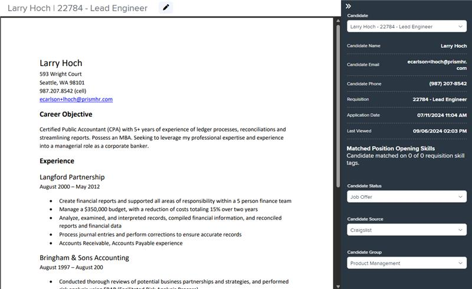
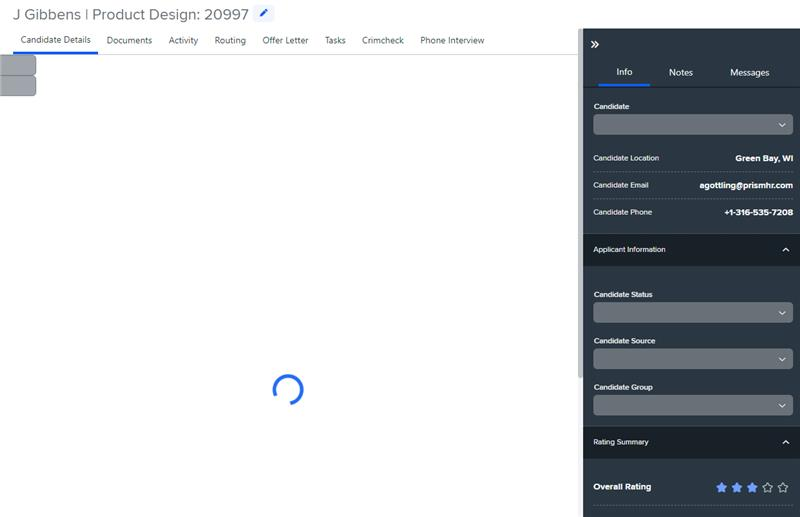

# Markup Audit Report

## Table of Contents

1. [File Paths](#file-paths)
2. [Unique Tags in Each File](#unique-tags-in-each-file)
3. [Differences in Markup Structure](#differences-in-markup-structure)
   - [Header Section](#header-section)
   - [Drawer Layout](#drawer-layout)
   - [Modals](#modals)
   - [Footer Section](#footer-section)
4. [Summary](#summary)

## File Paths

- `candidates-detail.component.html` belongs to the "AgileHR" project.
- `h-can-deet.component.html` belongs to the "Mocks-Talent-ng" project.

## Unique Tags in Each File

- **candidates-detail.component.html (AgileHR):**

  - `talent-footer`, `button-base`, `candidates-right-drawer`, `modal-base`, `ng-template`, `settings-table`, `settings-row`, `input-multiline`, `ejs-multiselect`, `modal-drawer`, `talent-email-selected`, `talent-loading`, `input-ssn`, `input-datepicker`, `input-email`, `input-text`, `toggle-switch`, `input-dropdown`, `input-dropdown-multi`

- **h-can-deet.component.html (Mocks-Talent-ng):**
  - `page-title`, `layout-drawers`, `layout-drawer-center`, `layout-drawer-right`, `layout-toolbox`, `app-h-can-info`, `app-h-can-docs`, `app-h-can-activity`, `app-h-can-rout`, `app-h-can-offer`, `app-h-can-task`, `app-crimcheck`, `app-h-can-phoneint`, `input-phone`, `nylas`

## Differences in Markup Structure

### Header Section

- **AgileHR:**

  - Does not include a header section.

- **Mocks-Talent-ng:**
  - Uses `<page-title [title]="'J Gibbens | Product Design: 20997'" [cta]="true">` for the header.
  - Includes a `button-base` for editing the candidate.

### Drawer Layout

- **AgileHR:**

  - Uses a custom drawer layout with `div` elements and classes `drawers`, `drawers__center`, and `drawers__right`.
  - Includes a `button-base` for toggling the right drawer.
  - Uses `candidates-right-drawer` within the right drawer.

- **Mocks-Talent-ng:**
  - Uses `layout-drawers` with `layout-drawer-center` and `layout-drawer-right` components.
  - Includes `layout-toolbox` within the right drawer.
  - Uses `app-hc-drawer` within the toolbox.

### Modals

- **AgileHR:**

  - Includes multiple `modal-base` components with `ng-template` for different actions (e.g., unsaved changes, add note, dismiss candidate, share resume, email candidate, view application, route candidate, unroute candidate, feedback, hiring).
  - Uses `settings-table` and `settings-row` within modals.
  - Includes `input-multiline`, `ejs-multiselect`, `input-ssn`, `input-datepicker`, `input-email`, `input-text`, `toggle-switch`, `input-dropdown`, `input-dropdown-multi` within modals.
  - Uses `modal-drawer` for full-page modals.

- **Mocks-Talent-ng:**
  - Includes multiple `modal-base` components with `ng-template` for different actions (e.g., edit candidate, hire, dismiss, add note, share candidate).
  - Uses `settings-table` and `settings-row` within modals.
  - Includes `input-text`, `input-phone`, `input-ssn`, `input-datepicker`, `input-dropdown`, `input-multiline` within modals.

### Footer Section

- **AgileHR:**

  - Uses `talent-footer` with various attributes for custom buttons, navigation, and save actions.

- **Mocks-Talent-ng:**
  - Does not include a footer section.

## Summary

The primary differences between the two files are in the use of header sections, drawer layouts, modals, and footer sections. The `candidates-detail.component.html` file from "AgileHR" uses a custom drawer layout with `div` elements, includes a `talent-footer` for navigation and actions, and has multiple `modal-base` components for various actions. The `h-can-deet.component.html` file from "Mocks-Talent-ng" uses `layout-drawers` for the drawer layout, includes a header section with `page-title`, and has multiple `modal-base` components for various actions. It also includes `layout-toolbox` within the right drawer and does not include a footer section.

## Prod Screenshots

## Mocks Screenshots

## Prod URL

[link to the page in prod](https://piedpiper.agilehr.net/hiring/candidates/candidate_01j2h56ecpe0wbkf1d21z8w2fj/details)

## Mocks URL

[link to the page in mock](http://localhost:4340/candidates/:id/h-can-deet)
