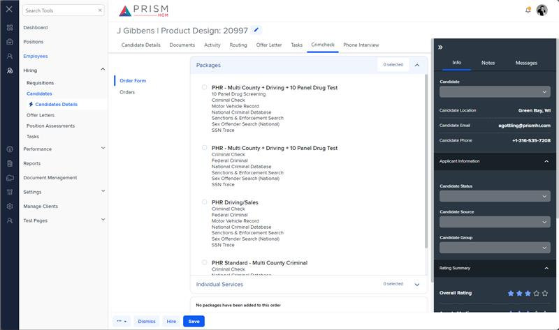

# Markup Audit Report

## Table of Contents

1. [File Paths](#file-paths)
2. [Unique Tags in Each File](#unique-tags-in-each-file)
3. [Differences in Markup Structure](#differences-in-markup-structure)
   - [Header Section](#header-section)
   - [Tabs and Content](#tabs-and-content)
   - [Modals](#modals)
4. [Summary](#summary)

## File Paths

- `crimcheck.component.html` belongs to the "AgileHR" project.
- `crimcheck.component.html-1` belongs to the "Mocks-Talent-ng" project.

## Unique Tags in Each File

- **crimcheck.component.html (AgileHR):**

  - `page-title`

- **crimcheck.component.html-1 (Mocks-Talent-ng):**
  - `ejs-tab`, `e-tabitems`, `e-tabitem`, `ng-template`, `app-of`, `app-og`, `modal-drawer`, `button-base`

## Differences in Markup Structure

### Header Section

- **AgileHR:**

  - Uses `<page-title [title]="'Crimcheck'"></page-title>` for the header.

- **Mocks-Talent-ng:**
  - Does not include a header section.

### Tabs and Content

- **AgileHR:**

  - Does not include any tab components.

- **Mocks-Talent-ng:**
  - Uses `ejs-tab` with `e-tabitems` and `e-tabitem` for tabbed content.
  - Includes `ng-template` elements for tab content, with `app-of` and `app-og` components.

### Modals

- **AgileHR:**

  - Does not include any modal components.

- **Mocks-Talent-ng:**
  - Includes a `modal-drawer` component with a `ng-template` for modal content.
  - Uses `button-base` components within the modal for "Cancel" and "Add" actions.

## Summary

The primary differences between the two files are in the use of header sections, tabs, and modals. The `crimcheck.component.html` file from "AgileHR" includes a header section with `page-title` and does not include any tabs or modals. The `crimcheck.component.html-1` file from "Mocks-Talent-ng" uses `ejs-tab` for tabbed content, includes `ng-template` elements for tab content, and has a `modal-drawer` component with `button-base` components for actions.

Additional Notes:
crimcheck.component in AgileHR only has a page-title, which means it is either not being used or not yet implemented. The component has a full implementation in the mocks site.

## Prod Screenshots

Not Found

## Mocks Screenshots

## Prod URL

Not Found

## Mocks URL

[link to the page in mock](http://localhost:4340/candidates/:id/h-can-deet)
