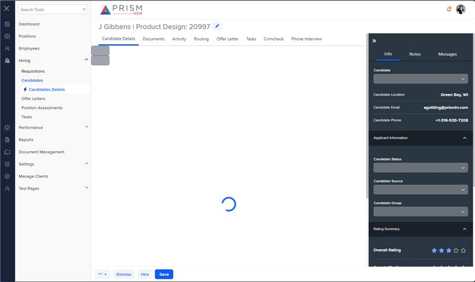

# Markup Audit Report

## Table of Contents

1. [File Paths](#file-paths)
2. [Unique Tags in Each File](#unique-tags-in-each-file)
3. [Differences in Markup Structure](#differences-in-markup-structure)
   - [Header Section](#header-section)
   - [PDF Viewer](#pdf-viewer)
   - [Form Fields](#form-fields)
   - [Toolbar](#toolbar)
4. [Summary](#summary)

## File Paths

- `details.component.html` belongs to the "AgileHR" project.
- `h-can-info.component.html` belongs to the "Mocks-Talent-ng" project.

## Unique Tags in Each File

- **details.component.html (AgileHR):**

  - `page-title`, `button-base`, `layout-drawers`, `layout-drawer-center`, `message-panel`, `modal-base`, `settings-table`, `settings-row`, `input-text`, `input-email`, `input-phone`, `input-dropdown`, `ejs-maskedtextbox`, `ng-template`

- **h-can-info.component.html (Mocks-Talent-ng):**
  - `ejs-pdfviewer`, `ejs-toolbar`, `e-items`, `e-item`

## Differences in Markup Structure

### Header Section

- **AgileHR:**

  - Uses `<page-title [title]="title"></page-title>` for the header.
  - Includes a `button-base` component for editing with a tooltip, icon, and visibility control.

- **Mocks-Talent-ng:**
  - Does not include a header section.

### PDF Viewer

- **AgileHR:**

  - Uses an `iframe` to display the PDF document if `documentPath` is available.
  - Includes conditional rendering using `@if` for displaying the PDF or a message panel.

- **Mocks-Talent-ng:**
  - Uses `ejs-pdfviewer` for displaying the PDF document with properties like `serviceUrl`, `documentPath`, and `enableToolbar`.

### Form Fields

- **AgileHR:**

  - Includes a form within a `modal-base` component for editing candidate details.
  - Uses `settings-table` and `settings-row` components for form layout.
  - Includes various input components like `input-text`, `input-email`, `input-phone`, `input-dropdown`, and `ejs-maskedtextbox`.

- **Mocks-Talent-ng:**
  - Does not include any form fields.

### Toolbar

- **AgileHR:**

  - Does not include a toolbar.

- **Mocks-Talent-ng:**
  - Includes an `ejs-toolbar` component with `e-items` and `e-item` components for zoom and fit-to-page functionalities.

## Summary

The primary differences between the two files are in the use of header sections, PDF viewers, form fields, and toolbars. The `details.component.html` file from "AgileHR" includes a header section with `page-title` and `button-base`, uses an `iframe` for displaying the PDF document with conditional rendering, and includes a form for editing candidate details using various input components. The `h-can-info.component.html` file from "Mocks-Talent-ng" uses `ejs-pdfviewer` for displaying the PDF document and includes an `ejs-toolbar` for zoom and fit-to-page functionalities. It does not include a header section or form fields.

## Prod Screenshots

## Mocks Screenshots

## Prod URL

[link to the page in prod](https://piedpiper.agilehr.net/hiring/candidates/candidate_01j2h56ecpe0wbkf1d21z8w2fj/details)

## Mocks URL

[link to the page in mock](http://localhost:4340/candidates/:id/h-can-deet)
