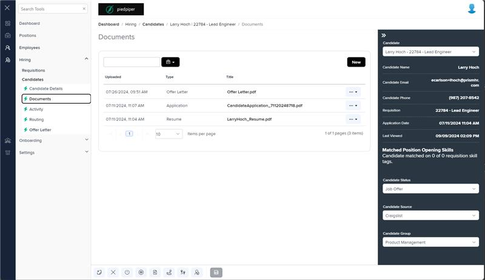
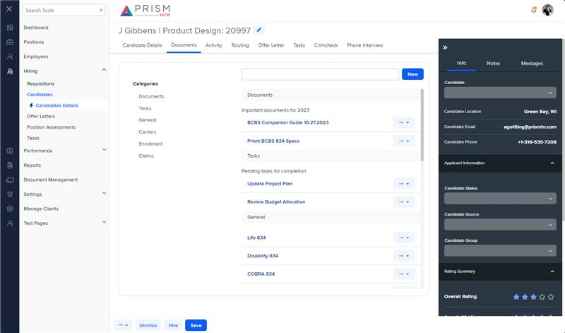

# Markup Audit Report

## Table of Contents

1. [File Paths](#file-paths)
2. [Unique Tags in Each File](#unique-tags-in-each-file)
3. [Differences in Markup Structure](#differences-in-markup-structure)
   - [Header Section](#header-section)
   - [Grid Component](#grid-component)
   - [Toolbar](#toolbar)
   - [Modals](#modals)
4. [Summary](#summary)

## File Paths

- `documents.component.html` belongs to the "AgileHR" project.
- `h-can-docs.component.html` belongs to the "Mocks-Talent-ng" project.

## Unique Tags in Each File

- **documents.component.html (AgileHR):**

  - `page-title`, `talent-grid`, `e-columns`, `e-column`, `ejs-tooltip`, `input-dropdown`, `input-dropdown-multi`, `ng-template`

- **h-can-docs.component.html (Mocks-Talent-ng):**
  - `document-library`, `button-new`, `input-file`

## Differences in Markup Structure

### Header Section

- **AgileHR:**

  - Uses `<page-title [title]="'Documents'"></page-title>` for the header.

- **Mocks-Talent-ng:**
  - Does not include a header section.

### Grid Component

- **AgileHR:**

  - Uses `talent-grid` with various properties and columns defined using `e-columns` and `e-column`.
  - Includes custom templates for columns using `ng-template` and `ejs-tooltip`.

- **Mocks-Talent-ng:**
  - Uses `document-library` with properties like `reportsObject`, `categoryDropdownItems`, and `fileType`.

### Toolbar

- **AgileHR:**

  - Does not include a custom toolbar.

- **Mocks-Talent-ng:**
  - Includes a `button-new` component with a tooltip and click event for adding a new document.

### Modals

- **AgileHR:**

  - Includes multiple `modal-base` components for different actions (e.g., upload, delete).
  - Uses `ng-template` elements for modal content.
  - Includes a `settings-table` with `settings-row` components for file upload and document type selection.

- **Mocks-Talent-ng:**
  - Includes a `modal-base` component for adding a new document.
  - Uses `ng-template` elements for modal content.
  - Includes a `settings-table` with a `settings-row` component for file upload using `input-file`.

## Summary

The primary differences between the two files are in the use of header sections, grid components, toolbars, and modals. The `documents.component.html` file from "AgileHR" includes a header section with `page-title`, uses `talent-grid` for the grid, and includes multiple `modal-base` components for different actions. It also includes `settings-table` and `settings-row` components for file upload and document type selection. The `h-can-docs.component.html` file from "Mocks-Talent-ng" uses `document-library` for the grid and includes a `button-new` component for adding a new document. It also includes a `modal-base` component for adding a new document with a `settings-table` and `settings-row` for file upload using `input-file`.

## Prod Screenshots

## Mocks Screenshots

## Prod URL

[link to the page in prod](https://piedpiper.agilehr.net/hiring/candidates/candidate_01j2h56ecpe0wbkf1d21z8w2fj/documents)

## Mocks URL

[link to the page in mock](http://localhost:4340/candidates/:id/h-can-deet)
