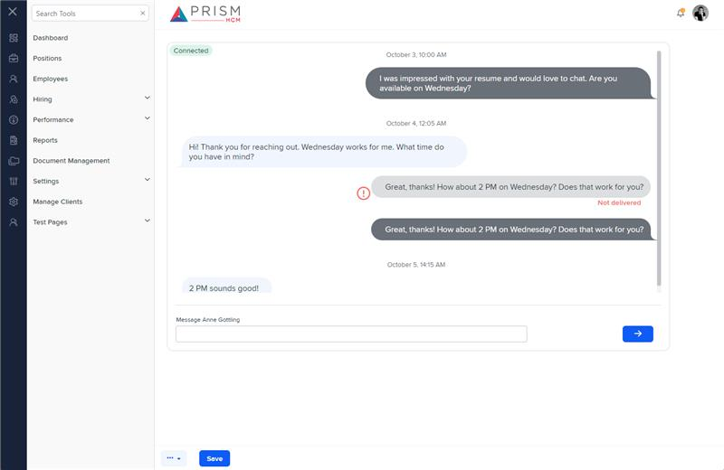

# Markup Audit Report

## Table of Contents

1. [File Paths](#file-paths)
2. [Unique Tags in Each File](#unique-tags-in-each-file)
3. [Differences in Markup Structure](#differences-in-markup-structure)
   - [Header Section](#header-section)
   - [Messaging Tool](#messaging-tool)
4. [Summary](#summary)

## File Paths

- `messaging.component.html` belongs to the "AgileHR" project.
- `h-can-mess.component.html` belongs to the "Mocks-Talent-ng" project.

## Unique Tags in Each File

- **messaging.component.html (AgileHR):**

  - `page-title`

- **h-can-mess.component.html (Mocks-Talent-ng):**
  - `messaging-tool`

## Differences in Markup Structure

### Header Section

- **AgileHR:**

  - Uses `<page-title [title]="'Messaging'"></page-title>` for the header.

- **Mocks-Talent-ng:**
  - Does not include a header section.

### Messaging Tool

- **AgileHR:**

  - Does not include a messaging tool component.

- **Mocks-Talent-ng:**
  - Uses `<messaging-tool></messaging-tool>` for the messaging functionality.

## Summary

The primary differences between the two files are in the use of header sections and messaging tools. The `messaging.component.html` file from "AgileHR" includes a header section with `page-title` and does not include a messaging tool component. The `h-can-mess.component.html` file from "Mocks-Talent-ng" uses `messaging-tool` for the messaging functionality and does not include a header section.

Additional Notes:
messaging.component in AgileHR only has a page-title, which means it is either not being used or not yet implemented. The component has a full implementation in the mocks site.

## Prod Screenshots

Not Found

## Mocks Screenshots

## Prod URL

Not Found

## Mocks URL

[link to the page in mock](http://localhost:4340/candidates/:id/h-can-mess)
