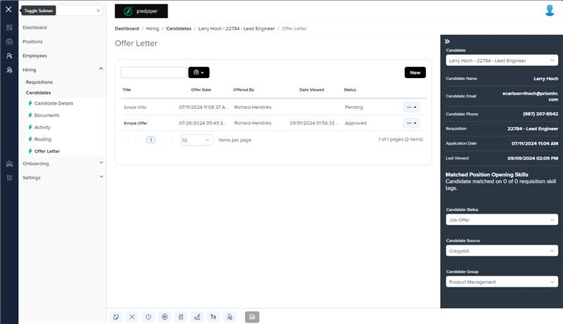

# Markup Audit Report

## Table of Contents

1. [File Paths](#file-paths)
2. [Unique Tags in Each File](#unique-tags-in-each-file)
3. [Differences in Markup Structure](#differences-in-markup-structure)
   - [Header Section](#header-section)
   - [Grid Component](#grid-component)
   - [Toolbar](#toolbar)
   - [Modals](#modals)
4. [Summary](#summary)

## File Paths

- `offer-letter.component.html` belongs to the "AgileHR" project.
- `h-can-offer.component.html` belongs to the "Mocks-Talent-ng" project.

## Unique Tags in Each File

- **offer-letter.component.html (AgileHR):**

  - `page-title`, `talent-grid`, `e-columns`, `e-column`, `ng-template`, `ejs-tooltip`, `modal-base`, `modal-drawer`, `talent-offer-letter-modal`

- **h-can-offer.component.html (Mocks-Talent-ng):**
  - `grid-filters`, `input-text`, `button-dropdown-grid`, `button-new`, `ejs-grid`, `e-columns`, `e-column`

## Differences in Markup Structure

### Header Section

- **AgileHR:**

  - Uses `<page-title [title]="'Offer Letter'"></page-title>` for the header.

- **Mocks-Talent-ng:**
  - Does not include a header section.

### Grid Component

- **AgileHR:**

  - Uses `talent-grid` with various properties and columns defined using `e-columns` and `e-column`.
  - Includes custom templates for columns using `ng-template` and `ejs-tooltip`.

- **Mocks-Talent-ng:**
  - Uses `ejs-grid` within a `grid-filters` component, with columns defined using `e-columns` and `e-column`.
  - Includes custom templates for columns using `ng-template`.

### Toolbar

- **AgileHR:**

  - Does not include a custom toolbar.

- **Mocks-Talent-ng:**
  - Includes a custom toolbar within `grid-filters`, using `input-text` for search, `button-dropdown-grid` for options, and `button-new` for adding a new offer.

### Modals

- **AgileHR:**

  - Includes multiple `modal-base` components for different actions (e.g., resend email, delete, view rejection notes).
  - Uses `ng-template` elements for modal content.
  - Includes a `modal-drawer` component for adding a new offer with a corresponding `ng-template` for the modal content.

- **Mocks-Talent-ng:**
  - Does not include any modal components.

## Summary

The primary differences between the two files are in the use of header sections, grid components, toolbars, and modals. The `offer-letter.component.html` file from "AgileHR" includes a header section with `page-title`, uses `talent-grid` for the grid, and includes multiple `modal-base` components for different actions. It also includes a `modal-drawer` component for adding a new offer. The `h-can-offer.component.html` file from "Mocks-Talent-ng" uses `ejs-grid` within a `grid-filters` component and includes a custom toolbar. It does not include any modal components.

## Prod Screenshots

## Mocks Screenshots

## Prod URL

[link to the page in prod](https://piedpiper.agilehr.net/hiring/candidates/candidate_01j2h56ecpe0wbkf1d21z8w2fj/offer-letter)

## Mocks URL

[link to the page in mock](http://localhost:4340/candidates/:id/h-can-deet)
