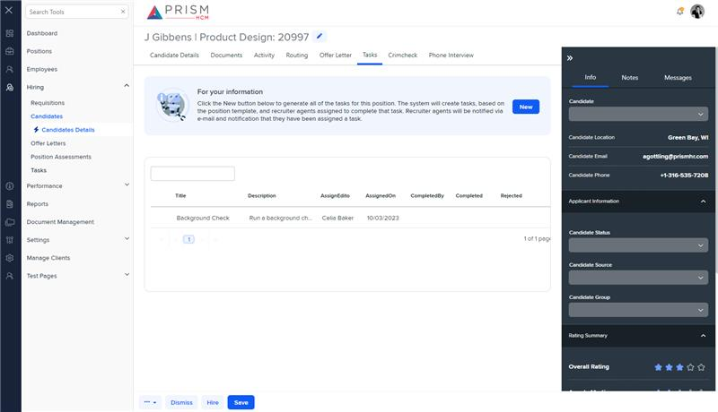

# Markup Audit Report

## Table of Contents

1. [File Paths](#file-paths)
2. [Unique Tags in Each File](#unique-tags-in-each-file)
3. [Differences in Markup Structure](#differences-in-markup-structure)
   - [Header Section](#header-section)
   - [Layout and Drawers](#layout-and-drawers)
   - [Tabs and Content](#tabs-and-content)
   - [Message Panel](#message-panel)
   - [Dropdown](#dropdown)
4. [Summary](#summary)

## File Paths

- `tasks.component.html` belongs to the "AgileHR" project.
- `h-tasks.component.html` belongs to the "Mocks-Talent-ng" project.

## Unique Tags in Each File

- **tasks.component.html (AgileHR):**

  - `page-title`

- **h-tasks.component.html (Mocks-Talent-ng):**
  - `layout-drawers`, `layout-drawer-center`, `layout-drawer-right`, `message-panel`, `ejs-tab`, `e-tabitems`, `e-tabitem`, `ng-template`, `app-ht-deets`, `layout-toolbox`, `input-dropdown`

## Differences in Markup Structure

### Header Section

- Both files use `<page-title [title]="'Tasks'"></page-title>` for the header.

### Layout and Drawers

- **AgileHR:**

  - Does not include any layout or drawer components.

- **Mocks-Talent-ng:**
  - Uses `layout-drawers` with `layout-drawer-center` and `layout-drawer-right` components to organize the main content and side drawer.

### Tabs and Content

- **AgileHR:**

  - Does not include any tab components.

- **Mocks-Talent-ng:**
  - Uses `ejs-tab` with `e-tabitems` and `e-tabitem` for tabbed content.
  - Includes `ng-template` elements for tab content, with `app-ht-deets` components.

### Message Panel

- **AgileHR:**

  - Does not include a message panel component.

- **Mocks-Talent-ng:**
  - Includes a `message-panel` component with attributes `title`, `content`, `state`, and `config`.

### Dropdown

- **AgileHR:**

  - Does not include any dropdown components.

- **Mocks-Talent-ng:**
  - Includes an `input-dropdown` component within a `layout-toolbox` in the right drawer.

## Summary

The primary differences between the two files are in the use of layout and drawer components, tabs, message panels, and dropdowns. The `tasks.component.html` file from "AgileHR" includes only a header section with `page-title`. The `h-tasks.component.html` file from "Mocks-Talent-ng" uses `layout-drawers` for organizing the main content and side drawer, includes `ejs-tab` for tabbed content, a `message-panel` for displaying information, and an `input-dropdown` within a `layout-toolbox` in the right drawer.

Additional Notes:
messaging.component in AgileHR only has a page-title, which means it is either not being used or not yet implemented. The component has a full implementation in the mocks site.

## Prod Screenshots

Not Found

## Mocks Screenshots

## Prod URL

Not Found

## Mocks URL

[link to the page in mock](http://localhost:4340/candidates/:id/h-can-deet)
