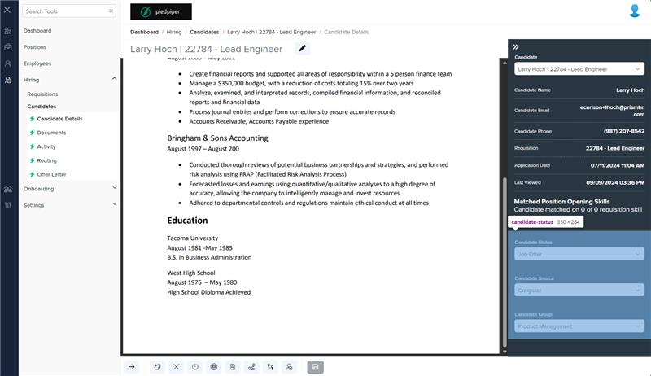
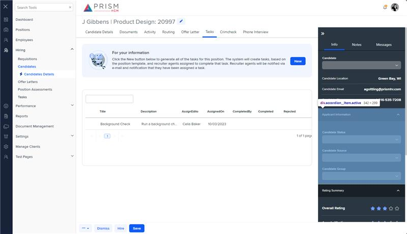

# Markup Audit Report

## Table of Contents

1. [File Paths](#file-paths)
2. [Unique Tags in Each File](#unique-tags-in-each-file)
3. [Differences in Markup Structure](#differences-in-markup-structure)
   - [Form Group](#form-group)
   - [Input Dropdowns](#input-dropdowns)
4. [Summary](#summary)

## File Paths

- `candidate-status.component.html` belongs to the "AgileHR" project.
- The provided markup snippet belongs to the "Mocks-Talent-ng" project.

## Unique Tags in Each File

- **candidate-status.component.html (AgileHR):**

  - `fieldset`, `div`, `input-dropdown`

- **Mocks-Talent-ng:**
  - `input-dropdown`

## Differences in Markup Structure

### Form Group

- **AgileHR:**

  - Uses a `fieldset` with a `[formGroup]` directive to group form controls and manage form state.
  - Contains a `div` with `formGroupName="candidateStatus"` to further group related form controls.

- **Mocks-Talent-ng:**
  - Does not include any form group or fieldset elements.

### Input Dropdowns

- **AgileHR:**

  - Uses `input-dropdown` components with additional attributes:
    - `[ngClass]="{'disabled-input': candidateHired}"`
    - `[data]="statusesList"`, `[data]="sourcesList"`, `[data]="groupsList"`
    - `placeholder="Candidate Status"`, `placeholder="Candidate Source"`, `placeholder="Candidate Group"`
    - `[form]="candidateInformationForm.get('candidateStatus')"`
    - `formControlName="candidateStatusTypeId"`, `formControlName="candidateSourceTypeId"`, `formControlName="candidateGroupTypeId"`

- **Mocks-Talent-ng:**
  - Uses `input-dropdown` components with minimal attributes:
    - `[data]="data"`
    - `placeholder="'Candidate Status'"`, `placeholder="'Candidate Source'"`, `placeholder="'Candidate Group'"`

## Summary

The primary differences between the two files are in the use of form groups and the attributes of the `input-dropdown` components. The `candidate-status.component.html` file from "AgileHR" uses a `fieldset` with a `[formGroup]` directive and a `div` with `formGroupName` to group related form controls. It also includes `input-dropdown` components with additional attributes for data binding, form control binding, and conditional styling. The provided markup snippet from "Mocks-Talent-ng" uses `input-dropdown` components with minimal attributes and does not include any form group or fieldset elements.

Additional Notes:
The implementation of candidate-status in the mocks site is markup of an accordion item inside of the hc-drawer compnoent and not its own standalone component.

## Prod Screenshots

## Mocks Screenshots

## Prod URL

[link to the page in prod](https://piedpiper.agilehr.net/hiring/candidates/candidate_01j2h56ecpe0wbkf1d21z8w2fj/details)

## Mocks URL

[link to the page in mock](http://localhost:4340/candidates/:id/h-can-deet)
