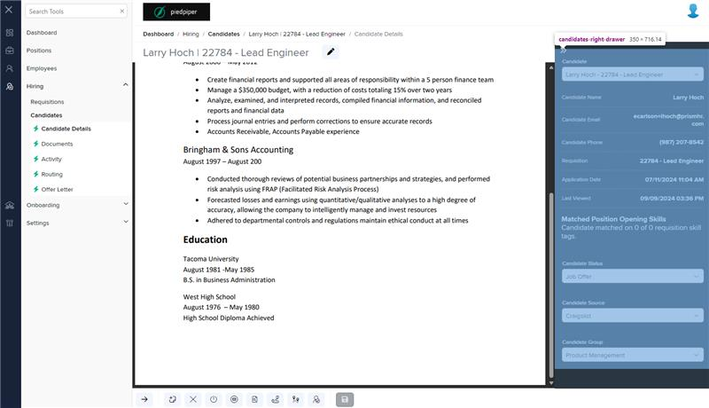
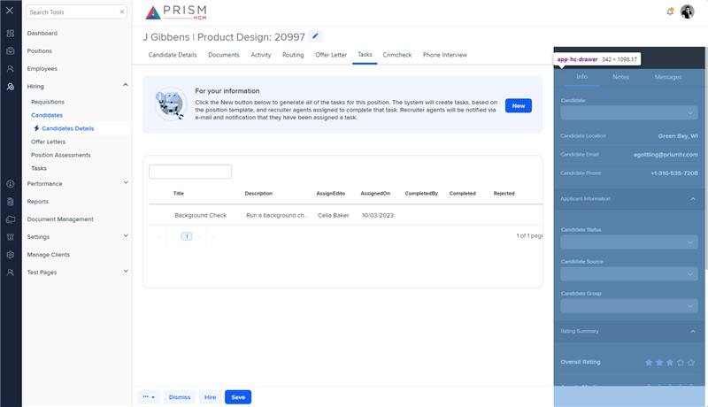

# Markup Audit Report

## Table of Contents

1. [File Paths](#file-paths)
2. [Unique Tags in Each File](#unique-tags-in-each-file)
3. [Differences in Markup Structure](#differences-in-markup-structure)
   - [Header Section](#header-section)
   - [Input Dropdowns](#input-dropdowns)
   - [Candidate Information](#candidate-information)
   - [Accordion Sections](#accordion-sections)
   - [Modals](#modals)
4. [Summary](#summary)

## File Paths

- `candidates-right-drawer.component.html` belongs to the "AgileHR" project.
- `hc-drawer.component.html` belongs to the "Mocks-Talent-ng" project.

## Unique Tags in Each File

- **candidates-right-drawer.component.html (AgileHR):**

  - `candidate-status`

- **hc-drawer.component.html (Mocks-Talent-ng):**
  - `ejs-tab`, `e-tabitems`, `e-tabitem`, `accordion`, `accordion-item`, `input-multiline`, `input-checkbox`, `button-base`, `toolbox-message`, `modal-base`, `ng-template`

## Differences in Markup Structure

### Header Section

- **AgileHR:**

  - Does not include a header section.

- **Mocks-Talent-ng:**
  - Uses `<ejs-tab>` with `<e-tabitems>` and `<e-tabitem>` for tabbed content.

### Input Dropdowns

- **AgileHR:**

  - Uses `input-dropdown` with attributes:
    - `[data]="candidateList"`
    - `[placeholder]="'Candidate'"`
    - `[enableFiltering]="true"`
    - `[filtering]="listFiltering"`
    - `[callback]="selectCandidate"`
    - `[form]="form"`
    - `formControlName="typeId"`

- **Mocks-Talent-ng:**
  - Uses `input-dropdown` with attributes:
    - `[data]="data"`
    - `[value]="value"`
    - `[enableFiltering]="true"`
    - `[placeholder]="'Candidate '"`

### Candidate Information

- **AgileHR:**

  - Displays candidate information using `div` elements with `drawers__value` class:
    - Candidate Name, Email, Phone, Requisition, Application Date, Last Viewed, Matched Position Opening Skills

- **Mocks-Talent-ng:**
  - Displays candidate information using `div` elements with `drawers__value` class:
    - Candidate Location, Email, Phone

### Accordion Sections

- **AgileHR:**

  - Does not include any accordion sections.

- **Mocks-Talent-ng:**
  - Uses `accordion` with `accordion-item` for various sections:
    - Applicant Information, Rating Summary, Candidate Scores, Job Skills Match, Add a Note, Notes, Add a Message, Messages

### Modals

- **AgileHR:**

  - Includes a commented-out section for credit score information.
  - Uses `candidate-status` component.

- **Mocks-Talent-ng:**
  - Uses `modal-base` with `ng-template` for delete confirmation modal.
  - Includes `button-base` components for actions within the modal.

## Summary

The primary differences between the two files are in the use of header sections, input dropdowns, candidate information display, accordion sections, and modals. The `candidates-right-drawer.component.html` file from "AgileHR" uses `input-dropdown` with more attributes for filtering and form control, displays detailed candidate information, and includes a `candidate-status` component. The `hc-drawer.component.html` file from "Mocks-Talent-ng" uses `ejs-tab` for tabbed content, `accordion` for various sections, and `modal-base` for delete confirmation. It also includes `button-base` components for actions within the modal.# Markup Audit Report

## Table of Contents

1. [File Paths](#file-paths)
2. [Unique Tags in Each File](#unique-tags-in-each-file)
3. [Differences in Markup Structure](#differences-in-markup-structure)
   - [Header Section](#header-section)
   - [Input Dropdowns](#input-dropdowns)
   - [Candidate Information](#candidate-information)
   - [Accordion Sections](#accordion-sections)
   - [Modals](#modals)
4. [Summary](#summary)

## File Paths

- `candidates-right-drawer.component.html` belongs to the "AgileHR" project.
- `hc-drawer.component.html` belongs to the "Mocks-Talent-ng" project.

## Unique Tags in Each File

- **candidates-right-drawer.component.html (AgileHR):**

  - `candidate-status`

- **hc-drawer.component.html (Mocks-Talent-ng):**
  - `ejs-tab`, `e-tabitems`, `e-tabitem`, `accordion`, `accordion-item`, `input-multiline`, `input-checkbox`, `button-base`, `toolbox-message`, `modal-base`, `ng-template`

## Differences in Markup Structure

### Header Section

- **AgileHR:**

  - Does not include a header section.

- **Mocks-Talent-ng:**
  - Uses `<ejs-tab>` with `<e-tabitems>` and `<e-tabitem>` for tabbed content.

### Input Dropdowns

- **AgileHR:**

  - Uses `input-dropdown` with attributes:
    - `[data]="candidateList"`
    - `[placeholder]="'Candidate'"`
    - `[enableFiltering]="true"`
    - `[filtering]="listFiltering"`
    - `[callback]="selectCandidate"`
    - `[form]="form"`
    - `formControlName="typeId"`

- **Mocks-Talent-ng:**
  - Uses `input-dropdown` with attributes:
    - `[data]="data"`
    - `[value]="value"`
    - `[enableFiltering]="true"`
    - `[placeholder]="'Candidate '"`

### Candidate Information

- **AgileHR:**

  - Displays candidate information using `div` elements with `drawers__value` class:
    - Candidate Name, Email, Phone, Requisition, Application Date, Last Viewed, Matched Position Opening Skills

- **Mocks-Talent-ng:**
  - Displays candidate information using `div` elements with `drawers__value` class:
    - Candidate Location, Email, Phone

### Accordion Sections

- **AgileHR:**

  - Does not include any accordion sections.

- **Mocks-Talent-ng:**
  - Uses `accordion` with `accordion-item` for various sections:
    - Applicant Information, Rating Summary, Candidate Scores, Job Skills Match, Add a Note, Notes, Add a Message, Messages

### Modals

- **AgileHR:**

  - Includes a commented-out section for credit score information.
  - Uses `candidate-status` component.

- **Mocks-Talent-ng:**
  - Uses `modal-base` with `ng-template` for delete confirmation modal.
  - Includes `button-base` components for actions within the modal.

## Summary

The primary differences between the two files are in the use of header sections, input dropdowns, candidate information display, accordion sections, and modals. The `candidates-right-drawer.component.html` file from "AgileHR" uses `input-dropdown` with more attributes for filtering and form control, displays detailed candidate information, and includes a `candidate-status` component. The `hc-drawer.component.html` file from "Mocks-Talent-ng" uses `ejs-tab` for tabbed content, `accordion` for various sections, and `modal-base` for delete confirmation. It also includes `button-base` components for actions within the modal.

## Prod Screenshots

## Mocks Screenshots

## Prod URL

[link to the page in prod](https://piedpiper.agilehr.net/hiring/candidates/candidate_01j2h56ecpe0wbkf1d21z8w2fj/details)

## Mocks URL

[link to the page in mock](http://localhost:4340/candidates/:id/h-can-deet)
