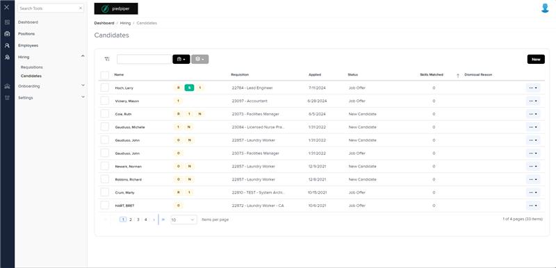
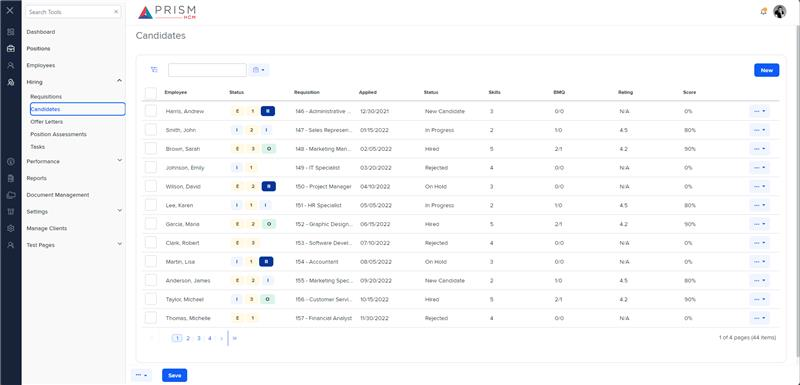

# Markup Audit Report

## Table of Contents

1. [File Paths](#file-paths)
2. [Unique Tags in Each File](#unique-tags-in-each-file)
3. [Differences in Markup Structure](#differences-in-markup-structure)
   - [Header Section](#header-section)
   - [Grid Component](#grid-component)
   - [Filters](#filters)
   - [Modals](#modals)
   - [Footer Section](#footer-section)
4. [Summary](#summary)

## File Paths

- `candidates.component.html` belongs to the "AgileHR" project.
- `candidates.component.html-1` belongs to the "Mocks-Talent-ng" project.

## Unique Tags in Each File

- **candidates.component.html (AgileHR):**

  - `talent-grid`, `input-dropdown-multi`, `e-columns`, `e-column`, `ejs-tooltip`, `modal-base`, `talent-route-selected`, `modal-drawer`, `talent-email-selected`, `talent-dismiss-candidate`, `talent-create-new-candidate`

- **candidates.component.html-1 (Mocks-Talent-ng):**
  - `grid-filters`, `input-text`, `button-dropdown-grid`, `popover`, `ejs-grid`, `input-file`, `input-phone`

## Differences in Markup Structure

### Header Section

- Both files use `<page-title [title]="'Candidates'"></page-title>` for the header.

### Grid Component

- **AgileHR:**

  - Uses `talent-grid` with various properties and events.
  - Includes `e-columns` and `e-column` for defining grid columns.
  - Uses `ejs-tooltip` for tooltips within grid columns.

- **Mocks-Talent-ng:**
  - Uses `ejs-grid` with properties like `enableAdaptiveUI`, `rowRenderingMode`, `allowPaging`, and `loadingIndicator`.
  - Includes `e-columns` and `e-column` for defining grid columns.
  - Uses `popover` for tooltips within grid columns.

### Filters

- **AgileHR:**

  - Uses `input-dropdown-multi` within a `ng-template` for filters.
  - Includes filters for requisition status, requisitions, locations, candidate status, sent status, source, and groups.

- **Mocks-Talent-ng:**
  - Uses `grid-filters` with `leftTemplate`, `centerTemplate`, and `centerHeaderTemplate` for filters.
  - Includes `input-dropdown-multi` for types, requisitions, and locations.
  - Uses `input-text` for search and `button-dropdown-grid` for table tools.

### Modals

- **AgileHR:**

  - Uses `modal-base` with `ng-template` for various modals.
  - Includes modals for resume, dismiss candidate, change requisitions, change status, candidate routed bulk action, and new candidate.
  - Uses `talent-route-selected`, `talent-email-selected`, `talent-dismiss-candidate`, and `talent-create-new-candidate` components within modals.
  - Uses `modal-drawer` for full-page modals.

- **Mocks-Talent-ng:**
  - Uses `modal-base` with `ng-template` for various modals.
  - Includes modals for new user and new candidate.
  - Uses `settings-table` and `settings-row` components within modals.
  - Includes `input-file` for file uploads and `input-phone` for phone number inputs within modals.

### Footer Section

- **AgileHR:**

  - Does not include a specific footer section.

- **Mocks-Talent-ng:**
  - Includes a custom toolbar within `centerHeaderTemplate` with `input-text` for search and `button-dropdown-grid` for table tools.
  - Includes `button-base` for adding a new candidate.

## Summary

The primary differences between the two files are in the use of grid components, filters, modals, and footer sections. The `candidates.component.html` file from "AgileHR" uses `talent-grid` for the grid, `input-dropdown-multi` for filters, and `modal-base` with various components for modals. The `candidates.component.html-1` file from "Mocks-Talent-ng" uses `ejs-grid` for the grid, `grid-filters` for filters, and `modal-base` with `settings-table` and `settings-row` for modals. It also includes a custom toolbar with search and table tools.

## Prod Screenshots

## Mocks Screenshots

## Prod URL

[link to the page in prod](https://piedpiper.agilehr.net/hiring/candidates#page=1&pageSize=10&sortCol=skillsMatched)

## Mocks URL

[link to the page in mock](http://localhost:4340/candidates)
