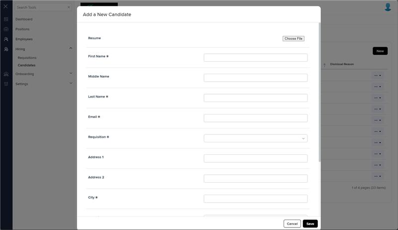
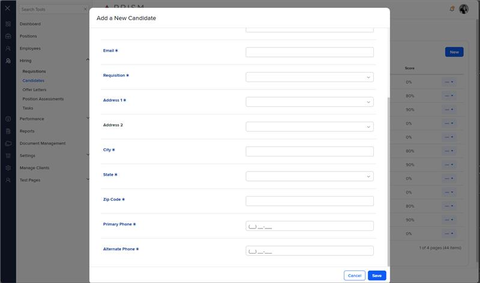

# Markup Audit Report

## Table of Contents

1. [File Paths](#file-paths)
2. [Unique Tags in Each File](#unique-tags-in-each-file)
3. [Differences in Markup Structure](#differences-in-markup-structure)
   - [Conditional Rendering](#conditional-rendering)
   - [Form Fields](#form-fields)
   - [Modals](#modals)
4. [Summary](#summary)

## File Paths

- `create-new-candidate.component.html` belongs to the "AgileHR" project.
- `candidates.component.html` belongs to the "Mocks-Talent-ng" project.

## Unique Tags in Each File

- **create-new-candidate.component.html (AgileHR):**

  - `@if`, `input-email`, `ejs-maskedtextbox`, `input-phone`

- **candidates.component.html (Mocks-Talent-ng):**
  - `input-file`

## Differences in Markup Structure

### Conditional Rendering

- **AgileHR:**

  - Uses `@if` directive to conditionally render the preloader and form based on `isSavingOrParsing`.

- **Mocks-Talent-ng:**
  - Does not use any conditional rendering directives.

### Form Fields

- **AgileHR:**

  - Includes form fields for `Resume`, `First Name`, `Middle Name`, `Last Name`, `Email`, `Requisition`, `Address 1`, `Address 2`, `City`, `State`, `Zip Code`, `Primary Phone`, and `Alternate Phone`.
  - Uses `input-email` for the email field.
  - Uses `ejs-maskedtextbox` for the zip code field.
  - Uses `input-phone` for phone fields.

- **Mocks-Talent-ng:**
  - Includes form fields for `Resume`, `First Name`, `Middle Name`, `Last Name`, `Email`, `Requisition`, `Address 1`, `Address 2`, `City`, `State`, `Zip Code`, `Primary Phone`, and `Alternate Phone`.
  - Uses `input-file` for the resume field.
  - Uses `input-text` for the email and zip code fields.
  - Uses `input-phone` for phone fields.

### Modals

- **AgileHR:**

  - Includes a `modal-base` component for value override warning with a corresponding `ng-template` for the modal content.

- **Mocks-Talent-ng:**
  - Includes a `modal-base` component for creating a new candidate with a corresponding `ng-template` for the modal content.

## Summary

The primary differences between the two files are in the use of conditional rendering, form fields, and modals. The `create-new-candidate.component.html` file from "AgileHR" uses `@if` for conditional rendering, includes specific components like `input-email`, `ejs-maskedtextbox`, and `input-phone` for form fields, and has a modal for value override warning. The `candidates.component.html` file from "Mocks-Talent-ng" uses `input-file` for the resume field, `input-text` for the email and zip code fields, and includes a modal for creating a new candidate.

Additional Notes:
create-new-candidate.component in AgileHR is the content for a modal window and corresponds to a modal inside candidates.component in mocks-talent-ng and not the whole file.

## Prod Screenshots

## Mocks Screenshots

## Prod URL

[link to the page in prod](https://piedpiper.agilehr.net/hiring/candidates#page=1&pageSize=10&sortCol=skillsMatched)

## Mocks URL

[link to the page in mock](http://localhost:4340/candidates)
