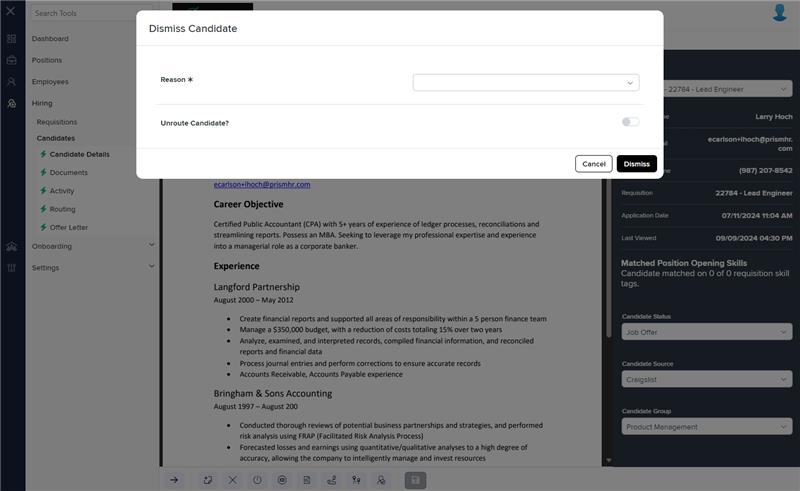
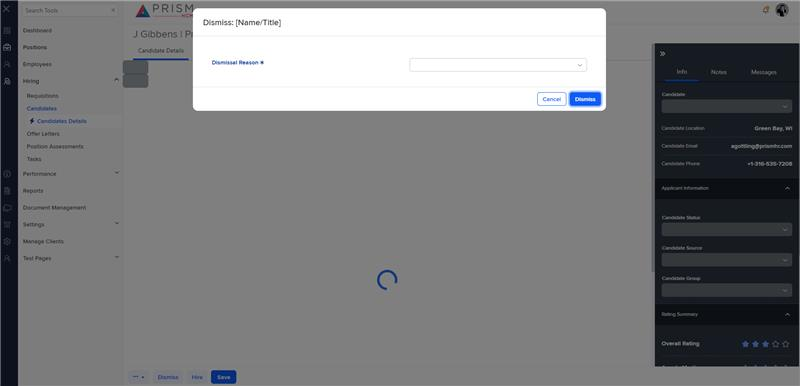

# Markup Audit Report

## Table of Contents

1. [File Paths](#file-paths)
2. [Unique Tags in Each File](#unique-tags-in-each-file)
3. [Differences in Markup Structure](#differences-in-markup-structure)
   - [Form Group](#form-group)
   - [Input Dropdowns](#input-dropdowns)
   - [Toggle Switch](#toggle-switch)
   - [Modal Content](#modal-content)
4. [Summary](#summary)

## File Paths

- `dismiss-candidate.component.html` belongs to the "AgileHR" project.
- The markup under the `<!-- dismiss -->` comment in `h-can-deet.component.html` belongs to the "Mocks-Talent-ng" project.

## Unique Tags in Each File

- **dismiss-candidate.component.html (AgileHR):**

  - `div`, `settings-row`, `input-dropdown`, `toggle-switch`

- **h-can-deet.component.html (Mocks-Talent-ng):**
  - `modal-base`, `ng-template`, `settings-table`

## Differences in Markup Structure

### Form Group

- **AgileHR:**

  - Uses a `div` with a `[formGroup]` directive to group form controls and manage form state.
  - Uses `@if` directive to conditionally render the form content based on `dismissCandidateForm`.

- **Mocks-Talent-ng:**
  - Does not include any form group or conditional rendering directives.

### Input Dropdowns

- **AgileHR:**

  - Uses `input-dropdown` within `settings-row` for selecting the dismissal reason.
  - Attributes include:
    - `[data]="dismissReasonList"`
    - `[form]="dismissCandidateForm"`
    - `formControlName="reasonId"`
    - `[required]="true"`
    - `[validation]="{ required: true }`
    - `[placeholder]="'Reason'"`

- **Mocks-Talent-ng:**
  - Uses `input-dropdown` within `settings-row` for selecting the dismissal reason.
  - Attributes include:
    - `[data]="data"`
    - `[placeholder]="'Dismissal Reason'"`

### Toggle Switch

- **AgileHR:**

  - Includes a `toggle-switch` within `settings-row` for the "Unroute Candidate?" option.
  - Attributes include:
    - `[form]="dismissCandidateForm"`
    - `formControlName="unrouteCandidates"`

- **Mocks-Talent-ng:**
  - Does not include a toggle switch component.

### Modal Content

- **AgileHR:**

  - Does not include any modal components.

- **Mocks-Talent-ng:**
  - Uses `modal-base` with `ng-template` for the modal content.
  - Includes `settings-table` and `settings-row` components within the modal.

## Summary

The primary differences between the two files are in the use of form groups, input dropdowns, toggle switches, and modal content. The `dismiss-candidate.component.html` file from "AgileHR" uses a `div` with a `[formGroup]` directive, includes conditional rendering with `@if`, and uses `input-dropdown` and `toggle-switch` components within `settings-row`. The markup under the `<!-- dismiss -->` comment in `h-can-deet.component.html` from "Mocks-Talent-ng" uses `modal-base` with `ng-template` for modal content, includes `settings-table` and `settings-row` components, and uses `input-dropdown` with minimal attributes.

## Prod Screenshots

## Mocks Screenshots

## Prod URL

[link to the page in prod](https://piedpiper.agilehr.net/hiring/candidates/candidate_01j2h56ecpe0wbkf1d21z8w2fj/details)

## Mocks URL

[link to the page in mock](http://localhost:4340/candidates/:id/h-can-deet)
