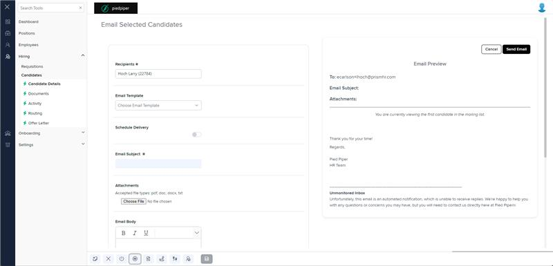

# Markup Audit Report

## Table of Contents

1. [File Paths](#file-paths)
2. [Unique Tags in Each File](#unique-tags-in-each-file)
3. [Differences in Markup Structure](#differences-in-markup-structure)
   - [Header Section](#header-section)
   - [Form Fields](#form-fields)
   - [Attachments Section](#attachments-section)
   - [Email Body Section](#email-body-section)
   - [Footer Section](#footer-section)
4. [Summary](#summary)

## File Paths

- `email-selected.component.html` belongs to the "AgileHR" project.
- The file from "Mocks-Talent-ng" is not available.

## Unique Tags in Each File

- **email-selected.component.html (AgileHR):**
  - `page-title`, `settings-table`, `settings-row`, `input-dropdown-multi`, `input-dropdown`, `toggle-switch`, `talent-datetimepicker`, `input-text`, `input-rich-text`, `button-base`

## Differences in Markup Structure

### Header Section

- **AgileHR:**
  - Uses `<page-title [title]="'Email Selected Candidates'"></page-title>` for the header.

### Form Fields

- **AgileHR:**
  - Uses `settings-table` and `settings-row` components to organize form fields.
  - Includes `input-dropdown-multi` for selecting recipients.
  - Includes `input-dropdown` for selecting email templates.
  - Uses `toggle-switch` for scheduling delivery.
  - Uses `talent-datetimepicker` for selecting date and time.
  - Uses `input-text` for entering the email subject.

### Attachments Section

- **AgileHR:**
  - Includes a section for attachments with an icon, file name display, and delete option.
  - Uses a standard `<input type="file">` for file uploads.

### Email Body Section

- **AgileHR:**
  - Uses `input-rich-text` for the email body with WYSIWYG editor functionality.

### Footer Section

- **AgileHR:**
  - Includes a footer section with `button-base` components for "Cancel" and "Send Email" actions.
  - Displays an email preview with details such as scheduled delivery, recipient, subject, and attachments.

## Summary

The primary differences in the markup structure of the `email-selected.component.html` file from "AgileHR" include the use of a header section with `page-title`, form fields organized using `settings-table` and `settings-row`, and various input components such as `input-dropdown-multi`, `input-dropdown`, `toggle-switch`, `talent-datetimepicker`, and `input-text`. The file also includes a section for attachments, an email body section with `input-rich-text`, and a footer section with `button-base` components for actions and an email preview. The file from "Mocks-Talent-ng" is not available for comparison.

## Prod Screenshots

## Mocks Screenshots

Not Found

## Prod URL

[link to the page in prod](https://piedpiper.agilehr.net/hiring/candidates/candidate_01j2h56ecpe0wbkf1d21z8w2fj/details)

## Mocks URL

[link to the page in mock](http://localhost:4340/candidates/:id/h-can-deet)
