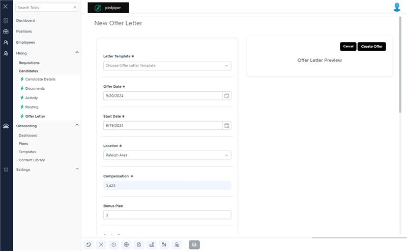

# Markup Audit Report

## Table of Contents

1. [File Paths](#file-paths)
2. [Unique Tags in Each File](#unique-tags-in-each-file)
3. [Differences in Markup Structure](#differences-in-markup-structure)
   - [Header Section](#header-section)
   - [Form Fields](#form-fields)
   - [Footer Section](#footer-section)
   - [Offer Letter Preview](#offer-letter-preview)
4. [Summary](#summary)

## File Paths

- `offer-letter-modal.component.html` belongs to the "AgileHR" project.
- The file from "Mocks-Talent-ng" is not available.

## Unique Tags in Each File

- **offer-letter-modal.component.html (AgileHR):**
  - `page-title`, `settings-table`, `settings-row`, `input-dropdown`, `input-datepicker`, `input-numeric`, `input-text`, `input-rich-text`, `toggle-switch`, `button-base`

## Differences in Markup Structure

### Header Section

- **AgileHR:**
  - Uses `<page-title [title]="'New Offer Letter'"></page-title>` for the header.

### Form Fields

- **AgileHR:**
  - Uses `settings-table` and `settings-row` components to organize form fields.
  - Includes `input-dropdown` for selecting letter template and location.
  - Includes `input-datepicker` for selecting offer date and start date.
  - Uses `input-numeric` for entering compensation and signing bonus.
  - Uses `input-text` for entering bonus plan and direct manager.
  - Uses `input-rich-text` for additional information with WYSIWYG editor functionality.
  - Includes `toggle-switch` for toggling SSN and DOB collection.

### Footer Section

- **AgileHR:**
  - Includes a footer section with `button-base` components for "Cancel" and "Create Offer" actions.

### Offer Letter Preview

- **AgileHR:**
  - Includes an offer letter preview section with a title and body.
  - Uses a `div` with `innerHTML` binding to display the preview HTML content.

## Summary

The primary differences in the markup structure of the `offer-letter-modal.component.html` file from "AgileHR" include the use of a header section with `page-title`, form fields organized using `settings-table` and `settings-row`, and various input components such as `input-dropdown`, `input-datepicker`, `input-numeric`, `input-text`, `input-rich-text`, and `toggle-switch`. The file also includes a footer section with `button-base` components for actions and an offer letter preview section with a title and body. The file from "Mocks-Talent-ng" is not available for comparison.

## Prod Screenshots

## Mocks Screenshots

Not Found

## Prod URL

[link to the page in prod](https://piedpiper.agilehr.net/hiring/candidates/candidate_01hzmtv2yke08v6kjemc6gdh6g/offer-letter)

## Mocks URL

Not Found
