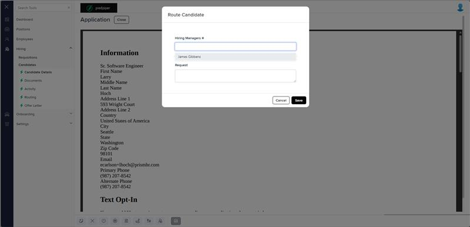

# Markup Audit Report

## Table of Contents

1. [File Paths](#file-paths)
2. [Unique Tags in Each File](#unique-tags-in-each-file)
3. [Differences in Markup Structure](#differences-in-markup-structure)
   - [Form Group](#form-group)
   - [Input Dropdowns](#input-dropdowns)
   - [Multiline Input](#multiline-input)
4. [Summary](#summary)

## File Paths

- `route-selected.component.html` belongs to the "AgileHR" project.
- The file from "Mocks-Talent-ng" is not available.

## Unique Tags in Each File

- **route-selected.component.html (AgileHR):**
  - `div`, `settings-row`, `input-dropdown-multi`, `input-multiline`

## Differences in Markup Structure

### Form Group

- **AgileHR:**
  - Uses a `div` with a conditional `@if` directive to render the form content based on `routeSelectedForm`.

### Input Dropdowns

- **AgileHR:**
  - Uses `input-dropdown-multi` within `settings-row` for selecting hiring managers.
  - Attributes include:
    - `[data]="hiringManagersList"`
    - `[form]="routeSelectedForm"`
    - `formControlName="employeeTypeIds"`
    - `[required]="true"`
    - `mode="Box"`
    - `ngDefaultControl`
    - `placeholder="Route To"`

### Multiline Input

- **AgileHR:**
  - Uses `input-multiline` within `settings-row` for entering route notes.
  - Attributes include:
    - `[placeholder]="'Route Notes'"`
    - `[form]="routeSelectedForm"`
    - `formControlName="notes"`

## Summary

The primary differences in the markup structure of the `route-selected.component.html` file from "AgileHR" include the use of a `div` with a conditional `@if` directive to render the form content, `input-dropdown-multi` within `settings-row` for selecting hiring managers, and `input-multiline` within `settings-row` for entering route notes. The file from "Mocks-Talent-ng" is not available for comparison.

## Prod Screenshots

## Mocks Screenshots

Not Found

## Prod URL

[link to the page in prod](https://piedpiper.agilehr.net/hiring/candidates/candidate_01j2h56ecpe0wbkf1d21z8w2fj/details)

## Mocks URL

Not Found
