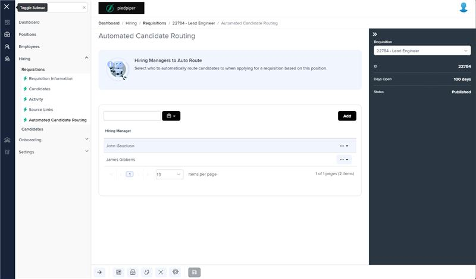
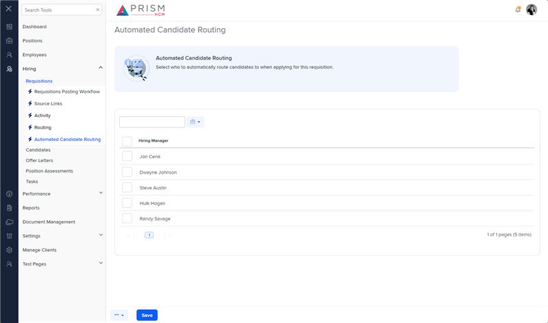

# Markup Audit Report

## Table of Contents

1. [File Paths](#file-paths)
2. [Differences in Markup Structure](#differences-in-markup-structure)
   - [Unique Tags in Each File](#unique-tags-in-each-file)
   - [Header Section](#header-section)
   - [Grid Component](#grid-component)
   - [Toolbar](#toolbar)
   - [Modals](#modals)
   - [Form Elements](#form-elements)
3. [Summary](#summary)

## File Paths

- `candidate-routing.component.html` belongs to the "AgileHR" project.
- `ac-routing.component.html` belongs to the "Mocks-Talent-ng" project.

## Differences in Markup Structure

### Unique Tags in Each File

- **candidate-routing.component.html (AgileHR):**

  - `talent-grid`, `modal-base`, `ng-template`, `settings-table`, `settings-row`, `input-dropdown-multi`

- **ac-routing.component.html (Mocks-Talent-ng):**
  - `grid-filters`, `input-text`, `button-dropdown-grid`, `ejs-grid`

### Header Section

- Both files include a `page-title` component with the title "Automated Candidate Routing".
- Both files include a `message-panel` component, but the content text differs slightly.

### Grid Component

- `candidate-routing.component.html` uses `talent-grid` with various properties and columns defined using `e-columns` and `e-column`.
- `ac-routing.component.html` uses `ejs-grid` within a `grid-filters` component, with columns defined using `e-columns` and `e-column`.

### Toolbar

- `ac-routing.component.html` includes a custom toolbar within a `grid-filters` component, using `input-text` for search and `button-dropdown-grid` for options.
- `candidate-routing.component.html` does not include a custom toolbar.

### Modals

- `candidate-routing.component.html` includes two `modal-base` components for delete and add actions, with corresponding `ng-template` elements for the modal content.
- `ac-routing.component.html` does not include any modal components.

### Form Elements

- `candidate-routing.component.html` includes form elements within the add modal, such as `settings-table`, `settings-row`, and `input-dropdown-multi`.
- `ac-routing.component.html` does not include any form elements.

## Summary

The primary differences between the two files are in the structure and components used for the grid, toolbar, modals, and form elements. The `candidate-routing.component.html` file from "AgileHR" uses `talent-grid` for the grid and includes modals for delete and add actions, with form elements within the add modal. The `ac-routing.component.html` file from "Mocks-Talent-ng" uses `ejs-grid` within a `grid-filters` component and includes a custom toolbar.

## Prod Screenshots

## Mocks Screenshots

## Prod URL

[link to the page in prod](https://piedpiper.agilehr.net/hiring/requisitions/requisition_1wzdr73jygxr8stqr01mx6tna3/candidate-routing)

## Mocks URL

[link to the page in mock](http://localhost:4340/hiring/requisitions/:id/ac-routing)
