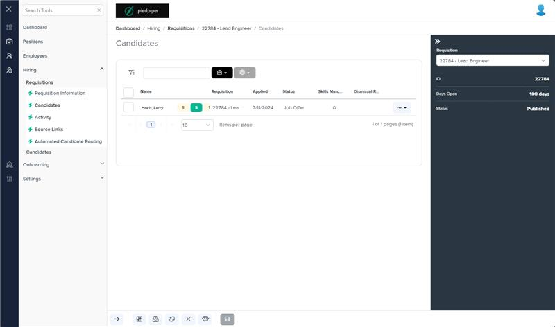

# Markup Audit Report

## Table of Contents

1. [File Paths](#file-paths)
2. [Differences in Markup Structure](#differences-in-markup-structure)
   - [Unique Tags in Each File](#unique-tags-in-each-file)
3. [Summary](#summary)

## File Paths

- `candidates.component.html` belongs to the "AgileHR" project.
- There is no associated file in the "Mocks-Talent-ng" project.

## Differences in Markup Structure

### Unique Tags in Each File

- **candidates.component.html (AgileHR):**

  - `page-title`,`talent-grid`,`input-dropdown-multi`, `e-columns`, `e-column`, `ejs-tooltip`, `ng-template`, `settings-table`, `settings-row`, `input-dropdown`, `modal-base`

## Summary

This file is unique to the dev enviroment in `AgileHR`. There is no associated file in
`mocks-talent-ng`

## Prod Screenshots

## Mocks Screenshots

Not Found

## Prod URL

[link to the page in prod](https://piedpiper.agilehr.net/hiring/requisitions/requisition_74z9r73jygxr8stqr01mx6tna3/candidates)

## Mocks URL

Not Found
