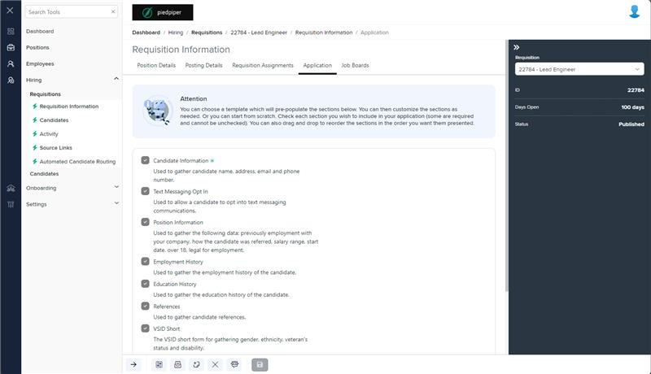

# Markup Audit Report

## Table of Contents

1. [File Paths](#file-paths)
2. [Unique Tags in Each File](#unique-tags-in-each-file)
3. [Differences in Markup Structure](#differences-in-markup-structure)
   - [Message Panel](#message-panel)
   - [Definition Container](#definition-container)
   - [Listbox](#listbox)
4. [Summary](#summary)

## File Paths

- `application.component.html` belongs to the "AgileHR" project.
- There is no associated file in the "Mocks-Talent-ng" project.

## Unique Tags in Each File

- **application.component.html (AgileHR):**
  - `message-panel`, `input-dropdown`, `ejs-listbox`, `ejs-checkbox`, `ng-template`

## Differences in Markup Structure

### Message Panel

- **AgileHR:**
  - Includes a `message-panel` component with attributes `title`, `content`, and `state`.

### Definition Container

- **AgileHR:**
  - Includes a `div` with the class `definition-container` that conditionally renders based on `isEditable` and `!isPublishedOrClosed`.
  - Contains a `fieldset` with a `ng-container` that uses `formGroup` and `input-dropdown` components.

### Listbox

- **AgileHR:**
  - Uses `ejs-listbox` with attributes `dataSource`, `allowDragAndDrop`, and an event binding for `drop`.
  - Contains an `ng-template` for item templates, which includes `ejs-checkbox`, `span`, and `p` elements.

## Summary

The `application.component.html` file from "AgileHR" includes unique components such as `message-panel`, `input-dropdown`, `ejs-listbox`, `ejs-checkbox`, and `ng-template`. The file uses conditional rendering for the `definition-container` and includes a `message-panel` component with specific attributes. The `ejs-listbox` component is used with drag-and-drop functionality and custom item templates. There is no associated file in the "Mocks-Talent-ng" project for comparison.

## Prod Screenshots

## Mocks Screenshots

Not Found

## Prod URL

[link to the page in prod](https://piedpiper.agilehr.net/hiring/requisitions/requisition_01j203caetfqpangs4gptyke4k/requisition-info/application)

## Mocks URL

Not Found
