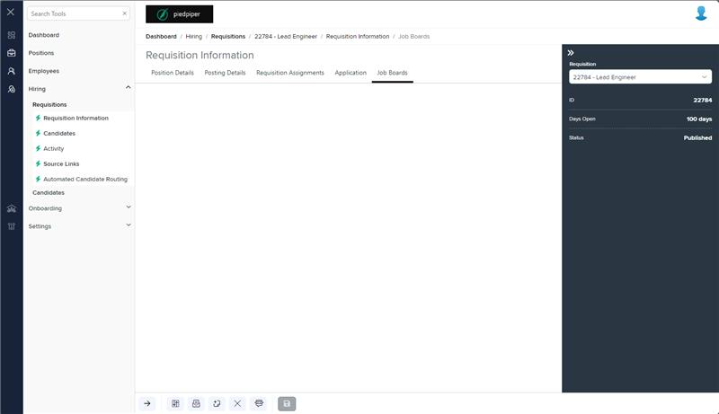
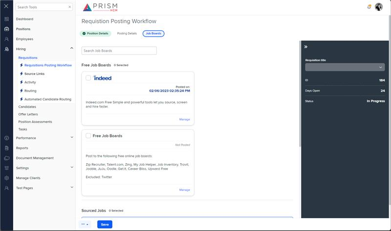

# Markup Audit Report

## Table of Contents

1. [File Paths](#file-paths)
2. [Unique Tags in Each File](#unique-tags-in-each-file)
3. [Differences in Markup Structure](#differences-in-markup-structure)
   - [Conditional Rendering](#conditional-rendering)
   - [Message Panel](#message-panel)
   - [Job Boards Container](#job-boards-container)
4. [Summary](#summary)

## File Paths

- `job-boards.component.html` belongs to the "AgileHR" project.
- `job-boards.component.html` belongs to the "Mocks-Talent-ng" project.

## Unique Tags in Each File

- **job-boards.component.html (AgileHR):**

  - `@if`

- **job-boards.component.html (Mocks-Talent-ng):**
  - None

## Differences in Markup Structure

### Conditional Rendering

- **AgileHR:**

  - Uses `@if` directives to conditionally render the `message-panel` and `job-boards-container` components based on the values of `isClosed`, `isExpired`, and `isIndeedEnabled`.

- **Mocks-Talent-ng:**
  - Does not use any conditional rendering directives.

### Message Panel

- **AgileHR:**

  - Includes a `message-panel` component with attributes `title`, `content`, and `state`.

- **Mocks-Talent-ng:**
  - Does not include a `message-panel` component.

### Job Boards Container

- **AgileHR:**

  - Includes a `job-boards-container` component with attributes `integrationSections`, `integrationTitle`, `isIndeedEnabled`, `isNew`, and an event binding for `freeJobBoardSelected`.

- **Mocks-Talent-ng:**
  - Includes a `job-boards-container` component with attributes `integrationSections` and `integrationTitle`.

## Summary

The primary differences between the two files are in the use of conditional rendering, the presence of a `message-panel` component, and the attributes and event bindings of the `job-boards-container` component. The `job-boards.component.html` file from "AgileHR" uses `@if` directives for conditional rendering, includes a `message-panel` component, and has additional attributes and event bindings on the `job-boards-container` component. The `job-boards.component.html` file from "Mocks-Talent-ng" does not use conditional rendering, does not include a `message-panel` component, and has fewer attributes on the `job-boards-container` component.

## Prod Screenshots

## Mocks Screenshots

## Prod URL

[link to the page in prod](https://piedpiper.agilehr.net/hiring/requisitions/requisition_74z9r73jygxr8stqr01mx6tna3/requisition-info/job-boards)

## Mocks URL

[link to the page in mock](http://localhost:4340/hiring/requisitions/1/req-workflow/job-boards)
