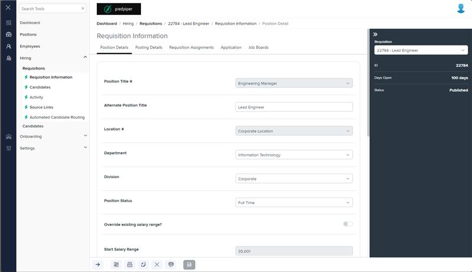
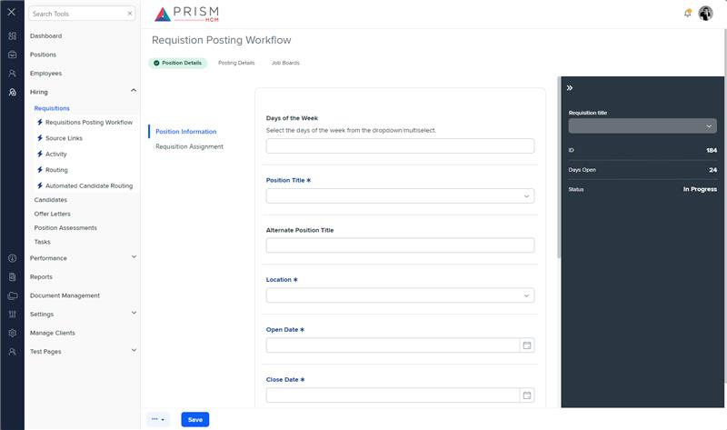

# Markup Audit Report

## Table of Contents

1. [File Paths](#file-paths)
2. [Unique Tags in Each File](#unique-tags-in-each-file)
3. [Differences in Markup Structure](#differences-in-markup-structure)
   - [Form Group](#form-group)
   - [Date Pickers](#date-pickers)
   - [Salary Range](#salary-range)
   - [Position Description](#position-description)
   - [Tags](#tags)
   - [Additional Sections](#additional-sections)
4. [Summary](#summary)

## File Paths

- `position-detail.component.html` belongs to the "AgileHR" project.
- `h-pos-info.component.html` belongs to the "Mocks-Talent-ng" project.

## Unique Tags in Each File

- **position-detail.component.html (AgileHR):**

  - `fieldset`, `formGroup`, `formControlName`, `talent-datetimepicker`, `ejs-multiselect`, `input-rich-text`, `ng-container`, `@if`, `toggle-switch`, `input-numeric`

- **h-pos-info.component.html (Mocks-Talent-ng):**
  - `input-datepicker`, `input-timepicker`, `input-dropdown-multi`

## Differences in Markup Structure

### Form Group

- **AgileHR:**

  - Uses a `fieldset` with a `formGroup` directive to group form controls and manage form state.

- **Mocks-Talent-ng:**
  - Does not use a `fieldset` or `formGroup` directive.

### Date Pickers

- **AgileHR:**

  - Uses `talent-datetimepicker` for date inputs with form control bindings.

- **Mocks-Talent-ng:**
  - Uses `input-datepicker` for date inputs without form control bindings.

### Salary Range

- **AgileHR:**

  - Includes salary range fields within a `fieldset` with conditional rendering based on `isOverrideSalary`.

- **Mocks-Talent-ng:**
  - Does not include salary range fields.

### Position Description

- **AgileHR:**

  - Uses `input-rich-text` for the "Position Description" field with conditional rendering based on `isOverrideDescription`.

- **Mocks-Talent-ng:**
  - Uses `input-rich-text` for the "Position Description" field with a fixed height of 250.

### Tags

- **AgileHR:**

  - Uses `ejs-multiselect` for the "Tags" field with custom event bindings for tagging and removing.

- **Mocks-Talent-ng:**
  - Uses `input-dropdown-multi` for the "Tags" field with filtering enabled.

### Additional Sections

- **AgileHR:**

  - Includes additional sections with `toggle-switch` components for "Disclaimer", "Pay Rate", "Requisition Type", "Tags", "Require Resume", "Require Additional Documents", "Private Requisition", and "Multiple Positions Available".

- **Mocks-Talent-ng:**
  - Includes additional sections for "Days of the Week", "Hours Per Week", "Shift Start", "Shift End", and "Requisition Assignment".

## Summary

The primary differences between the two files are in the use of form groups, date pickers, salary range fields, position description fields, tags fields, and additional sections. The `position-detail.component.html` file from "AgileHR" uses a `fieldset` with a `formGroup` directive, `talent-datetimepicker` for date inputs, and `ejs-multiselect` for tags. It also includes additional sections with `toggle-switch` components. The `h-pos-info.component.html` file from "Mocks-Talent-ng" uses `input-datepicker` for date inputs, `input-timepicker` for time inputs, and `input-dropdown-multi` for tags. It includes additional sections for "Days of the Week", "Hours Per Week", "Shift Start", "Shift End", and "Requisition Assignment".

## Prod Screenshots

## Mocks Screenshots

## Prod URL

[link to the page in prod](https://piedpiper.agilehr.net/hiring/requisitions/requisition_01j203caetfqpangs4gptyke4k/requisition-info/position-details)

## Mocks URL

[link to the page in mock](http://localhost:4340/hiring/requisitions/1/req-workflow/position-details)
