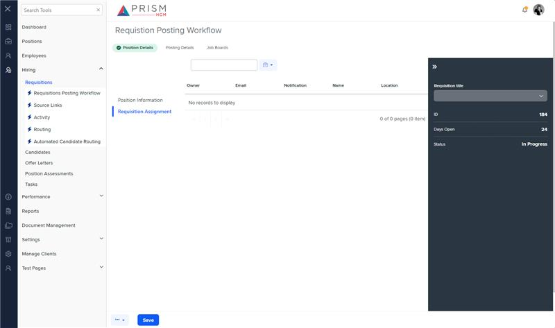

# Markup Audit Report

## Table of Contents

1. [File Paths](#file-paths)
2. [Unique Tags in Each File](#unique-tags-in-each-file)
3. [Differences in Markup Structure](#differences-in-markup-structure)
   - [Grid Component](#grid-component)
   - [Templates](#templates)
   - [Modals](#modals)
4. [Summary](#summary)

## File Paths

- `requisition-assignment.component.html` belongs to the "AgileHR" project.
- `h-pos-det.component.html` belongs to the "Mocks-Talent-ng" project.

## Unique Tags in Each File

- **requisition-assignment.component.html (AgileHR):**

  - `talent-grid`, `settings-table`, `settings-row`, `input-dropdown-multi`, `toggle-switch`

- **h-pos-det.component.html (Mocks-Talent-ng):**
  - `ejs-tab`, `e-tabitems`, `e-tabitem`, `grid-filters`, `input-text`, `button-dropdown-grid`, `ejs-grid`, `app-h-pos-info`

## Differences in Markup Structure

### Grid Component

- **AgileHR:**

  - Uses `talent-grid` with various properties and columns defined using `e-columns` and `e-column`.

- **Mocks-Talent-ng:**
  - Uses `ejs-grid` within a `grid-filters` component, with columns defined using `e-columns` and `e-column`.

### Templates

- **AgileHR:**

  - Includes `ng-template` elements for custom column templates like `emailTemplate`, `notificationTemplate`, and `dropdownactionbutton`.

- **Mocks-Talent-ng:**
  - Includes `ng-template` elements for custom column templates like `toolbarTemplate`, `editbutton`, `evealuateSTatus`, `itemStatus`, and `searchbar`.

### Modals

- **AgileHR:**

  - Includes multiple `modal-base` components for adding, editing, and deleting requisition assignments, with corresponding `ng-template` elements for the modal content.

- **Mocks-Talent-ng:**
  - Includes a `modal-base` component for adding a new user, with a corresponding `ng-template` element for the modal content.

## Summary

The primary differences between the two files are in the use of grid components, templates, and modals. The `requisition-assignment.component.html` file from "AgileHR" uses `talent-grid` for the grid and includes multiple `modal-base` components for different actions. It also includes `ng-template` elements for custom column templates. The `h-pos-det.component.html` file from "Mocks-Talent-ng" uses `ejs-grid` within a `grid-filters` component and includes a `modal-base` component for adding a new user. It also includes `ng-template` elements for various custom column templates.

## Prod Screenshots

## Mocks Screenshots

## Prod URL

[link to the page in prod](https://piedpiper.agilehr.net/hiring/requisitions/requisition_01j203caetfqpangs4gptyke4k/requisition-info/requisition-assignment)

## Mocks URL

[link to the page in mock](http://localhost:4340/hiring/requisitions/1/req-workflow/position-details)
