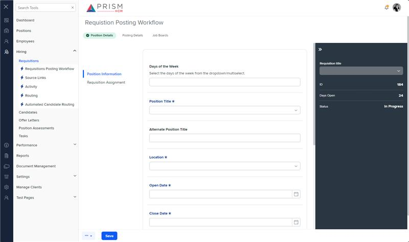

# Markup Audit Report

## Table of Contents

1. [File Paths](#file-paths)
2. [Unique Tags in Each File](#unique-tags-in-each-file)
3. [Differences in Markup Structure](#differences-in-markup-structure)
   - [Header Section](#header-section)
   - [Navigation](#navigation)
   - [Layout](#layout)
4. [Summary](#summary)

## File Paths

- `requisition-info.component.html` belongs to the "AgileHR" project.
- `req-workflow.component.html` belongs to the "Mocks-Talent-ng" project.

## Unique Tags in Each File

- **requisition-info.component.html (AgileHR):**

  - `navigation-tab`

- **req-workflow.component.html (Mocks-Talent-ng):**
  - `navigation-step`, `layout-drawers`, `layout-drawer-center`, `layout-drawer-right`, `layout-toolbox`, `app-hr-drawer`

## Differences in Markup Structure

### Header Section

- **AgileHR:**

  - Uses `<page-title [title]="'Requisition Information'"></page-title>` for the header.

- **Mocks-Talent-ng:**
  - Uses `<page-title [title]="'Requistion Posting Workflow'"></page-title>` for the header.

### Navigation

- **AgileHR:**

  - Includes a `<navigation-tab></navigation-tab>` component within a `
`.

- **Mocks-Talent-ng:**
  - Includes a `<navigation-step></navigation-step>` component directly.

### Layout

- **AgileHR:**

  - Uses a simple `
` and `<router-outlet></router-outlet>` structure.

- **Mocks-Talent-ng:**
  - Uses a more complex layout with `<layout-drawers>`, `<layout-drawer-center>`, and `<layout-drawer-right>` components.
  - Includes a `<layout-toolbox>` within the right drawer, containing an `<app-hr-drawer>` component.

## Summary

The primary differences between the two files are in the navigation and layout structures. The `requisition-info.component.html` file from "AgileHR" uses a simple structure with a `<navigation-tab>` component and a `<router-outlet>`. The `req-workflow.component.html` file from "Mocks-Talent-ng" uses a more complex layout with `layout-drawers`, `layout-drawer-center`, and `layout-drawer-right` components, and includes additional components like `navigation-step`, `layout-toolbox`, and `app-hr-drawer`.

## Prod Screenshots

## Mocks Screenshots

## Prod URL

[link to the page in prod](https://piedpiper.agilehr.net/hiring/requisitions/requisition_01j203caetfqpangs4gptyke4k/requisition-info/position-details)

## Mocks URL

[link to the page in mock](http://localhost:4340/hiring/requisitions/1/req-workflow/position-details)
