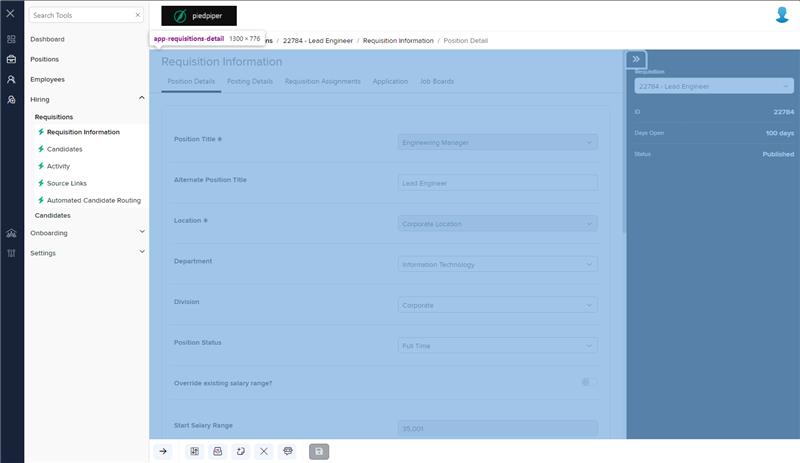

# Markup Audit Report

## Table of Contents

1. [File Paths](#file-paths)
2. [Unique Tags in Each File](#unique-tags-in-each-file)
3. [Differences in Markup Structure](#differences-in-markup-structure)
   - [Header Section](#header-section)
   - [Drawer Layout](#drawer-layout)
   - [Footer Section](#footer-section)
   - [Modals](#modals)
4. [Summary](#summary)

## File Paths

- `requisitions-detail.component.html` belongs to the "AgileHR" project.
- `req-workflow.component.html` belongs to the "Mocks-Talent-ng" project.

## Unique Tags in Each File

- **requisitions-detail.component.html (AgileHR):**

  - `talent-footer`, `button-base`, `talent-requisitions-drawer`, `modal-base`, `ng-template`, `settings-table`, `settings-row`, `input-multiline`, `ejs-multiselect`, `modal-drawer`

- **req-workflow.component.html (Mocks-Talent-ng):**
  - `navigation-step`, `layout-drawers`, `layout-drawer-center`, `layout-drawer-right`, `layout-toolbox`, `app-hr-drawer`

## Differences in Markup Structure

### Header Section

- **AgileHR:**

  - Does not include a header section.

- **Mocks-Talent-ng:**
  - Uses `<page-title [title]="'Requisition Posting Workflow'"></page-title>` for the header.

### Drawer Layout

- **AgileHR:**

  - Uses a custom drawer layout with `div` elements and classes `drawers`, `drawers__center`, and `drawers__right`.
  - Includes a `button-base` for toggling the right drawer.
  - Uses `talent-requisitions-drawer` within the right drawer.

- **Mocks-Talent-ng:**
  - Uses `layout-drawers` with `layout-drawer-center` and `layout-drawer-right` components.
  - Includes `layout-toolbox` within the right drawer.
  - Uses `app-hr-drawer` within the toolbox.

### Footer Section

- **AgileHR:**

  - Uses `talent-footer` with various attributes for custom buttons, navigation, and save actions.

- **Mocks-Talent-ng:**
  - Does not include a footer section.

### Modals

- **AgileHR:**

  - Includes multiple `modal-base` components with `ng-template` for different actions (e.g., add note, confirmation, invite, unsaved changes, free job board).
  - Uses `settings-table` and `settings-row` within modals.
  - Includes `input-multiline` and `ejs-multiselect` within modals.
  - Uses `modal-drawer` for previewing applications/postings.

- **Mocks-Talent-ng:**
  - Does not include any modal components.

## Summary

The primary differences between the two files are in the use of header sections, drawer layouts, footer sections, and modals. The `requisitions-detail.component.html` file from "AgileHR" uses a custom drawer layout with `div` elements, includes a `talent-footer` for navigation and actions, and has multiple `modal-base` components for various actions. The `req-workflow.component.html` file from "Mocks-Talent-ng" uses `layout-drawers` for the drawer layout, includes a header section with `page-title`, and does not include any footer or modal components.

## Prod Screenshots

## Mocks Screenshots

## Prod URL

[link to the page in prod](https://piedpiper.agilehr.net/hiring/requisitions/requisition_74z9r73jygxr8stqr01mx6tna3/requisition-info/position-details)

## Mocks URL

[link to the page in mock](http://localhost:4340/hiring/requisitions/1/req-workflow/position-details)
