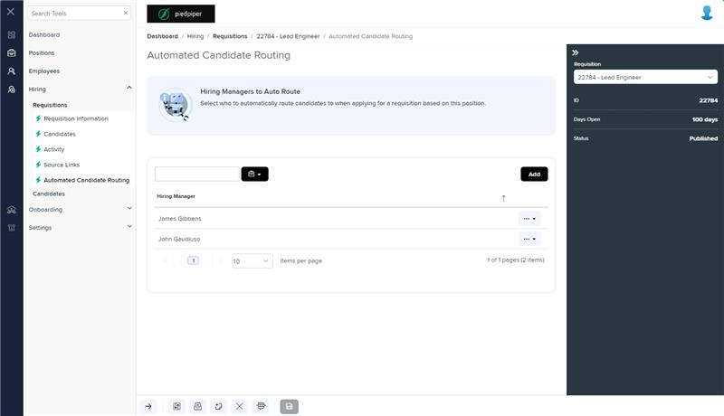
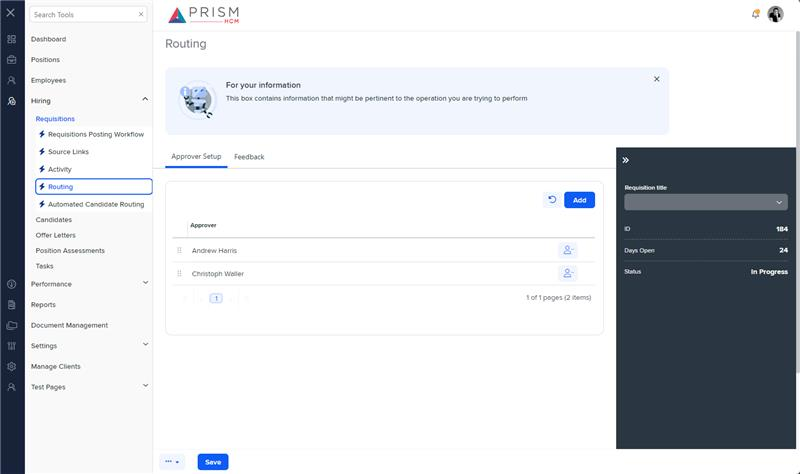

# Markup Audit Report

## Table of Contents

1. [File Paths](#file-paths)
2. [Unique Tags in Each File](#unique-tags-in-each-file)
3. [Differences in Markup Structure](#differences-in-markup-structure)
   - [Header Section](#header-section)
   - [Message Panel](#message-panel)
   - [Grid Component](#grid-component)
   - [Modals](#modals)
4. [Summary](#summary)

## File Paths

- `candidate-routing.component.html` belongs to the "AgileHR" project.
- `routing.component.html` belongs to the "Mocks-Talent-ng" project.

## Unique Tags in Each File

- **candidate-routing.component.html (AgileHR):**

  - `talent-grid`, `settings-table`, `settings-row`, `input-dropdown-multi`, `toggle-switch`

- **routing.component.html (Mocks-Talent-ng):**
  - `layout-drawers`, `layout-drawer-center`, `layout-drawer-right`, `layout-toolbox`, `app-hr-drawer`, `ejs-tab`, `e-tabitems`, `e-tabitem`, `grid-filters`, `input-text`, `button-base`, `ejs-grid`, `popover`

## Differences in Markup Structure

### Header Section

- Both files use `<page-title [title]="'Automated Candidate Routing'"></page-title>` for the header.

### Message Panel

- Both files include a `message-panel` component with similar attributes:
  - `title`, `content`, `state`

### Grid Component

- **AgileHR:**

  - Uses `talent-grid` with various properties and columns defined using `e-columns` and `e-column`.

- **Mocks-Talent-ng:**
  - Uses `ejs-grid` within a `grid-filters` component, with columns defined using `e-columns` and `e-column`.

### Modals

- **AgileHR:**

  - Includes multiple `modal-base` components for adding, editing, and deleting requisition assignments, with corresponding `ng-template` elements for the modal content.

- **Mocks-Talent-ng:**
  - Includes a `modal-base` component for adding a new user, with a corresponding `ng-template` element for the modal content.

## Summary

The primary differences between the two files are in the use of grid components, templates, and modals. The `candidate-routing.component.html` file from "AgileHR" uses `talent-grid` for the grid and includes multiple `modal-base` components for different actions. It also includes `ng-template` elements for custom column templates. The `routing.component.html` file from "Mocks-Talent-ng" uses `ejs-grid` within a `grid-filters` component and includes a `modal-base` component for adding a new user. It also includes `ng-template` elements for various custom column templates.

Additional Notes:

The routing page in the mocks site is associated to the Automated Candidate Routing Page in the dev site.
There is a Routing page in the dev site that is currently unused.

## Prod Screenshots

## Mocks Screenshots

## Prod URL

[link to the page in prod](https://piedpiper.agilehr.net/hiring/requisitions/requisition_74z9r73jygxr8stqr01mx6tna3/candidate-routing#page=1&pageSize=10&sortCol=fullName)

## Mocks URL

[link to the page in mock](http://localhost:4340/hiring/requisitions/:id/routing)

## Prod Screenshots

## Mocks Screenshots

## Prod URL

[link to the page in prod](https://piedpiper.agilehr.net/hiring/requisitions/requisition_74z9r73jygxr8stqr01mx6tna3/source-links)

## Mocks URL

[link to the page in mock](http://localhost:4340/hiring/requisitions/:id/h-source-links)
