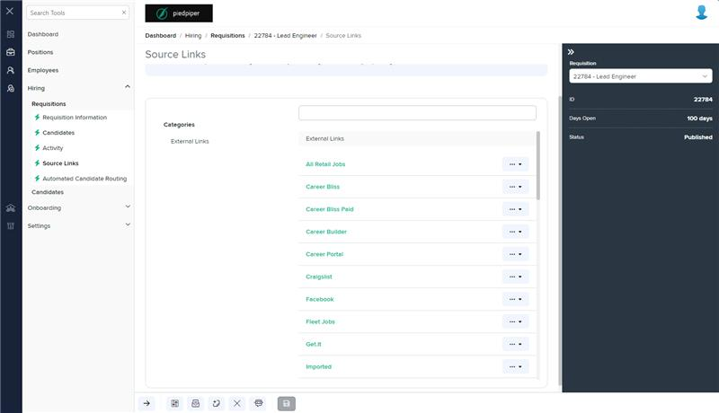
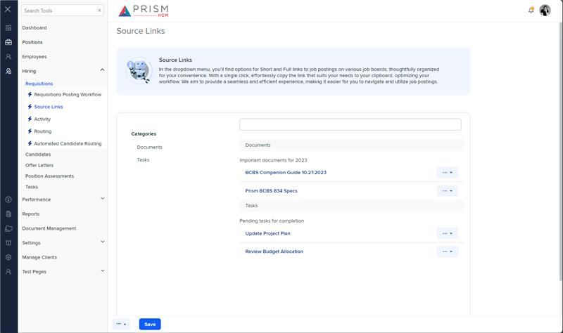

# Markup Audit Report

## Table of Contents

1. [File Paths](#file-paths)
2. [Unique Tags](#unique-tags)
3. [Differences in Markup Structure](#differences-in-markup-structure)
4. [Summary](#summary)

## File Paths

- `source-links.component.html` belongs to the "AgileHR" project.
- `h-source-links.component.html` belongs to the "Mocks-Talent-ng" project.

## Unique Tags

- **source-links.component.html (AgileHR):**

  - `@if`

- **h-source-links.component.html (Mocks-Talent-ng):**
  - None

## Differences in Markup Structure

1. **Message Panel Content:**

   - Both files include a `message-panel` component with similar content, but the text differs slightly:
     - `source-links.component.html`: "In the dropdown menus, you'll discover an option to copy a link to post on various job boards. These links are thoughtfully organized for your convenience. With just one click, you can effortlessly copy the link that best suits your needs directly to your clipboard, streamlining your workflow. Our goal is to provide a seamless and efficient experience, making it easier for you to navigate and utilize job postings."
     - `h-source-links.component.html`: "In the dropdown menu, you'll find options for Short and Full links to job postings on various job boards, thoughtfully organized for your convenience. With a single click, effortlessly copy the link that suits your needs to your clipboard, optimizing your workflow. We aim to provide a seamless and efficient experience, making it easier for you to navigate and utilize job postings."

2. **Conditional Rendering:**

   - `source-links.component.html` uses an `@if` directive to conditionally render the `document-library` component based on the length of `reportsObject`.
   - `h-source-links.component.html` does not include any conditional rendering and always renders the `document-library` component.

3. **Document Library Component:**
   - `source-links.component.html` includes an additional attribute `dropdownCallback="selected"` on the `document-library` component.
   - `h-source-links.component.html` does not include the `dropdownCallback` attribute on the `document-library` component.

## Summary

The primary differences between the two files are in the content of the `message-panel`, the use of conditional rendering, and the attributes of the `document-library` component. The `source-links.component.html` file from "AgileHR" uses an `@if` directive to conditionally render the `document-library` component and includes an additional `dropdownCallback` attribute. The `h-source-links.component.html` file from "Mocks-Talent-ng" always renders the `document-library` component and does not include the `dropdownCallback` attribute.

## Prod Screenshots

## Mocks Screenshots

## Prod URL

[link to the page in prod](https://piedpiper.agilehr.net/hiring/requisitions/requisition_74z9r73jygxr8stqr01mx6tna3/source-links)

## Mocks URL

[link to the page in mock](http://localhost:4340/hiring/requisitions/:id/h-source-links)
