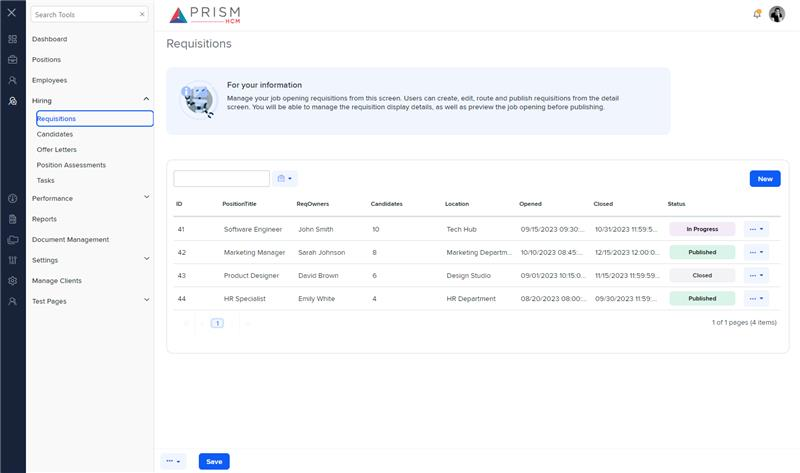

# Markup Audit Report

## Table of Contents

1. [File Paths](#file-paths)
2. [Unique Tags in Each File](#unique-tags-in-each-file)
3. [Differences in Markup Structure](#differences-in-markup-structure)
   - [Header Section](#header-section)
   - [Message Panel](#message-panel)
   - [Grid Component](#grid-component)
   - [Toolbar](#toolbar)
   - [Modals](#modals)
4. [Summary](#summary)

## File Paths

- `requisitions.component.html` belongs to the "AgileHR" project.
- `h-reqs.component.html` belongs to the "Mocks-Talent-ng" project.

## Unique Tags in Each File

- **requisitions.component.html (AgileHR):**

  - `talent-grid`, `settings-table`, `settings-row`, `input-dropdown-multi`, `toggle-switch`, `input-dropdown`, `ejs-tooltip`, `modal-base`, `ng-template`

- **h-reqs.component.html (Mocks-Talent-ng):**
  - `grid-filters`, `input-text`, `button-dropdown-grid`, `ejs-grid`, `popover`

## Differences in Markup Structure

### Header Section

- Both files use `<page-title [title]="'Requisitions'"></page-title>` for the header.

### Message Panel

- **Mocks-Talent-ng:**

  - Includes a `message-panel` component with attributes `title`, `content`, and `state`.

- **AgileHR:**
  - Does not include a `message-panel` component.

### Grid Component

- **AgileHR:**

  - Uses `talent-grid` with various properties and columns defined using `e-columns` and `e-column`.
  - Includes custom templates for columns using `ng-template`.

- **Mocks-Talent-ng:**
  - Uses `ejs-grid` within a `grid-filters` component, with columns defined using `e-columns` and `e-column`.
  - Includes custom templates for columns using `ng-template`.

### Toolbar

- **AgileHR:**

  - Does not include a custom toolbar.

- **Mocks-Talent-ng:**
  - Includes a custom toolbar within `grid-filters`, using `input-text` for search and `button-dropdown-grid` for actions.

### Modals

- **AgileHR:**

  - Includes multiple `modal-base` components for different actions (e.g., confirmation, dates).
  - Uses `ng-template` elements for modal content.

- **Mocks-Talent-ng:**
  - Includes `modal-base` components for adding a new user and deleting a requisition.
  - Uses `ng-template` elements for modal content.

## Summary

The primary differences between the two files are in the use of grid components, toolbars, and modals. The `requisitions.component.html` file from "AgileHR" uses `talent-grid` for the grid and includes multiple `modal-base` components for different actions. It also includes `ng-template` elements for custom column templates and modal content. The `h-reqs.component.html` file from "Mocks-Talent-ng" uses `ejs-grid` within a `grid-filters` component and includes a custom toolbar. It also includes `modal-base` components for adding a new user and deleting a requisition.

## Prod Screenshots

## Mocks Screenshots

## Prod URL

[link to the page in prod](https://piedpiper.agilehr.net/hiring/requisitions)

## Mocks URL

[link to the page in mock](http://localhost:4340/hiring/requisitions)
