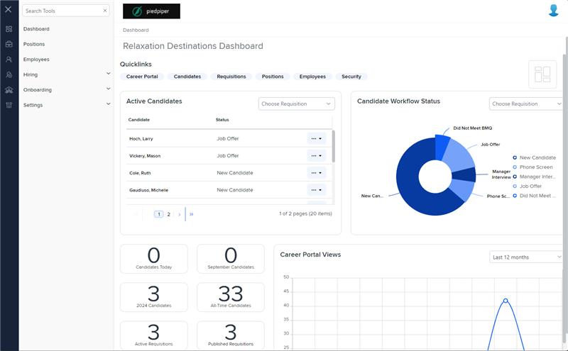
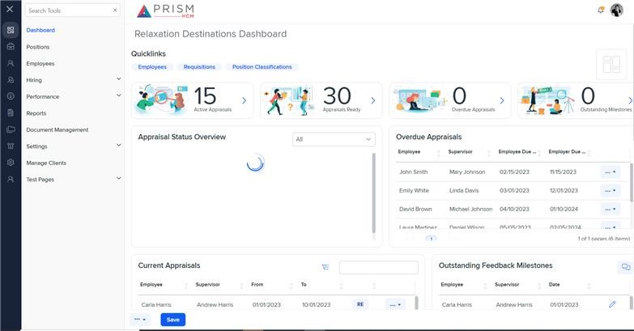

# Markup Audit Report

## Table of Contents

1. [File Paths](#file-paths)
2. [Unique Tags in Each File](#unique-tags-in-each-file)
3. [Differences in Markup Structure](#differences-in-markup-structure)
   - [Header Section](#header-section)
   - [Navigation](#navigation)
   - [Main Content](#main-content)
   - [Footer Section](#footer-section)
   - [Drawer Layout](#drawer-layout)
   - [Modal Configuration](#modal-configuration)
4. [Summary](#summary)

## File Paths

- `landing.component.html` belongs to the "AgileHR" project.
- `app.component.html` belongs to the "Mocks-Talent-ng" project.

## Unique Tags in Each File

- **landing.component.html (AgileHR):**

  - `talent-personal-drawer`, `talent-reset-password`, `talent-help-center`

- **app.component.html (Mocks-Talent-ng):**
  - `layout-home`, `button-indicator`, `user-avatar-button`, `information-panel`, `email-row-container`, `email-row`, `user-avatar`, `user-settings`, `dark-mode`, `breadcrumb`, `button-dropdown`

## Differences in Markup Structure

### Header Section

- **AgileHR:**

  - Uses `<page-header [logo]="logo">` with an avatar image and a click event to toggle the personal drawer.

- **Mocks-Talent-ng:**
  - Uses `<page-header [logo]="logo">` with `button-indicator`, `user-avatar-button`, and `information-panel` components for notifications and user information.

### Navigation

- **AgileHR:**

  - Uses `<nav-left>` with event bindings for toggling the submenu and passing navigation items.

- **Mocks-Talent-ng:**
  - Uses `<nav-left>` with similar event bindings and attributes for navigation items.

### Main Content

- **AgileHR:**

  - Uses `<main>` with an ID of `main-content-area` and includes breadcrumbs, a section for main content, and a footer with conditional buttons.

- **Mocks-Talent-ng:**
  - Uses `<router-outlet>` for routing and displaying components.
  - Includes a breadcrumb navigation section with a custom `breadcrumb` component.

### Footer Section

- **AgileHR:**

  - Uses a footer with conditional rendering for buttons based on the `footerService` state.
  - Includes `ejs-tooltip` and `ejs-button` components for tooltips and buttons.

- **Mocks-Talent-ng:**
  - Uses a footer with `button-dropdown` and `button-base` components for various actions like dismissing, hiring, and saving a candidate.

### Drawer Layout

- **AgileHR:**

  - Uses a custom drawer layout with a `talent-personal-drawer` component for the personal drawer.

- **Mocks-Talent-ng:**
  - Uses `information-panel` components for displaying user information and settings within a drawer layout.

### Modal Configuration

- **AgileHR:**

  - Uses multiple `modal-base` components with `ng-template` for logout, password reset, and help center modals.

- **Mocks-Talent-ng:**
  - Does not include any modal configuration.

## Summary

The primary differences between the two files are in the use of header sections, navigation, main content, footer sections, drawer layouts, and modal configurations. The `landing.component.html` file from "AgileHR" uses a custom drawer layout, includes a footer with conditional buttons, and has multiple modal configurations for logout, password reset, and help center. The `app.component.html` file from "Mocks-Talent-ng" uses `information-panel` components for notifications and user information, includes a breadcrumb navigation section, and uses a footer with `button-dropdown` and `button-base` components for various actions.

## Prod Screenshots

## Mocks Screenshots

## Prod URL

[link to the page in prod](https://piedpiper.agilehr.net/)

## Mocks URL

[link to the page in mock](http://localhost:4340/dashboard)
