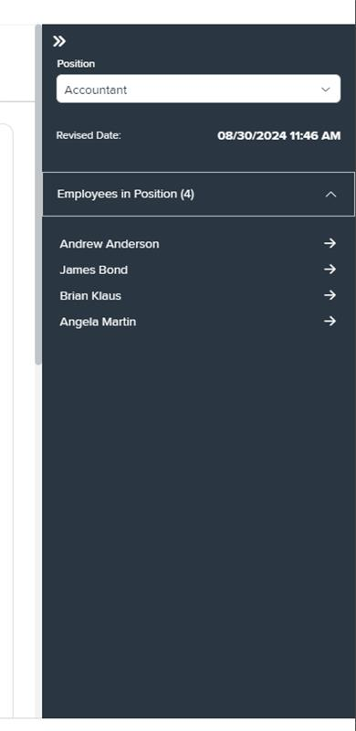
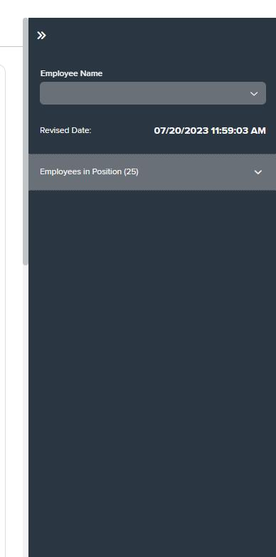

# Markup Audit Report

## Table of Contents

1. [File Paths](#file-paths)
2. [Unique Tags in Each File](#unique-tags-in-each-file)
3. [Differences in Markup Structure](#differences-in-markup-structure)
   - [Form Group](#form-group)
   - [Accordion Component](#accordion-component)
   - [Employee List](#employee-list)
   - [Footer Section](#footer-section)
4. [Summary](#summary)

## File Paths

- `position-drawer.component.html` belongs to the "AgileHR" project.
- `pos-drawer.component.html` belongs to the "Mocks-Talent-ng" project.

## Unique Tags in Each File

- **position-drawer.component.html (AgileHR):**

  - `div`, `input-dropdown`, `ejs-accordion`, `e-accordionitems`, `e-accordionitem`, `ng-template`

- **pos-drawer.component.html (Mocks-Talent-ng):**
  - `div`, `input-dropdown`, `accordion`, `accordion-item`, `ng-template`

## Differences in Markup Structure

### Form Group

- **AgileHR:**

  - Uses a `div` with a `[formGroup]` directive to group form controls and manage form state.
  - Includes conditional rendering with `@if` directive for `customListData` and `selectedData`.

- **Mocks-Talent-ng:**
  - Uses a `div` without a `[formGroup]` directive.
  - Does not include conditional rendering for dropdown data.

### Accordion Component

- **AgileHR:**

  - Uses `ejs-accordion` with `e-accordionitems` and `e-accordionitem` for the accordion component.
  - Includes `ng-template` for defining header and content templates.

- **Mocks-Talent-ng:**
  - Uses `accordion` with `accordion-item` for the accordion component.
  - Includes `ng-template` for defining accordion content.

### Employee List

- **AgileHR:**

  - Uses `ng-template` with `@for` directive to iterate over `employeeList`.
  - Includes conditional rendering with `@if` directive for `canViewEmployeesList`.
  - Uses `navigateToEmployee(employee)` for navigation.

- **Mocks-Talent-ng:**
  - Uses static `a` tags within `ng-template` for the employee list.
  - Does not include conditional rendering or dynamic navigation.

### Footer Section

- **AgileHR:**

  - Includes a commented-out footer section with `button-base` components for "Position Description Report" and "Create Requisitions".

- **Mocks-Talent-ng:**
  - Includes a commented-out footer section with `button-base` components for "Position Description Report" and "Create Requisitions".

## Summary

The primary differences between the two files are in the use of form groups, accordion components, employee lists, and footer sections. The `position-drawer.component.html` file from "AgileHR" uses a `[formGroup]` directive, `ejs-accordion` for the accordion component, and dynamic rendering for the employee list with navigation. The `pos-drawer.component.html` file from "Mocks-Talent-ng" uses a simpler `accordion` component and static employee list without dynamic rendering or navigation. Both files include a commented-out footer section with `button-base` components.

## Prod Screenshots

## Mocks Screenshots

## Prod URL

[link to the page in prod](https://piedpiper.agilehr.net/core/positions/position_7qw8tbqzn0xr8stpr01mx6tna3/info/details)

## Mocks URL

[link to the page in mock](http://localhost:4340/positions/:id/pos-desc)
