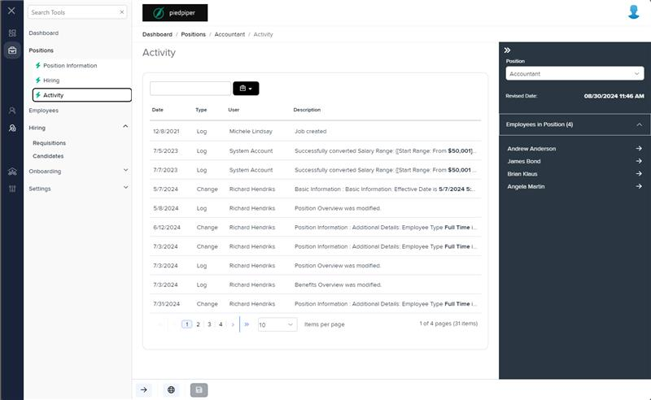
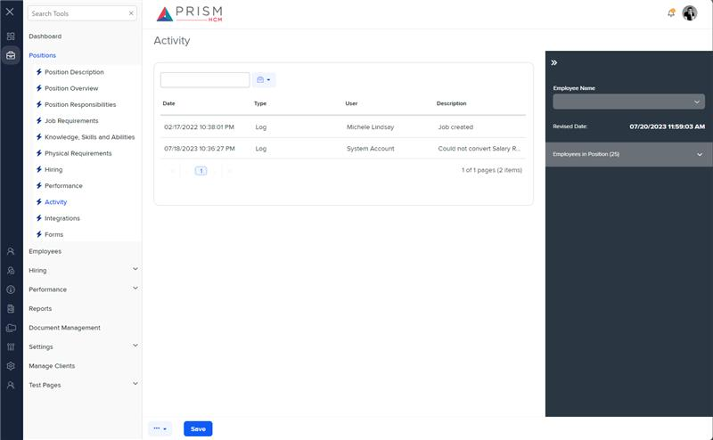

# Markup Audit Report

## Table of Contents

1. [File Paths](#file-paths)
2. [Unique Tags in Each File](#unique-tags-in-each-file)
3. [Differences in Markup Structure](#differences-in-markup-structure)
   - [Header Section](#header-section)
   - [Grid Component](#grid-component)
   - [Filters and Toolbar](#filters-and-toolbar)
4. [Summary](#summary)

## File Paths

- `activity.component.html` belongs to the "AgileHR" project.
- `posa-deets.component.html` belongs to the "Mocks-Talent-ng" project.

## Unique Tags in Each File

- **activity.component.html (AgileHR):**

  - `page-title`, `talent-grid`, `e-columns`, `e-column`

- **posa-deets.component.html (Mocks-Talent-ng):**
  - `grid-filters`, `ng-template`, `input-text`, `button-dropdown-grid`, `ejs-grid`

## Differences in Markup Structure

### Header Section

- **AgileHR:**

  - Uses `<page-title [title]="'Activity'"></page-title>` for the header.

- **Mocks-Talent-ng:**
  - Does not include a header section.

### Grid Component

- **AgileHR:**

  - Uses `talent-grid` with various properties such as `allowPaging`, `allowSorting`, `allowExport`, `data`, `searchFields`, `allowBulkActions`, `allowFiltering`, and `allowNew`.
  - Includes `e-columns` and `e-column` for defining grid columns with specific attributes like `field`, `headerText`, `width`, `format`, `type`, `valueAccessor`, `disableHtmlEncode`, and `allowSorting`.

- **Mocks-Talent-ng:**
  - Uses `ejs-grid` with properties like `enableAdaptiveUI`, `rowRenderingMode`, `allowPaging`, and `dataSource`.
  - Includes `e-columns` and `e-column` for defining grid columns with attributes like `field` and `headerText`.

### Filters and Toolbar

- **AgileHR:**

  - Does not include any filters or toolbar components.

- **Mocks-Talent-ng:**
  - Uses `grid-filters` with `centerTemplate` and `centerHeaderTemplate` for filters and toolbar.
  - Includes `ng-template` for defining custom toolbar content.
  - Uses `input-text` for search functionality and `button-dropdown-grid` for table tools.

## Summary

The primary differences between the two files are in the use of header sections, grid components, and filters/toolbar. The `activity.component.html` file from "AgileHR" includes a header section with `page-title`, uses `talent-grid` for the grid with various properties and column definitions, and does not include any filters or toolbar components. The `posa-deets.component.html` file from "Mocks-Talent-ng" uses `ejs-grid` for the grid, includes `grid-filters` with custom toolbar content defined using `ng-template`, and uses `input-text` for search functionality and `button-dropdown-grid` for table tools.

## Prod Screenshots

## Mocks Screenshots

## Prod URL

[link to the page in prod](https://piedpiper.agilehr.net/core/positions/position_7qw8tbqzn0xr8stpr01mx6tna3/activity)

## Mocks URL

[link to the page in mock](http://localhost:4340/positions/:id/pos-activity)
