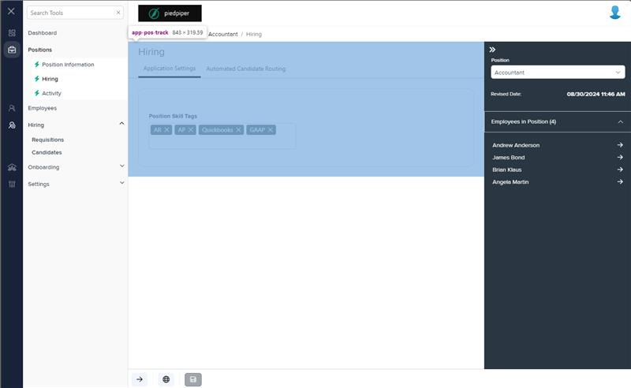
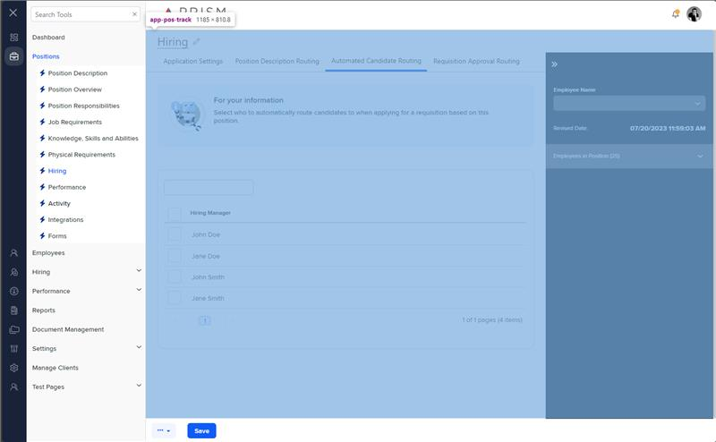

# Markup Audit Report

## Table of Contents

1. [File Paths](#file-paths)
2. [Unique Tags in Each File](#unique-tags-in-each-file)
3. [Differences in Markup Structure](#differences-in-markup-structure)
   - [Header Section](#header-section)
   - [Tab Component](#tab-component)
   - [Drawer Layout](#drawer-layout)
   - [Content Templates](#content-templates)
4. [Summary](#summary)

## File Paths

- `pos-track.component.html` belongs to the "AgileHR" project.
- `pos-track.component.html-1` belongs to the "Mocks-Talent-ng" project.

## Unique Tags in Each File

- **pos-track.component.html (AgileHR):**

  - `app-postrack-deets`, `app-postrack-acr`

- **pos-track.component.html-1 (Mocks-Talent-ng):**
  - `layout-drawers`, `layout-drawer-center`, `layout-drawer-right`, `layout-toolbox`, `app-pos-drawer`, `settings-table`, `settings-row`, `input-dropdown-multi`, `app-postrack-pdr`, `app-postrack-rar`

## Differences in Markup Structure

### Header Section

- **AgileHR:**

  - Uses `<page-title [title]="'Hiring'"></page-title>` for the header.

- **Mocks-Talent-ng:**
  - Uses `<page-title [title]="'Hiring'" [editable]="true"></page-title>` for the header.

### Tab Component

- **AgileHR:**

  - Uses `<ejs-tab id="element">` with two `<e-tabitem>` elements.
  - Each `<e-tabitem>` includes an `ng-template` for content:
    - `<app-postrack-deets>` for the first tab.
    - `<app-postrack-acr>` for the second tab.

- **Mocks-Talent-ng:**
  - Uses `<ejs-tab id="element">` with four `<e-tabitem>` elements.
  - Each `<e-tabitem>` includes an `ng-template` for content:
    - `<settings-table>` and `<settings-row>` with `<input-dropdown-multi>` for the first tab.
    - `<app-postrack-pdr>` for the second tab.
    - `<app-postrack-acr>` for the third tab.
    - `<app-postrack-rar>` for the fourth tab.

### Drawer Layout

- **AgileHR:**

  - Does not include any drawer layout components.

- **Mocks-Talent-ng:**
  - Uses `<layout-drawers>` with `<layout-drawer-center>` and `<layout-drawer-right>` components.
  - Includes `<layout-toolbox>` within the right drawer.
  - Uses `<app-pos-drawer>` within the toolbox.

### Content Templates

- **AgileHR:**

  - Uses `ng-template` for defining content within `<e-tabitem>` elements:
    - `<app-postrack-deets>` for the first tab.
    - `<app-postrack-acr>` for the second tab.

- **Mocks-Talent-ng:**
  - Uses `ng-template` for defining content within `<e-tabitem>` elements:
    - `<settings-table>` and `<settings-row>` with `<input-dropdown-multi>` for the first tab.
    - `<app-postrack-pdr>` for the second tab.
    - `<app-postrack-acr>` for the third tab.
    - `<app-postrack-rar>` for the fourth tab.

## Summary

The primary differences between the two files are in the use of header sections, tab components, drawer layouts, and content templates. The `pos-track.component.html` file from "AgileHR" uses a simple header, a tab component with two tabs, and content templates for `app-postrack-deets` and `app-postrack-acr`. The `pos-track.component.html-1` file from "Mocks-Talent-ng" uses an editable header, a tab component with four tabs, a drawer layout with a toolbox, and content templates for `settings-table`, `settings-row`, `input-dropdown-multi`, `app-postrack-pdr`, `app-postrack-acr`, and `app-postrack-rar`.

## Prod Screenshots

## Mocks Screenshots

## Prod URL

[link to the page in prod](https://piedpiper.agilehr.net/core/positions/position_7qw8tbqzn0xr8stpr01mx6tna3/hiring)

## Mocks URL

[link to the page in mock](http://localhost:4340/positions/:id/pos-track)
