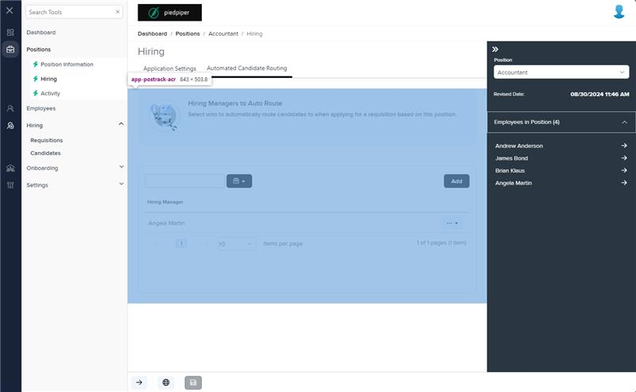
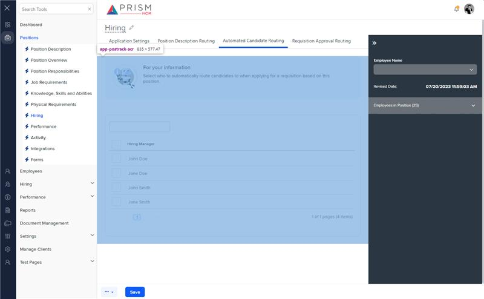

# Markup Audit Report

## Table of Contents

1. [File Paths](#file-paths)
2. [Unique Tags in Each File](#unique-tags-in-each-file)
3. [Differences in Markup Structure](#differences-in-markup-structure)
   - [Message Panel](#message-panel)
   - [Grid Component](#grid-component)
   - [Filters and Toolbar](#filters-and-toolbar)
   - [Modals](#modals)
4. [Summary](#summary)

## File Paths

- `postrack-acr.component.html` belongs to the "AgileHR" project.
- `postrack-acr.component.html-1` belongs to the "Mocks-Talent-ng" project.

## Unique Tags in Each File

- **postrack-acr.component.html (AgileHR):**

  - `talent-grid`, `e-columns`, `e-column`, `modal-base`, `ng-template`, `settings-table`, `settings-row`, `input-dropdown-multi`

- **postrack-acr.component.html-1 (Mocks-Talent-ng):**
  - `grid-filters`, `input-text`, `ejs-grid`

## Differences in Markup Structure

### Message Panel

- **AgileHR:**

  - Uses `<message-panel [title]="'Hiring Managers to Auto Route'" [content]="'Select who to automatically route candidates to when applying for a requisition based on this position.'" [state]="0" [config]="{ dismissible: false }"></message-panel>`.

- **Mocks-Talent-ng:**
  - Uses `<message-panel [title]="'For your information'" [content]="'Select who to automatically route candidates to when applying for a requisition based on this position.'" [state]="0" [config]="{ dismissible: false }"></message-panel>`.

### Grid Component

- **AgileHR:**

  - Uses `<talent-grid>` with various properties such as `allowPaging`, `allowRowSelect`, `allowNew`, `allowSorting`, `allowExport`, `data`, `searchFields`, `allowBulkActions`, `allowFiltering`, `friendlyName`, `exportFileName`, `initializing`, `idProperty`, `loading`, `newButtonTooltipText`, `allowSelectOptions`, `selectActionTooltip`, `selectOptions`, and `(selected)`.
  - Includes `<e-columns>` and `<e-column>` for defining grid columns.

- **Mocks-Talent-ng:**
  - Uses `<ejs-grid>` with properties like `dataSource`, `enableAdaptiveUI`, `rowRenderingMode`, and `allowPaging`.
  - Includes `<e-columns>` and `<e-column>` for defining grid columns.

### Filters and Toolbar

- **AgileHR:**

  - Does not include any filters or toolbar components.

- **Mocks-Talent-ng:**
  - Uses `<grid-filters>` with `centerTemplate` and `centerHeaderTemplate`.
  - Includes `<ng-template>` for defining custom toolbar content.
  - Uses `<input-text>` for search functionality.

### Modals

- **AgileHR:**

  - Includes multiple `<modal-base>` components with `<ng-template>` for different actions (e.g., hiring manager popup, confirmation popup).
  - Uses `<settings-table>` and `<settings-row>` within modals.
  - Includes `<input-dropdown-multi>` within modals for selecting hiring managers.

- **Mocks-Talent-ng:**
  - Does not include any modal components.

## Summary

The primary differences between the two files are in the use of message panels, grid components, filters/toolbar, and modals. The `postrack-acr.component.html` file from "AgileHR" uses a specific message panel title, `talent-grid` for the grid with various properties and column definitions, and includes multiple `modal-base` components for different actions. The `postrack-acr.component.html-1` file from "Mocks-Talent-ng" uses a different message panel title, `ejs-grid` for the grid, includes `grid-filters` with custom toolbar content defined using `<ng-template>`, and uses `<input-text>` for search functionality. It does not include any modal components.

## Prod Screenshots

## Mocks Screenshots

## Prod URL

[link to the page in prod](https://piedpiper.agilehr.net/core/positions/position_7qw8tbqzn0xr8stpr01mx6tna3/hiring)

## Mocks URL

[link to the page in mock](http://localhost:4340/positions/:id/pos-track)
