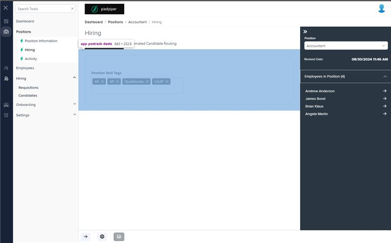
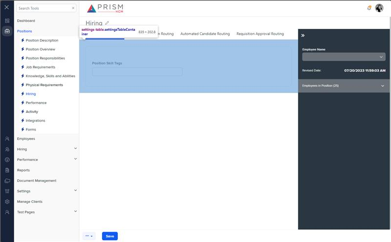

# Markup Audit Report

## Table of Contents

1. [File Paths](#file-paths)
2. [Unique Tags in Each File](#unique-tags-in-each-file)
3. [Differences in Markup Structure](#differences-in-markup-structure)
   - [Form Group](#form-group)
   - [Input Components](#input-components)
4. [Summary](#summary)

## File Paths

- `postrack-deets.component.html` belongs to the "AgileHR" project.
- The provided markup snippet belongs to the "Mocks-Talent-ng" project.

## Unique Tags in Each File

- **postrack-deets.component.html (AgileHR):**

  - `fieldset`, `div`, `ejs-multiselect`

- **Mocks-Talent-ng:**
  - `input-dropdown-multi`

## Differences in Markup Structure

### Form Group

- **AgileHR:**

  - Uses a `fieldset` with a `[formGroup]` directive to group form controls and manage form state.
  - Includes a `div` with `formGroupName="positionHiring"` to further group related form controls.

- **Mocks-Talent-ng:**
  - Does not include any form group or fieldset elements.

### Input Components

- **AgileHR:**

  - Uses `ejs-multiselect` within `settings-row` for selecting position skill tags.
  - Attributes include:
    - `id="multiselectelement"`
    - `[value]="initialTags"`
    - `[dataSource]="tagsData"`
    - `[allowCustomValue]="canAddNewJobSkillTag"`
    - `(tagging)="onTagging($event)"`
    - `(removing)="onRemoving($event)"`
    - `[enabled]="isEditable"`
    - `mode="Box"`
    - `placeholder="Insert Tags..."`
    - `[fields]="fields"`

- **Mocks-Talent-ng:**
  - Uses `input-dropdown-multi` within `settings-row` for selecting position skill tags.
  - Attributes include:
    - `[data]="data"`
    - `[placeholder]="'Select items'"`
    - `[showSelectAll]="true"`
    - `[mode]="'Box'"`

## Summary

The primary differences between the two files are in the use of form groups and input components. The `postrack-deets.component.html` file from "AgileHR" uses a `fieldset` with a `[formGroup]` directive and a `div` with `formGroupName` to group related form controls. It also uses `ejs-multiselect` for selecting position skill tags with various attributes for data binding, event handling, and customization. The provided markup snippet from "Mocks-Talent-ng" uses `input-dropdown-multi` for selecting position skill tags with attributes for data binding and display options, and does not include any form group or fieldset elements.

Additional Notes:
The markup from mocks-talent-ng is inserted directly into pos-track.component.html, and is not its own component. The postrack-deets.component component in mocks-talent-ng exists but is unused.

## Prod Screenshots

## Mocks Screenshots

## Prod URL

[link to the page in prod](https://piedpiper.agilehr.net/core/positions/position_7qw8tbqzn0xr8stpr01mx6tna3/hiring)

## Mocks URL

[link to the page in mock](http://localhost:4340/positions/:id/pos-track)
