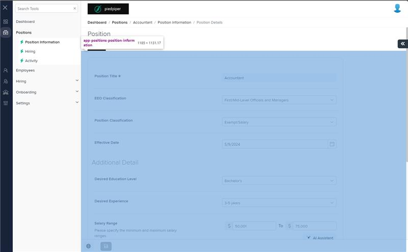
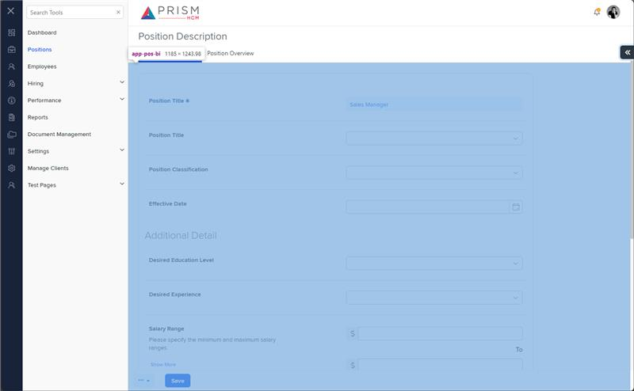

# Markup Audit Report

## Table of Contents

1. [File Paths](#file-paths)
2. [Unique Tags in Each File](#unique-tags-in-each-file)
3. [Differences in Markup Structure](#differences-in-markup-structure)
   - [Form Group](#form-group)
   - [Position Title](#position-title)
   - [Salary Range](#salary-range)
   - [Additional Fields](#additional-fields)
   - [Modal Configuration](#modal-configuration)
4. [Summary](#summary)

## File Paths

- `position-information.component.html` belongs to the "AgileHR" project.
- `posbi-deets.component.html` belongs to the "Mocks-Talent-ng" project.

## Unique Tags in Each File

- **position-information.component.html (AgileHR):**

  - `fieldset`, `input-numeric`, `salary-range-request`, `salary-range`

- **posbi-deets.component.html (Mocks-Talent-ng):**
  - `ng-container`, `modal-base`

## Differences in Markup Structure

### Form Group

- **AgileHR:**

  - Uses `<fieldset [formGroup]="positionForm" [disabled]="disabled">` to group form controls and manage form state.
  - Includes nested `
` for further grouping.

- **Mocks-Talent-ng:**
  - Does not include any form group or fieldset elements.

### Position Title

- **AgileHR:**

  - Uses conditional rendering with `@if(isPositionSynced)` to display different input fields for position title based on the `isPositionSynced` flag.
  - Uses `<input-text [form]="positionInfoDisabledForm" formControlName="title" [required]="true"></input-text>` when `isPositionSynced` is true.
  - Uses `<input-text [form]="positionForm.get('positionBasicInformation')" formControlName="title" [required]="true"></input-text>` when `isPositionSynced` is false.

- **Mocks-Talent-ng:**
  - Uses `<input-text [placeholder]="'Position Title'" [required]="true" [value]="'Sales Manager'"></input-text>` for position title.
  - Also includes `<input-dropdown [data]="posTitle" [placeholder]="'Position Title'" [enableFiltering]="true" [filtering]="true"></input-dropdown>` for position title.

### Salary Range

- **AgileHR:**

  - Uses `<input-numeric [form]="positionForm.get('positionBasicInformation')" formControlName="salaryStartRange" [precision]="2" [canIncrement]="false"></input-numeric>` for salary start range.
  - Uses `<input-numeric [form]="positionForm.get('positionBasicInformation')" formControlName="salaryEndRange" [precision]="2" [canIncrement]="false"></input-numeric>` for salary end range.
  - Includes error messages for salary range validation.
  - Uses `<button-base *hasFeature="[Features.aiIntegration]" [title]="'AI Assistant'" [tooltip]="'Generate an AI-powered salary range tailored to this job'" [class]="['ghost']" [iconClass]="'prism-icons-AI'" (click)="openSalaryRangeRequest()"></button-base>` for AI assistant button.

- **Mocks-Talent-ng:**
  - Uses `<input-text [placeholder]="'Salary Start Range'"></input-text>` for salary start range.
  - Uses `<input-text [placeholder]="'Salary End Range'"></input-text>` for salary end range.
  - Uses `<button-base [title]="'AI Assistant'" [tooltip]="'Generate an AI-powered salary range tailored to this job'" [class]="['ghost']" [iconClass]="'prism-icons-AI'" onKeyPress="" onKeyDown="" onKeyUp="" (click)="aiSalaryRange()"></button-base>` for AI assistant button.

### Additional Fields

- **AgileHR:**

  - Includes fields for EEO Classification, Position Classification, Effective Date, Desired Education Level, Desired Experience, Pay Method, Employee Type, Job Code, Job Grade, and Payroll Code.
  - Uses `input-dropdown`, `input-datepicker`, and `input-text` for these fields.

- **Mocks-Talent-ng:**
  - Includes similar fields for Position Classification, Effective Date, Desired Education Level, Desired Experience, Pay Method, Employee Type, Job Code, Job Grade, and Job Step.
  - Uses `input-dropdown`, `input-datepicker`, and `input-text` for these fields.

### Modal Configuration

- **AgileHR:**

  - Uses `<salary-range-request [visible]="salaryRangeRequestVisible" [form]="salaryRangeRequestForm" [loading]="salaryRangeRequestIsLoading" [experienceData]="experienceLevels" [educationData]="educationLevels" [tagData]="tagData" (onCancel)="closeSalaryRangeRequest()" (onConfirm)="runSalaryRangeRequest()"></salary-range-request>`.
  - Uses `<salary-range [visible]="salaryRangeDetailsVisible" [form]="salaryRangeDetailsForm" [salaryDetails]="salaryDetails" (onCancel)="closeSalaryRangeDetails()" (onConfirm)="applySalaryRangeDetails()"></salary-range>`.

- **Mocks-Talent-ng:**
  - Uses `<modal-base [config]="salaryRangeModal" [template]="editSetupContent"></modal-base>`.
  - Includes `<ng-template #editSetupContent><salary-range [salaryDetails]="salaryDetails"></salary-range></ng-template>`.

## Summary

The primary differences between the two files are in the use of form groups, position title inputs, salary range inputs, additional fields, and modal configurations. The `position-information.component.html` file from "AgileHR" uses form groups and fieldsets to organize form controls, includes conditional rendering for position title inputs, uses `input-numeric` for salary range inputs, and has specific modal configurations for salary range requests and details. The `posbi-deets.component.html` file from "Mocks-Talent-ng" does not use form groups, uses `input-text` for salary range inputs, and includes a modal configuration with `ng-template` for salary range details.

## Prod Screenshots

## Mocks Screenshots

## Prod URL

[link to the page in prod](https://piedpiper.agilehr.net/core/positions/position_7qw8tbqzn0xr8stpr01mx6tna3/info/details)

## Mocks URL

[link to the page in mock](http://localhost:4340/positions/:id/pos-desc)
