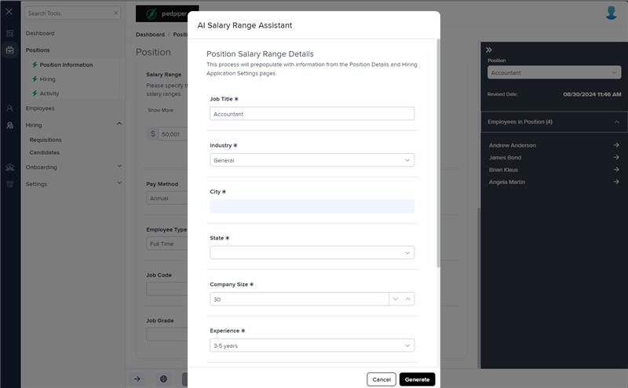

# Markup Audit Report

## Table of Contents

1. [File Paths](#file-paths)
2. [Unique Tags in Each File](#unique-tags-in-each-file)
3. [Differences in Markup Structure](#differences-in-markup-structure)
   - [Modal Configuration](#modal-configuration)
   - [Loading Indicator](#loading-indicator)
   - [Settings Table](#settings-table)
   - [Settings Rows](#settings-rows)
4. [Summary](#summary)

## File Paths

- `salary-range-request.component.html` belongs to the "AgileHR" project.
- The file from "Mocks-Talent-ng" was not found.

## Unique Tags in Each File

- **salary-range-request.component.html (AgileHR):**

  - `modal-base`, `ng-template`, `talent-loading`, `settings-table`, `settings-row`, `input-text`, `input-dropdown`, `input-numeric`, `input-dropdown-multi`

- **Mocks-Talent-ng:**
  - Not available

## Differences in Markup Structure

### Modal Configuration

- **AgileHR:**

  - Uses `<modal-base *hasFeature="[Features.aiIntegration]" [config]="config" [template]="salaryRangeRequestContent"></modal-base>`.
  - Includes `<ng-template #salaryRangeRequestContent>` for modal content.

- **Mocks-Talent-ng:**
  - Not available

### Loading Indicator

- **AgileHR:**

  - Uses `<talent-loading [loading]="loading"></talent-loading>` to indicate loading state.

- **Mocks-Talent-ng:**
  - Not available

### Settings Table

- **AgileHR:**

  - Uses `<settings-table settingsTitle="Position Salary Range Details" [formGroup]="form">` to group form controls and manage form state.

- **Mocks-Talent-ng:**
  - Not available

### Settings Rows

- **AgileHR:**

  - Includes multiple `<settings-row>` elements with titles such as "Job Title", "Industry", "City", "State", "Company Size", "Experience", "Education", "Direct Reports", and "Keywords".
  - Uses `input-text`, `input-dropdown`, `input-numeric`, and `input-dropdown-multi` within `settings-row`.

- **Mocks-Talent-ng:**
  - Not available

## Summary

The primary differences between the two files are in the use of modal configuration, loading indicators, settings tables, and settings rows. The `salary-range-request.component.html` file from "AgileHR" uses a modal configuration with a feature flag, includes a loading indicator, and uses `settings-table` and `settings-row` elements to organize form controls. The file from "Mocks-Talent-ng" was not found, so no comparison can be made.

Additional Notes:
This component is only used in AgileHR and not in Mocks-Talent-ng and is used as an alternative to the salary-range.component modal used in Mocks-Talent-ng.

## Prod Screenshots

## Mocks Screenshots

Not Found

## Prod URL

[link to the page in prod](https://piedpiper.agilehr.net/core/positions/position_7qw8tbqzn0xr8stpr01mx6tna3/info/details)

## Mocks URL

Not Found
