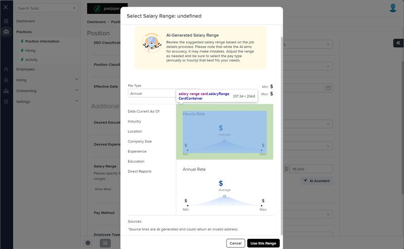
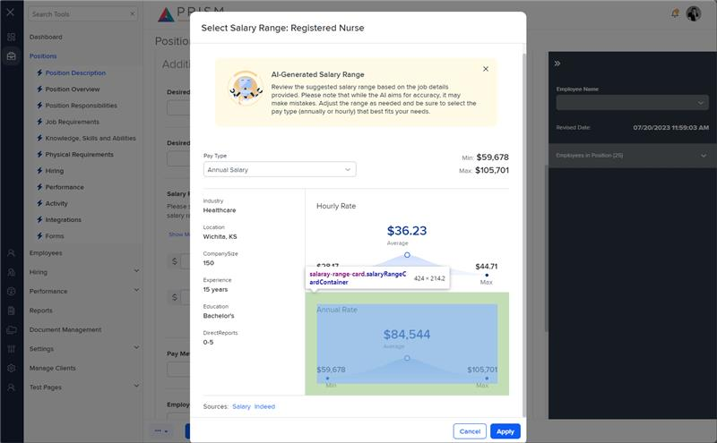

# Markup Audit Report

## Table of Contents

1. [File Paths](#file-paths)
2. [Unique Tags in Each File](#unique-tags-in-each-file)
3. [Differences in Markup Structure](#differences-in-markup-structure)
   - [Header Section](#header-section)
   - [Average Value](#average-value)
   - [SVG Chart](#svg-chart)
   - [Min and Max Values](#min-and-max-values)
4. [Summary](#summary)

## File Paths

- `salary-range-card.component.html` belongs to the "AgileHR" project.
- `salary-range-card.component.html-1` belongs to the "Mocks-Talent-ng" project.

## Unique Tags in Each File

- **salary-range-card.component.html (AgileHR):**

  - None

- **salary-range-card.component.html-1 (Mocks-Talent-ng):**
  - None

## Differences in Markup Structure

### Header Section

- **AgileHR:**

  - Uses `
{{ title }}
` for the header.

- **Mocks-Talent-ng:**
  - Uses `
{{ title }}
` for the header.

### Average Value

- **AgileHR:**

  - Uses `
 ${{ midValue?.toLocaleString() }} 
` for displaying the average value.

- **Mocks-Talent-ng:**
  - Uses `
 ${{ averageValue.toLocaleString() }} 
` for displaying the average value.

### SVG Chart

- **AgileHR:**

  - Uses `<svg xmlns="http://www.w3.org/2000/svg" viewBox="0 0 293.6 41.4">` for the SVG chart.
  - Includes `<linearGradient id="linear-gradient" x1="146.8" y1="10.2" x2="146.8" y2="33.1" gradientUnits="userSpaceOnUse">`.

- **Mocks-Talent-ng:**
  - Uses `<svg xmlns="http://www.w3.org/2000/svg" version="1.1" xmlns:xlink="http://www.w3.org/1999/xlink" viewBox="0 0 293.6 41.4">` for the SVG chart.
  - Includes `<linearGradient id="linear-gradient" x1="146.8" y1="10.2" x2="146.8" y2="33.1" gradientUnits="userSpaceOnUse">`.

### Min and Max Values

- **AgileHR:**

  - Uses `
 ${{ minValue?.toLocaleString() }} 
` for displaying the minimum value.
  - Uses `
 ${{ maxValue?.toLocaleString() }} 
` for displaying the maximum value.

- **Mocks-Talent-ng:**
  - Uses `
 ${{ minValue.toLocaleString() }} 
` for displaying the minimum value.
  - Uses `
 ${{ maxValue.toLocaleString() }} 
` for displaying the maximum value.

## Summary

The primary differences between the two files are in the attributes used for displaying the average, minimum, and maximum values. The `salary-range-card.component.html` file from "AgileHR" uses `midValue` for the average value and includes optional chaining (`?.`) for the minimum and maximum values. The `salary-range-card.component.html-1` file from "Mocks-Talent-ng" uses `averageValue` for the average value and does not include optional chaining for the minimum and maximum values. Both files use similar structures for the header, SVG chart, and value displays.

Additional Notes:
The markup and component for salary-range-card.component is used in the AgileHR Project, but is not directly accessible by any means. The screenshot was taken by opening the slary-range modal by custom code.

## Prod Screenshots

## Mocks Screenshots

## Prod URL

[link to the page in prod](https://piedpiper.agilehr.net/core/positions/position_7qw8tbqzn0xr8stpr01mx6tna3/info/details)

## Mocks URL

[link to the page in mock](http://localhost:4340/positions/:id/pos-desc)
