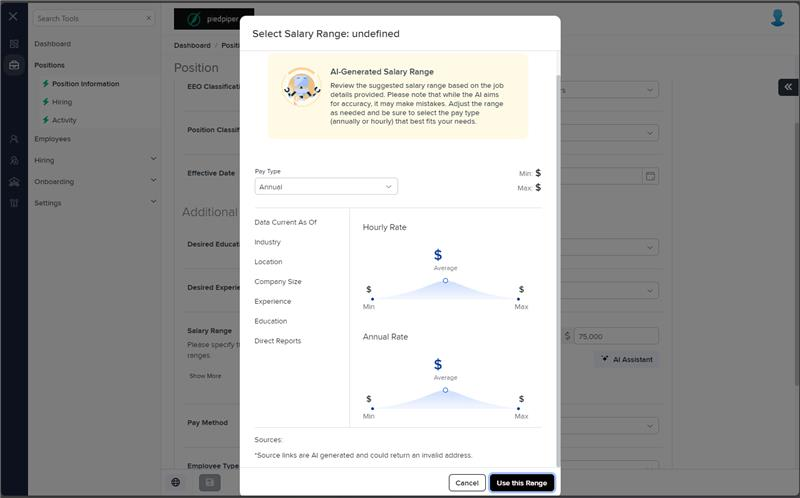
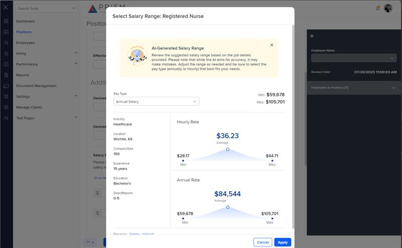

# Markup Audit Report

## Table of Contents

1. [File Paths](#file-paths)
2. [Unique Tags in Each File](#unique-tags-in-each-file)
3. [Differences in Markup Structure](#differences-in-markup-structure)
   - [Modal Configuration](#modal-configuration)
   - [Message Panel](#message-panel)
   - [Salary Range Header](#salary-range-header)
   - [Salary Range Details](#salary-range-details)
   - [Salary Range Cards](#salary-range-cards)
   - [Footer Section](#footer-section)
4. [Summary](#summary)

## File Paths

- `salary-range.component.html` belongs to the "AgileHR" project.
- `salary-range.component.html-1` belongs to the "Mocks-Talent-ng" project.

## Unique Tags in Each File

- **salary-range.component.html (AgileHR):**

  - `modal-base`, `ng-template`, `salary-range-card`

- **salary-range.component.html-1 (Mocks-Talent-ng):**
  - `ng-container`, `salaray-range-card`

## Differences in Markup Structure

### Modal Configuration

- **AgileHR:**

  - Uses `<modal-base *hasFeature="[Features.aiIntegration]" [config]="config" [template]="salaryRangeContent"></modal-base>`.
  - Includes `<ng-template #salaryRangeContent>` for modal content.

- **Mocks-Talent-ng:**
  - Does not use a modal configuration.

### Message Panel

- **AgileHR:**

  - Uses `<message-panel [title]="'AI-Generated Salary Range'" [content]="'Review the suggested salary range based on the job details provided. Please note that while the AI aims for accuracy, it may make mistakes. Adjust the range as needed and be sure to select the pay type (annually or hourly) that best fits your needs.'" [state]="1"></message-panel>`.

- **Mocks-Talent-ng:**
  - Uses `<message-panel [title]="'AI-Generated Salary Range'" [content]="'Review the suggested salary range based on the job details provided. Please note that while the AI aims for accuracy, it may make mistakes. Adjust the range as needed and be sure to select the pay type (annually or hourly) that best fits your needs.'" [state]="1" [config]="{ dismissible: true }"></message-panel>`.

### Salary Range Header

- **AgileHR:**

  - Uses `
`.
  - Includes `<input-dropdown [form]="form" formControlName="payType" [data]="payType" [placeholder]="'Pay Type'"></input-dropdown>`.

- **Mocks-Talent-ng:**
  - Uses `
`.
  - Includes `<input-dropdown [data]="payType" [placeholder]="'Pay Type'" [value]="payTypeValue" (optionSelected)="onOptionSelected($event)"></input-dropdown>`.

### Salary Range Details

- **AgileHR:**

  - Uses static HTML for displaying salary range details.
  - Includes multiple `
` elements for details like Data Current As Of, Industry, Location, Company Size, Experience, Education, and Direct Reports.

- **Mocks-Talent-ng:**
  - Uses `<ng-container *ngFor="let key of objectKeys(salaryDetails)">` to dynamically generate salary range details.
  - Filters out keys like 'SalaryRange', 'Sources', and 'JobTitle'.

### Salary Range Cards

- **AgileHR:**

  - Uses `<salary-range-card [title]="'Hourly Rate'" [minValue]="salaryDetails?.salaryRanges?.hourly?.minimum" [midValue]="salaryDetails?.salaryRanges?.hourly?.midpoint" [maxValue]="salaryDetails?.salaryRanges?.hourly?.maximum"></salary-range-card>`.
  - Uses `<salary-range-card [title]="'Annual Rate'" [minValue]="salaryDetails?.salaryRanges?.annual?.minimum" [midValue]="salaryDetails?.salaryRanges?.annual?.midpoint" [maxValue]="salaryDetails?.salaryRanges?.annual?.maximum"></salary-range-card>`.

- **Mocks-Talent-ng:**
  - Uses `<salaray-range-card [title]="'Hourly Rate'" [minValue]="salaryDetails.SalaryRange.Hourly.Min" [maxValue]="salaryDetails.SalaryRange.Hourly.Max" [averageValue]="salaryDetails.SalaryRange.Hourly.Average"></salaray-range-card>`.
  - Uses `<salaray-range-card [title]="'Annual Rate'" [minValue]="salaryDetails.SalaryRange.Annual.Min" [maxValue]="salaryDetails.SalaryRange.Annual.Max" [averageValue]="salaryDetails.SalaryRange.Annual.Average"></salaray-range-card>`.

### Footer Section

- **AgileHR:**

  - Uses `
`.
  - Includes a `@for` loop to iterate over `salaryDetails?.sources` and generate source links.

- **Mocks-Talent-ng:**
  - Uses `
`.
  - Includes an `<ng-container *ngFor="let source of salaryDetails.Sources">` to generate source links.

## Summary

The primary differences between the two files are in the use of modal configuration, message panels, salary range headers, salary range details, salary range cards, and footer sections. The `salary-range.component.html` file from "AgileHR" uses a modal configuration with a feature flag, static HTML for salary range details, and `salary-range-card` components. The `salary-range.component.html-1` file from "Mocks-Talent-ng" does not use a modal configuration, dynamically generates salary range details using `ng-container`, and uses `salaray-range-card` components.

Additional Notes:
The markup and component for salary-range.component is used in the AgileHR Project, but is not directly accessible by any means. The screenshot was taken by opening the modal by custom code.

## Prod Screenshots

## Mocks Screenshots

## Prod URL

[link to the page in prod](https://piedpiper.agilehr.net/core/positions/position_7qw8tbqzn0xr8stpr01mx6tna3/info/details)

## Mocks URL

[link to the page in mock](http://localhost:4340/positions/:id/pos-desc)
